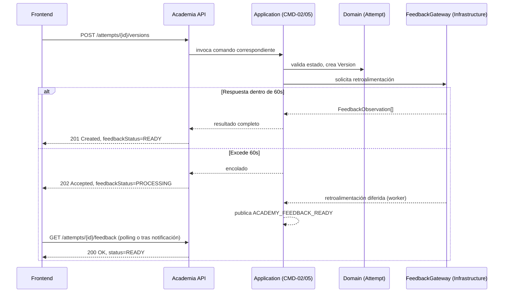
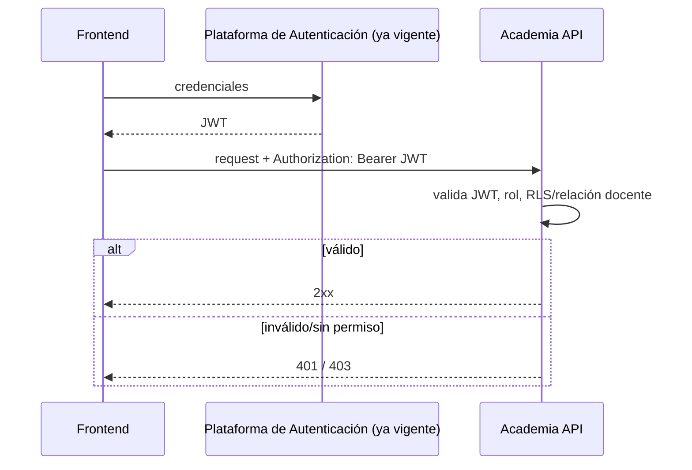
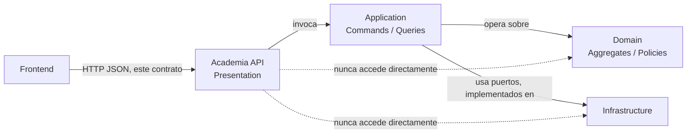

# ACADEMIA — API CONTRACT v1.0

**Estado:** DRAFT (pendiente de resolución de los puntos marcados PENDIENTE DE DECISIÓN DE API antes de congelarse)
**Fecha:** 2026-07-19
**Autor:** Principal API Architect, Rédaction Lab

**Documentos Frozen consumidos como contrato obligatorio (no modificados):** Product Blueprint, Arquitectura General, Domain Model, Application Model v1.0, Academia Functional Specification v1.1, Academia Infrastructure Model v1.0, Platform Core Foundation v1.0 (en particular, el Notification Catalog y el tipo ya aprobado `ACADEMY_FEEDBACK_READY`).

---

## 1. Objetivo

**Responsabilidad de este contrato.** Definir, de forma completa y sin ambigüedad, la superficie de comunicación HTTP entre el Frontend y el Backend del módulo Academia: qué recursos existen, qué operaciones admite cada uno, quién puede invocarlas y qué forma tiene cada intercambio de datos.

**Qué resuelve:** el mapeo 1:1 entre los 15 Commands y las 9 Queries ya definidos en el Application Model v1.0, y los 11 casos de uso de la Functional Specification v1.1, hacia una superficie REST concreta — sin agregar, quitar ni reinterpretar ninguno.

**Qué no resuelve:**
- Ninguna regla de negocio (eso permanece en el Domain Model).
- Ninguna decisión de infraestructura (eso permanece en el Infrastructure Model).
- El diseño de pantallas, componentes visuales o estado de cliente — eso corresponde a la fase siguiente, **Frontend Contract**.
- La forma final serializada exacta (OpenAPI/Swagger) — este documento es el contrato de diseño; su expresión técnica formal es un artefacto derivado, no producido aquí.

---

## 2. Convenciones globales

**Versionado:** por prefijo de URI — `/api/v1/academy/...`. Ver estrategia completa en la Sección 10.

**Formato:** JSON en todo intercambio (`Content-Type: application/json` obligatorio en request y response). Nombres de campo en `camelCase`.

**Fechas:** ISO-8601 en UTC (`2026-07-19T14:30:00Z`) en todo timestamp de entrada o salida — sin excepción, sin zona horaria local embebida.

**Identificadores:** UUID v4 para todo identificador de recurso expuesto (`unitId`, `attemptId`, `versionId`, `modelExampleId`, `overrideId`, `recommendationId`). Decisión de este contrato, consistente con el uso ya establecido de Value Objects de identidad en el Domain Model — no se expone ningún identificador secuencial/incremental de base de datos.

**Paginación:** `limit`/`offset`, con `limit` máximo de 100 y valor por defecto de 20 en toda colección. Toda respuesta paginada incluye `total`, `limit`, `offset` en un envoltorio `meta`.

**Ordenamiento:** parámetro `sort` opcional, formato `campo:asc|desc`, solo sobre campos explícitamente documentados por endpoint (Sección 4) — ningún endpoint admite ordenamiento arbitrario no documentado.

**Filtros:** documentados por endpoint (Sección 4); ningún filtro implícito no declarado.

**Errores:** envoltorio uniforme, ver Sección 11.

**Correlación:** header `X-Correlation-Id` — opcional en el request (el cliente puede proveerlo); si no se provee, el Backend genera uno. Siempre presente en la respuesta, en el mismo header. Ver Sección 12.

**Headers obligatorios (todo request autenticado):**
- `Authorization: Bearer <JWT>`
- `Content-Type: application/json` (en requests con body)
- `Accept: application/json`

**Headers opcionales:**
- `X-Correlation-Id`
- `Idempotency-Key` (obligatorio únicamente en los endpoints marcados como idempotentes por clave en la Sección 4 — ver también Sección 2 nota de idempotencia)
- `Accept-Language` (para localización de mensajes de error/contenido, reutilizando el mecanismo i18n ya vigente a nivel de plataforma)

**Nota de idempotencia general:** todo endpoint `POST` que crea un recurso con efecto de negocio (inicia, envía, repite, anula, recomienda, crea contenido editorial) exige el header `Idempotency-Key`. El Backend debe devolver la misma respuesta ante una repetición con la misma clave dentro de una ventana de 24 horas, sin duplicar el efecto. Los endpoints `PUT`/`PATCH` son idempotentes por semántica HTTP estándar y no requieren esta clave.

---

## 3. Recursos

Recursos derivados exclusivamente de los Aggregates del Domain Model, los Commands/Queries del Application Model y los casos de uso de la Functional Specification v1.1 — ninguno inventado:

| Recurso | Origen | Corresponde a |
|---|---|---|
| `academy/units` | `AcademyUnit` (Aggregate) | CU-01, CU-07, QRY-02, QRY-03 |
| `academy/attempts` | `Attempt` (Aggregate) | CU-01 a CU-06, QRY-05 |
| `academy/attempts/{id}/draft` | `Draft` (Entity) | CU-03, CMD-03, QRY-06 |
| `academy/attempts/{id}/versions` | `Version` (Entity) | CU-03, CU-05, CMD-02, CMD-05 |
| `academy/attempts/{id}/feedback` | `Feedback` (Entity) | CU-04, QRY-07 |
| `academy/attempts/{id}/reflection` | Reflexión (paso 10 del recorrido, dentro de `Attempt`) | CU-06, CMD-07 |
| `academy/model-examples` | `ModelExample` (Aggregate) | CU-08, CMD-12/13/14, QRY-08 |
| `academy/units/{id}/teacher-overrides` | `TeacherOverride` (Entity) | CU-10, CMD-10 |
| `academy/students/{id}/unit-recommendations` | Recomendación docente (registro independiente, resolución ARB CU-11) | CU-11, CMD-11 |
| `academy/progress-summary` | Vista agregada de `AcademyUnit` por estudiante | QRY-01, QRY-09, CU-09 |
| `academy/continuation` | Vista de continuidad ("Continúa donde te quedaste") | QRY-04, A-06 |

---

## 4. Endpoints

### EP-01 — Iniciar unidad
- **Objetivo:** iniciar el recorrido de una unidad desbloqueada (CU-01).
- **Método / URI:** `POST /api/v1/academy/units/{unitId}/attempts`
- **Autorización:** JWT válido + rol `STUDENT` + RLS (el estudiante solo puede operar sobre sus propias unidades).
- **Actor permitido:** Estudiante.
- **Parámetros:** `unitId` (path, UUID).
- **Request contract:** sin cuerpo.
- **Response contract:** `AttemptSummaryDTO` (Sección 5).
- **Códigos HTTP:** `201 Created` (nuevo intento); `200 OK` (ya existía un intento activo — se retorna el existente, sin duplicar, per CU-01 excepción).
- **Errores posibles:** `409 Conflict` (unidad en `LOCKED`); `404 Not Found` (unidad inexistente o no pertenece al estudiante).
- **Idempotencia:** requiere `Idempotency-Key`; repetición con misma clave retorna el mismo `Attempt`.
- **Eventos relacionados:** dispara `UnitStarted` (Domain Event, ya Frozen).
- **Dependencias:** `CMD-01 StartUnit`.

### EP-02 — Autoguardar borrador
- **Objetivo:** persistir el contenido en curso del estudiante de forma continua (A-06).
- **Método / URI:** `PUT /api/v1/academy/attempts/{attemptId}/draft`
- **Autorización:** JWT + rol `STUDENT` + RLS.
- **Actor permitido:** Estudiante.
- **Parámetros:** `attemptId` (path, UUID).
- **Request contract:** `{ content: string }`.
- **Response contract:** `DraftDTO`.
- **Códigos HTTP:** `200 OK`.
- **Errores posibles:** `404 Not Found` (intento inexistente/no pertenece al estudiante); `422 Unprocessable Entity` (contenido fuera del rango de longitud ya definido por `WordCountRange` en el Domain Model).
- **Idempotencia:** nativa por semántica `PUT` (mismo contenido → mismo resultado); no requiere `Idempotency-Key`.
- **Eventos relacionados:** ninguno de dominio (el autoguardado es un detalle de persistencia, no un Domain Event).
- **Dependencias:** `CMD-03 AutosaveDraft`.

### EP-03 — Enviar producción / reescritura
- **Objetivo:** registrar una nueva versión de la producción del estudiante — la primera (CU-03) o una reescritura posterior (CU-05).
- **Método / URI:** `POST /api/v1/academy/attempts/{attemptId}/versions`
- **Autorización:** JWT + rol `STUDENT` + RLS.
- **Actor permitido:** Estudiante.
- **Parámetros:** `attemptId` (path, UUID).
- **Request contract:** `{ content: string }`.
- **Response contract:** `VersionDTO`, con un campo `feedbackStatus: "READY" | "PROCESSING"`. Si `READY`, incluye el `FeedbackDTO` embebido (respuesta dentro de la ventana objetivo de 60s, Functional Spec Sección 11); si `PROCESSING`, el cliente debe consultar `EP-18` o esperar la notificación `ACADEMY_FEEDBACK_READY` (Platform Core Foundation, Notification Catalog).
- **Códigos HTTP:** `201 Created` con `feedbackStatus: READY`; `202 Accepted` con `feedbackStatus: PROCESSING`.
- **Errores posibles:** `422 Unprocessable Entity` (producción vacía/incompleta, CU-03 excepción; comprensión no verificada — ver PENDIENTE DE DECISIÓN DE API #1); `409 Conflict` (unidad no está en el paso correspondiente).
- **Idempotencia:** requiere `Idempotency-Key`.
- **Eventos relacionados:** `ProductionSubmitted` (primera versión) o evento equivalente de reescritura; `FeedbackRequested`; eventualmente `FeedbackDelivered`.
- **Dependencias:** `CMD-02 SubmitProduction` (primera versión) o `CMD-05 SubmitRevision` (subsiguientes) — la selección la determina el estado del `Attempt` en Application, no el cliente.

### EP-04 — Avanzar a fase de reflexión
- **Objetivo:** marcar que el estudiante concluyó su ciclo de reescritura y está listo para reflexionar (CU-06, previo).
- **Método / URI:** `PATCH /api/v1/academy/attempts/{attemptId}/phase`
- **Autorización:** JWT + rol `STUDENT` + RLS.
- **Actor permitido:** Estudiante.
- **Parámetros:** `attemptId` (path, UUID).
- **Request contract:** `{ targetPhase: "REFLECTION" }` — único valor válido para este endpoint.
- **Response contract:** `AttemptSummaryDTO` actualizado.
- **Códigos HTTP:** `200 OK`.
- **Errores posibles:** `409 Conflict` (no existe al menos un ciclo de reescritura completado, Regla funcional 5).
- **Idempotencia:** nativa por semántica `PATCH` hacia un estado objetivo explícito; repetir la misma solicitud sobre una unidad ya en `REFLECTION` retorna `200 OK` sin efecto adicional.
- **Eventos relacionados:** `RevisionStarted`/`ReflectionStarted` (ya documentados en el Domain Model como eventos de auditoría interna, H-11).
- **Dependencias:** `CMD-06 AdvanceToReflection`.

### EP-05 — Completar reflexión y cerrar unidad
- **Objetivo:** registrar las respuestas metacognitivas del estudiante y cerrar el ciclo de la unidad (CU-06).
- **Método / URI:** `POST /api/v1/academy/attempts/{attemptId}/reflection`
- **Autorización:** JWT + rol `STUDENT` + RLS.
- **Actor permitido:** Estudiante.
- **Parámetros:** `attemptId` (path, UUID).
- **Request contract:** `{ responses: string[] }` (respuestas a las preguntas metacognitivas presentadas).
- **Response contract:** `AcademyUnitDetailDTO` reflejando el nuevo estado (`COMPLETED`, y `MASTERED` si aplica de forma diferida — ver PENDIENTE DE DECISIÓN DE API, Sección 8 de este documento no cubre evaluación de `MASTERED` vía API pública, ver exclusión deliberada más abajo).
- **Códigos HTTP:** `201 Created`.
- **Errores posibles:** `409 Conflict` (unidad no está en fase `REFLECTION`).
- **Idempotencia:** requiere `Idempotency-Key`.
- **Eventos relacionados:** `ReflectionCompleted`, `UnitCompleted`, posible `EXTERNAL_ACTIVITY_COMPLETED` (hacia Mi Plan), posible desbloqueo de la siguiente unidad.
- **Dependencias:** `CMD-07 CompleteReflection` (patrón de sincronización Attempt→AcademyUnit, dos transacciones, ya definido en el Application Model — transparente para el cliente de la API, que recibe una única respuesta).

### EP-06 — Repetir unidad
- **Objetivo:** iniciar un nuevo recorrido sobre una unidad ya completada/dominada (CU-07).
- **Método / URI:** `POST /api/v1/academy/units/{unitId}/repetitions`
- **Autorización:** JWT + rol `STUDENT` + RLS.
- **Actor permitido:** Estudiante.
- **Parámetros:** `unitId` (path, UUID).
- **Request contract:** sin cuerpo.
- **Response contract:** `AttemptSummaryDTO` del nuevo intento.
- **Códigos HTTP:** `201 Created`.
- **Errores posibles:** `409 Conflict` (unidad no está en `COMPLETED`/`MASTERED`, CU-07 excepción).
- **Idempotencia:** requiere `Idempotency-Key`.
- **Eventos relacionados:** `UnitRepeated`.
- **Dependencias:** `CMD-09 RepeatUnit`.

### EP-07 — Aplicar anulación docente (bloqueo/reinicio forzado)
- **Objetivo:** forzar el bloqueo o el reinicio de una unidad de un estudiante (CU-10).
- **Método / URI:** `POST /api/v1/academy/units/{unitId}/teacher-overrides`
- **Autorización:** JWT + rol `TEACHER` + verificación de relación docente-estudiante.
- **Actor permitido:** Profesor.
- **Parámetros:** `unitId` (path, UUID).
- **Request contract:** `{ action: "FORCE_LOCK" | "FORCE_RESTART", reason: string }` (`reason` obligatorio, no vacío — Regla funcional 8).
- **Response contract:** `TeacherOverrideDTO`.
- **Códigos HTTP:** `201 Created`.
- **Errores posibles:** `403 Forbidden` (sin relación docente establecida); `409 Conflict` (acción no válida para el estado actual, CU-10 excepción).
- **Idempotencia:** requiere `Idempotency-Key`.
- **Eventos relacionados:** `TeacherOverrideApplied`.
- **Dependencias:** `CMD-10 ApplyTeacherOverride`.

### EP-08 — Recomendar unidad
- **Objetivo:** registrar una recomendación docente sobre una unidad, sin efecto de estado (CU-11, resolución ARB).
- **Método / URI:** `POST /api/v1/academy/students/{studentId}/unit-recommendations`
- **Autorización:** JWT + rol `TEACHER` + verificación de relación docente-estudiante.
- **Actor permitido:** Profesor.
- **Parámetros:** `studentId` (path, UUID).
- **Request contract:** `{ unitId: string }`.
- **Response contract:** `TeacherRecommendationDTO` (DTO no listado explícitamente en el Application Model v1.0 original — ver nota de trazabilidad más abajo).
- **Códigos HTTP:** `201 Created`.
- **Errores posibles:** `403 Forbidden` (sin relación docente establecida).
- **Idempotencia:** requiere `Idempotency-Key`.
- **Eventos relacionados:** ninguno de dominio — no invoca al Aggregate `AcademyUnit` (confirmado en el IRB de Infraestructura, Pendiente 1 del Infrastructure Model).
- **Dependencias:** `CMD-11 AssignUnitToStudent` (renombrado funcionalmente a "recomendar" por la resolución ARB del 2026-07-19).
- **Nota de trazabilidad:** `TeacherRecommendationDTO` no aparece en la lista original de DTOs del Application Model v1.0 (ese documento fue Frozen antes de que el ARB resolviera CU-11). Se define aquí como una extensión de Presentation/API, consistente con el `TeacherRecommendationRepository` ya definido en el Infrastructure Model — no reabre ni modifica el Application Model, que nunca tipificó este DTO por no tener aún la resolución funcional al momento de su cierre.

**Nota — representación de "grupo" en EP-07/EP-08:** la Functional Specification (Secciones 2 y 6) permite que el Profesor actúe sobre "un estudiante o un grupo completo", pero ningún Command, Query ni DTO del Application Model define una representación de grupo (no existe `GroupId` ni `GroupProgressSummaryDTO`). Este contrato **no inventa** una ruta de grupo — ver PENDIENTE DE DECISIÓN DE API #2.

### EP-09 — Crear ejemplo de la Biblioteca de Modelos
- **Objetivo:** publicar un nuevo `ModelExample` (CU-08, soporte editorial).
- **Método / URI:** `POST /api/v1/academy/model-examples`
- **Autorización:** JWT + rol `ADMIN`.
- **Actor permitido:** Administrador.
- **Request contract:** `{ textType: TextType, content: string, comparativeComment: string }`.
- **Response contract:** `ModelExampleDTO`.
- **Códigos HTTP:** `201 Created`.
- **Errores posibles:** `422 Unprocessable Entity` (`textType` fuera del enum de 5 valores válidos).
- **Idempotencia:** requiere `Idempotency-Key`.
- **Eventos relacionados:** ninguno de dominio de Academia (contenido editorial, no progreso de estudiante).
- **Dependencias:** `CMD-12 CreateModelExample`.

### EP-10 — Actualizar ejemplo de la Biblioteca de Modelos
- **Método / URI:** `PATCH /api/v1/academy/model-examples/{modelExampleId}`
- **Autorización:** JWT + rol `ADMIN`.
- **Actor permitido:** Administrador.
- **Request contract:** `{ content?: string, comparativeComment?: string }` (campos parciales).
- **Response contract:** `ModelExampleDTO`.
- **Códigos HTTP:** `200 OK`.
- **Errores posibles:** `404 Not Found`.
- **Idempotencia:** nativa por semántica `PATCH`.
- **Dependencias:** `CMD-13 UpdateModelExample`.

### EP-11 — Retirar ejemplo de la Biblioteca de Modelos
- **Método / URI:** `DELETE /api/v1/academy/model-examples/{modelExampleId}`
- **Autorización:** JWT + rol `ADMIN`.
- **Actor permitido:** Administrador.
- **Request contract:** sin cuerpo.
- **Response contract:** `ModelExampleDTO` con `status: "RETIRED"` (borrado lógico, no físico — CU-08 excepción: "ejemplo retirado... se omite sin bloquear el flujo").
- **Códigos HTTP:** `200 OK`.
- **Errores posibles:** `404 Not Found`.
- **Idempotencia:** nativa (retirar dos veces produce el mismo estado final).
- **Dependencias:** `CMD-14 RetireModelExample`.

### EP-12 — Consultar mi resumen de progreso
- **Método / URI:** `GET /api/v1/academy/progress-summary`
- **Autorización:** JWT + rol `STUDENT` (implícito: el propio estudiante autenticado).
- **Actor permitido:** Estudiante.
- **Response contract:** `StudentProgressSummaryDTO`.
- **Códigos HTTP:** `200 OK`.
- **Dependencias:** `QRY-01`.

### EP-13 — Consultar mapa de unidades
- **Método / URI:** `GET /api/v1/academy/units`
- **Autorización:** JWT + rol `STUDENT`.
- **Actor permitido:** Estudiante.
- **Parámetros:** `textType` (query, opcional, filtra por tipo de texto).
- **Response contract:** lista paginada de `AcademyUnitSummaryDTO`.
- **Códigos HTTP:** `200 OK`.
- **Dependencias:** `QRY-02`.

### EP-14 — Consultar detalle de una unidad
- **Método / URI:** `GET /api/v1/academy/units/{unitId}`
- **Autorización:** JWT + rol `STUDENT` + RLS.
- **Response contract:** `AcademyUnitDetailDTO`.
- **Códigos HTTP:** `200 OK`; `404 Not Found`.
- **Dependencias:** `QRY-03`.

### EP-15 — Consultar estado de continuidad
- **Objetivo:** soportar "Continúa donde te quedaste" (A-06, §6.3).
- **Método / URI:** `GET /api/v1/academy/continuation`
- **Autorización:** JWT + rol `STUDENT`.
- **Response contract:** `ContinuationStateDTO` (`null`/`204 No Content` si no hay unidad en curso).
- **Códigos HTTP:** `200 OK`; `204 No Content`.
- **Dependencias:** `QRY-04`.

### EP-16 — Consultar historial de intentos de una unidad
- **Método / URI:** `GET /api/v1/academy/units/{unitId}/attempts`
- **Autorización:** JWT + rol `STUDENT` + RLS.
- **Response contract:** lista paginada de `AttemptSummaryDTO`.
- **Códigos HTTP:** `200 OK`.
- **Dependencias:** `QRY-05`.

### EP-17 — Consultar borrador actual
- **Método / URI:** `GET /api/v1/academy/attempts/{attemptId}/draft`
- **Autorización:** JWT + rol `STUDENT` + RLS.
- **Response contract:** `DraftDTO`.
- **Códigos HTTP:** `200 OK`; `404 Not Found`.
- **Dependencias:** `QRY-06`.

### EP-18 — Consultar retroalimentación
- **Objetivo:** obtener la retroalimentación de una versión — incluye el caso de recuperación tras procesamiento asíncrono (EP-03, `202 Accepted`).
- **Método / URI:** `GET /api/v1/academy/attempts/{attemptId}/feedback`
- **Autorización:** JWT + rol `STUDENT` + RLS.
- **Response contract:** `FeedbackDTO` con `status: "READY" | "PROCESSING"`.
- **Códigos HTTP:** `200 OK` (en ambos estados — el cuerpo distingue vía `status`, no el código HTTP, para simplificar el polling del cliente); `404 Not Found` (versión sin solicitud de retroalimentación asociada).
- **Dependencias:** `QRY-07`.

### EP-19 — Consultar Biblioteca de Modelos
- **Método / URI:** `GET /api/v1/academy/model-examples`
- **Autorización:** JWT + rol `STUDENT` (consulta), `ADMIN` (gestión, ya cubierta por EP-09/10/11).
- **Parámetros:** `textType` (query, opcional).
- **Response contract:** lista paginada de `ModelExampleDTO` (`status: ACTIVE` únicamente para rol `STUDENT`).
- **Códigos HTTP:** `200 OK`.
- **Dependencias:** `QRY-08`.

### EP-20 — Consultar progreso de un estudiante (vista docente)
- **Objetivo:** soportar CU-09 (revisión de progreso agregado por el Profesor).
- **Método / URI:** `GET /api/v1/academy/students/{studentId}/progress-summary`
- **Autorización:** JWT + rol `TEACHER` + verificación de relación docente-estudiante.
- **Actor permitido:** Profesor.
- **Response contract:** `StudentProgressSummaryDTO`.
- **Códigos HTTP:** `200 OK`; `403 Forbidden` (sin relación docente establecida, CU-09 excepción).
- **Dependencias:** `QRY-09`.

### Exclusiones deliberadas (Commands sin endpoint público — no son omisiones)

| Command | Motivo de exclusión |
|---|---|
| `CMD-04 RecordFeedbackDelivered` | Invocado internamente por el pipeline de IA de Infrastructure (`FeedbackGateway`/worker asíncrono), nunca directamente por el Frontend. El estudiante lo observa a través de EP-03/EP-18, nunca lo invoca. |
| `CMD-08 EvaluateMastery` | Evaluación automática disparada por Application tras eventos calificables (no es una acción explícita de ningún caso de uso de la Functional Specification — ningún CU-01 a CU-11 describe al estudiante "solicitando" ser evaluado para `MASTERED`). No expuesto como endpoint. |
| `CMD-15 ProvisionAcademyUnitsForStudent` | Disparado por el proceso de alta/matriculación del estudiante (fuera del límite de contexto de Academia — ningún caso de uso de la Functional Specification lo describe como acción del estudiante o del Profesor dentro de Academia). No expuesto como endpoint público de este módulo. |

---

## 5. DTO Contracts

Estructura y significado — sin código, sin tipos de lenguaje concretos.

- **`AcademyUnitSummaryDTO`**: `unitId`, `textType`, `state` (uno de los 8 valores ya Frozen), `position` (orden dentro de la progresión de su tipo de texto), `isRecommended` (booleano, derivado de la existencia de una recomendación docente activa — no almacenado en el Aggregate).
- **`AcademyUnitDetailDTO`**: extiende `AcademyUnitSummaryDTO` + `activeAttemptId` (nulo si no hay intento en curso) + `attemptsCount`.
- **`AttemptSummaryDTO`**: `attemptId`, `unitId`, `state`, `currentStep` (uno de los 11 valores del `UnitStep`), `startedAt`.
- **`ContinuationStateDTO`**: `unitId`, `attemptId`, `currentStep`, `lastActivityAt`.
- **`DraftDTO`**: `attemptId`, `content`, `wordCount`, `lastSavedAt`.
- **`VersionDTO`**: `versionId`, `attemptId`, `versionNumber`, `content`, `submittedAt`, `feedbackStatus`.
- **`FeedbackObservationDTO`**: `category` (uno de los 10 valores de `FeedbackCategory`), `priority` (entero, ya definido en el Domain Model v1.1 tras H-07), `strength` (`STRENGTH`/`WEAKNESS`), `explanation`, `suggestion`.
- **`FeedbackDTO`**: `feedbackId`, `versionId`, `status` (`READY`/`PROCESSING`), `observations` (lista de `FeedbackObservationDTO`, ordenada por `priority` ascendente — macro antes que micro), `generatedAt` (nulo si `PROCESSING`).
- **`ModelExampleDTO`**: `modelExampleId`, `textType`, `content`, `comparativeComment`, `status` (`ACTIVE`/`RETIRED`).
- **`TeacherOverrideDTO`**: `overrideId`, `unitId`, `action` (`FORCE_LOCK`/`FORCE_RESTART`), `reason`, `appliedBy`, `appliedAt`.
- **`TeacherRecommendationDTO`** *(extensión de Presentation, ver nota de EP-08)*: `recommendationId`, `studentId`, `unitId`, `recommendedBy`, `recommendedAt`.
- **`StudentProgressSummaryDTO`**: `studentId`, `unitsByState` (conteo por cada uno de los 8 estados), `unitsByTextType` (conteo por cada uno de los 5 tipos de texto).

---

## 6. Validaciones

Validaciones visibles desde la API (no se repiten invariantes internas del Domain Model, solo su punto de exposición):

- Todo `content` de `Draft`/`Version` debe respetar el rango de longitud ya definido por el Value Object `WordCountRange` — el API rechaza con `422` antes de invocar Application si el tamaño excede un límite razonable de payload (protección de transporte, no regla de negocio).
- `TeacherOverride.reason` es obligatorio y no puede ser una cadena vacía (Regla funcional 8) — validado en el borde de la API antes de invocar `CMD-10`.
- `ModelExample.textType` debe pertenecer al enum `TextType` de 5 valores ya Frozen — cualquier otro valor es rechazado con `422` sin llegar a Application.
- Todo `unitId`/`attemptId`/`modelExampleId`/`studentId` en la URI debe tener formato UUID v4 válido — de lo contrario, `400 Bad Request` antes de cualquier verificación de autorización o existencia.
- El header `Idempotency-Key`, cuando es requerido (ver Sección 2), debe ser una cadena no vacía; su ausencia en un endpoint que lo exige produce `400 Bad Request`.

---

## 7. Seguridad

**JWT:** todo request autenticado exige un JWT válido emitido por el mecanismo de autenticación ya vigente a nivel de plataforma (reutilizado, no nuevo — consistente con el Infrastructure Model, Sección 8).

**Scopes/Roles:** se reutiliza exactamente el catálogo de roles ya reconocido como componente del Platform Core (`Permission Catalog`, STUDENT/TEACHER/ADMIN/SUPER_ADMIN/REVIEWER/AI_SERVICE/SYSTEM) — Academia no define scopes propios.

**Permisos:** aplicados exactamente según la matriz de la Functional Specification v1.1, Sección 2, ya reflejada endpoint por endpoint en la Sección 4 de este documento.

**Rate limiting:** **PENDIENTE DE DECISIÓN DE API** (#3) — ningún documento Frozen define umbrales de tasa de solicitudes para Academia ni para la plataforma en general. Se recomienda resolverlo a nivel de Platform Core (no específico de Academia), dado que es, por naturaleza, un componente transversal (ver Platform Core Foundation, Sección 3, criterio de pertenencia).

**CSRF:** no aplica. La autenticación de este contrato es exclusivamente por `Authorization: Bearer <JWT>`, no por cookies de sesión — el vector CSRF no existe bajo este esquema.

**CORS:** se hereda la política CORS ya vigente a nivel de plataforma; Academia no define una política propia.

---

## 8. Integración con IA

Este contrato **no expone** ningún endpoint que hable directamente con el proveedor de IA — esa comunicación ocurre íntegramente dentro de Infrastructure (`FeedbackGateway`, ya definido), invisible para el Frontend.

**Contrato observable desde la API:** `EP-03` (enviar producción/reescritura) es el único punto donde la API refleja el comportamiento híbrido ya congelado (Functional Spec v1.1, Sección 11): si el proveedor responde dentro de la ventana objetivo, la respuesta HTTP incluye la retroalimentación completa (`201 Created`, `feedbackStatus: READY`); si no, la respuesta es `202 Accepted` con `feedbackStatus: PROCESSING`, y el cliente debe recuperar el resultado vía `EP-18` (polling) o esperar la notificación `ACADEMY_FEEDBACK_READY` (Sección 9). El API Contract no expone timeouts, reintentos ni el estado del Circuit Breaker — esos son detalles de Infrastructure, no del contrato con el Frontend.

---

## 9. Notificaciones

Se usa exclusivamente el Notification Catalog ya aprobado en Platform Core Foundation v1.0. Academia, a través de este contrato, no define ningún tipo de notificación nuevo — reutiliza el ya aprobado:

- **`ACADEMY_FEEDBACK_READY`** (audiencia `STUDENT`, naturaleza `ACTION_REQUIRED`): emitido cuando una retroalimentación solicitada en modo `PROCESSING` (EP-03) queda lista. El Frontend se suscribe a este tipo a través del mecanismo de entrega de notificaciones ya vigente a nivel de plataforma (fuera del alcance de este documento) — este API Contract no define un endpoint de "recibir notificación"; documenta únicamente que este es el evento que el Frontend debe esperar tras un `202 Accepted` de EP-03.

Ningún otro tipo de `NotificationEvent` es emitido por Academia según los documentos Frozen revisados.

---

## 10. Versionado

**Estrategia:** versionado por prefijo de URI (`/api/v1/academy/...`). Cambios aditivos y compatibles hacia atrás (nuevos campos opcionales en response, nuevos endpoints) no requieren nueva versión. Cualquier cambio incompatible (renombrar/eliminar un campo, cambiar un tipo, alterar el significado de un código HTTP ya documentado) exige `/v2/` completo.

**Backward compatibility:** ningún campo documentado en un DTO se elimina ni cambia de tipo dentro de la misma versión mayor; solo se permite agregar campos opcionales.

**Deprecación:** un endpoint o campo deprecado se marca explícitamente en la documentación técnica derivada (fuera de este documento) con una fecha de retiro mínima de un ciclo de release completo — mismo principio ya establecido en el Platform Core Foundation, Sección 8, aplicado aquí de forma consistente.

---

## 11. Errores

**Envoltorio uniforme (todo error, cualquier endpoint):**
```
{
  "code": string,
  "message": string,
  "correlationId": string,
  "details"?: object
}
```

**Catálogo de códigos HTTP usados por este contrato:**

| Código | Significado en este contrato |
|---|---|
| `400` | Solicitud malformada (formato de identificador inválido, header requerido ausente). |
| `401` | JWT ausente o inválido. |
| `403` | Autenticado pero sin autorización sobre el recurso (relación docente-estudiante no establecida, rol insuficiente). |
| `404` | Recurso inexistente o fuera del alcance del actor (nunca se distingue de "no autorizado" cuando la distinción revelaría información sensible — a definir junto con el Error Catalog general). |
| `409` | Conflicto de estado (acción no válida para el estado actual del Aggregate). |
| `422` | Violación de una regla visible desde la API (contenido vacío, tipo de texto inválido, motivo de anulación vacío). |
| `429` | Límite de tasa excedido — umbral pendiente, ver Sección 7. |
| `500` / `503` | Error técnico interno / servicio no disponible. |

**Relación con el Error Catalog futuro:** el envoltorio y los códigos HTTP arriba definidos son estables y no requieren modificación; el valor exacto de `code` (taxonomía completa de códigos de negocio, p. ej. `ACADEMY_UNIT_LOCKED`, `ACADEMY_OVERRIDE_REASON_REQUIRED`) depende del **Error Catalog**, identificado en el Platform Core Foundation como componente pendiente de documento individual (aún no diseñado). **PENDIENTE DE DECISIÓN DE API** (#4): la lista exhaustiva de códigos de negocio de Academia no puede cerrarse hasta que el Error Catalog del Platform Core exista formalmente — este documento reserva el campo `code` sin fijar su vocabulario completo.

---

## 12. Observabilidad

**Correlation Id:** propagado vía `X-Correlation-Id` (Sección 2), reutilizando exactamente el mecanismo ya definido en el Infrastructure Model, Sección 10 — el mismo identificador atraviesa las dos transacciones del patrón Attempt→AcademyUnit y la llamada al Gateway de IA.

**Request Id:** cada request recibe un identificador único generado por el Backend, incluido en la respuesta (`X-Request-Id`), distinto del `Correlation Id` (que puede abarcar múltiples requests de un mismo flujo de usuario).

**Tracing:** cada endpoint queda instrumentado dentro de la infraestructura de tracing ya vigente a nivel de plataforma (Infrastructure Model, Sección 11) — sin instrumentación adicional específica de API.

**Logs:** todo request/response se registra siguiendo exactamente las restricciones ya definidas en el Infrastructure Model, Sección 10 (nunca contenido íntegro de `Draft`/`Version`/`Feedback` en logs de nivel INFO/DEBUG).

---

## 13. Performance

**Paginación:** obligatoria en toda colección (Sección 2) — ningún endpoint de listado retorna una colección sin acotar.

**Batching:** no se definen endpoints de operación por lotes — ningún documento Frozen exige una operación batch, y este contrato no la inventa.

**Compresión:** `gzip` estándar a nivel de transporte, heredado de la configuración ya vigente a nivel de plataforma — sin decisión específica de Academia.

**Caching HTTP:** `Cache-Control` habilitado únicamente en `EP-19` (Biblioteca de Modelos, lectura de baja frecuencia de cambio, consistente con el Infrastructure Model Sección 12); explícitamente deshabilitado (`Cache-Control: no-store`) en todo endpoint que refleje estado en curso de un `Attempt`/`AcademyUnit` (EP-03 a EP-08, EP-12 a EP-18) — mismo principio ya fijado en el Infrastructure Model: nunca cachear una lectura que participe en una decisión de negocio en curso.

**Timeouts:** `EP-03` sigue exactamente los umbrales ya congelados (60s objetivo / 3min máximo antes de retornar `202 Accepted`); el resto de endpoints usa el timeout estándar de plataforma (no específico de Academia).

---

## 14. Diagramas

### 14.1 Flujo request-response (ejemplo: EP-03)



### 14.2 Autenticación



### 14.3 Interacción Frontend ↔ API ↔ Application



---

## 15. Checklist

- [ ] Todo endpoint documentado en la Sección 4 corresponde a exactamente un Command o Query ya Frozen — ninguno inventado.
- [ ] Ningún endpoint carece de autorización y actor permitido documentados.
- [ ] Todo DTO de la Sección 5 tiene un propósito trazable a un caso de uso o Command/Query.
- [ ] Ningún endpoint retorna contenido íntegro de otro estudiante (verificable contra RLS, ya definido en Infrastructure Model).
- [ ] Todo endpoint de escritura con efecto de negocio exige `Idempotency-Key`, salvo `PUT`/`PATCH` (idempotentes por semántica HTTP).
- [ ] El envoltorio de error (Sección 11) es uniforme en el 100% de las respuestas de error.
- [ ] Ningún endpoint cachea una lectura que participe en una decisión de negocio en curso (Sección 13).
- [ ] Los tres Commands excluidos deliberadamente (CMD-04, CMD-08, CMD-15) están documentados como exclusión consciente, no como omisión.
- [ ] Los cuatro puntos `PENDIENTE DE DECISIÓN DE API` están señalados explícitamente, sin comportamiento asumido.

---

## PENDIENTES DE DECISIÓN DE API — resumen

1. **Verificación de comprensión (CU-02, pasos 1–6 del recorrido).** Ningún Command de los 15 ya Frozen en el Application Model cubre la persistencia de la verificación de comprensión exigida antes de "Producir". No es posible derivar un endpoint sin inventar un Command inexistente. Bloquea el diseño completo de los pasos previos a EP-03.
2. **Representación de "grupo" (CU-09, CU-11).** La Functional Specification permite acciones docentes sobre "un estudiante o un grupo", pero ningún DTO/Command define `GroupId` ni una vista agregada de grupo. EP-07/EP-08/EP-20 quedan definidos únicamente a nivel de estudiante individual.
3. **Umbrales de rate limiting.** Ningún documento Frozen los define; se recomienda resolverlos a nivel de Platform Core, no de Academia.
4. **Vocabulario completo del campo `code` de error.** Depende del Error Catalog del Platform Core, aún no diseñado como documento individual.

---

## VALIDACIÓN FINAL — Auditoría automática

| Verificación | Resultado |
|---|---|
| ✓ No se modificó ningún documento Frozen | **Cumple.** |
| ✓ Todos los endpoints provienen de casos de uso existentes | **Cumple**, con las tres exclusiones deliberadas documentadas explícitamente (CMD-04, CMD-08, CMD-15) y los dos vacíos de cobertura señalados como pendientes (#1, #2), no resueltos por invención. |
| ✓ No se inventaron recursos | **Cumple.** Todo recurso de la Sección 3 traza a un Aggregate, Command o Query ya Frozen. |
| ✓ No existen endpoints sin autorización definida | **Cumple.** |
| ✓ Todos los DTOs tienen un propósito | **Cumple**, incluyendo `TeacherRecommendationDTO`, señalado explícitamente como extensión de Presentation post-ARB, no como invención sin trazabilidad. |
| ✓ El contrato es suficiente para implementar Backend y Frontend en paralelo | **Cumple parcialmente** — sí para 20 de los 22 flujos derivables de los 11 casos de uso; los pasos 1–6 del recorrido (Pendiente #1) y las acciones a nivel de grupo (Pendiente #2) no pueden implementarse sin antes cerrar esos dos puntos. |

---

## DICTAMEN FINAL

**REQUIRES API REVIEW**

**Justificación:** el contrato cubre de forma completa y trazable los 12 Commands públicos y las 9 Queries ya Frozen, con seguridad, versionado, errores, observabilidad y performance definidos de forma suficiente para iniciar la implementación en paralelo de la mayoría del módulo. Sin embargo, el **Pendiente #1 (verificación de comprensión)** no es un detalle menor: cubre 6 de los 11 pasos del recorrido oficial de una unidad (A-02), y ningún endpoint puede diseñarse para ellos sin inventar un Command que el Application Model nunca definió. El **Pendiente #2 (representación de grupo)** afecta directamente a dos casos de uso ya Frozen (CU-09, CU-11). Ambos exigen una decisión previa — del Application Model en el caso del primero, posiblemente también del Domain Model si "grupo" resulta ser un concepto de primera clase — antes de que este API Contract pueda declararse listo para habilitar el Frontend Contract sin reinterpretación.
