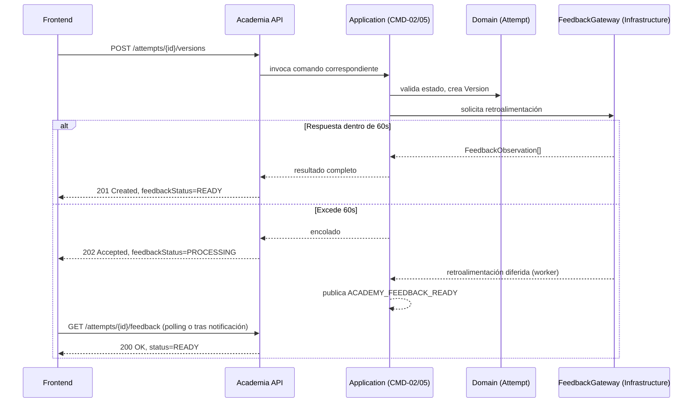
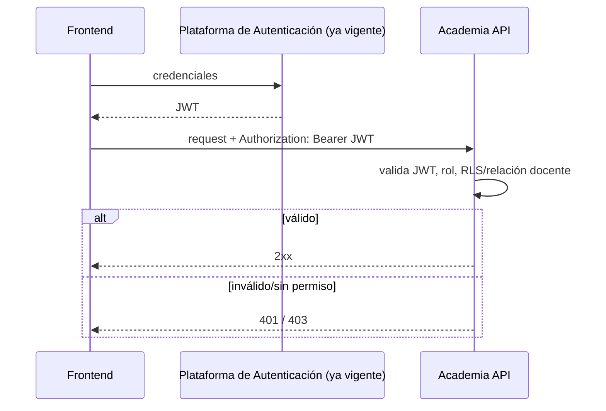
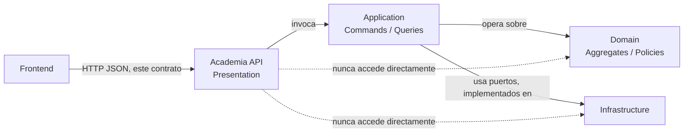

# ACADEMIA — API CONTRACT v1.3

**Estado:** DRAFT (pendiente de resolución de los puntos marcados PENDIENTE DE DECISIÓN DE API antes de congelarse)
**Fecha original:** 2026-07-19
**Fecha de esta revisión:** 2026-07-20
**Autor:** Principal API Architect, Rédaction Lab

**Historial de cambios**

| Versión | Fecha | ACP relacionado | Cambio |
|---|---|---|---|
| 1.0 | 2026-07-19 | — (versión inicial) | Documento original. |
| 1.1 | 2026-07-19 | ACP-001-A, ACP-001-B, ACP-001-C | Añadidos `EP-21` y `EP-22` (avance de paso y verificación de comprensión). Eliminada la ambigüedad de "grupo" en `EP-07`, `EP-08`, `EP-20` y retirada la marca `PENDIENTE DE DECISIÓN DE API #2` — decisión oficial: no existe `GroupId`, toda acción sobre "grupo" es selección múltiple orquestada por el Frontend sobre los endpoints ya existentes. Renombrado `ModelExampleDTO.comparativeComment` → `ModelExampleDTO.curatorialComment` (contenido estático del Administrador, no generado por IA en el alcance actual) — cierra la ambigüedad F-09. Ningún endpoint, DTO o regla de seguridad preexistente fue alterado más allá de lo aquí registrado. |
| 1.2 | 2026-07-20 | ACP-003 | **Teacher Review Visibility.** Añadido `EP-23` (historial académico detallado de un estudiante, vista docente), derivado 1:1 de `QRY-10 GetStudentUnitHistory` (Application Model v1.3). Añadido `StudentUnitHistoryDTO` (Sección 5) y el recurso `academy/students/{id}/units/{id}/history` (Sección 3). Ningún endpoint, DTO, regla de seguridad, código HTTP o convención preexistente fue modificado — cierra la inconsistencia detectada durante el Frontend Contract (Sección 4, P-13, Nota de alcance) entre el texto narrativo de la Functional Specification y la superficie de API disponible para el rol `TEACHER`. |
| 1.3 | 2026-07-20 | Reconciliación Documental (Sprint 4.2.2) | **R-04:** corregidas las referencias "Dependencias" de `EP-12` a `EP-20` (nueve endpoints), que citaban un `QRY-XX` distinto al que realmente produce cada DTO de respuesta — ver detalle en cada endpoint, Sección 4. `EP-19` citaba `QRY-08`, formalmente retirada desde ACP-002-B; corregida a `QRY-06`. **R-03:** retirado el campo `state` de `AttemptSummaryDTO` (Sección 5) — sin respaldo en el Application Model ni en el Domain Model, con riesgo de introducir un segundo estado paralelo a `UnitState` (Invariante 6). **R-02:** Sección 5 actualizada para que cada DTO compartido con el Application Model v1.4 tenga una única forma de campos — ver detalle DTO por DTO. Ningún endpoint fue añadido, eliminado o redefinido en su objetivo, verbo HTTP, código de respuesta o autorización; ningún Command, Query, Aggregate o regla de negocio fue modificado. |

**Documentos Frozen consumidos como contrato obligatorio (no modificados, salvo lo explícitamente registrado en el Historial de cambios de arriba):** Product Blueprint, Arquitectura General, Domain Model, Application Model v1.4, Academia Functional Specification v1.3, Academia Infrastructure Model v1.1, Platform Core Foundation v1.0 (en particular, el Notification Catalog y el tipo ya aprobado `ACADEMY_FEEDBACK_READY`). *(v1.3, R-09: referencias de versión actualizadas — antes citaba Application Model v1.1 y Functional Specification v1.1.)*

---

## 1. Objetivo

**Responsabilidad de este contrato.** Definir, de forma completa y sin ambigüedad, la superficie de comunicación HTTP entre el Frontend y el Backend del módulo Academia: qué recursos existen, qué operaciones admite cada uno, quién puede invocarlas y qué forma tiene cada intercambio de datos.

**Qué resuelve:** el mapeo 1:1 entre los 17 Commands y las 9 Queries activas (`QRY-08` retirada, ACP-002-B) ya definidos en el Application Model v1.4, y los 12 casos de uso de la Functional Specification v1.3, hacia una superficie REST concreta — sin agregar, quitar ni reinterpretar ninguno. *(v1.3, R-09: cifras y versiones actualizadas — antes citaba "15 Commands y 9 Queries... Application Model v1.0" y "11 casos de uso... v1.1".)*

**Qué no resuelve:**
- Ninguna regla de negocio (eso permanece en el Domain Model).
- Ninguna decisión de infraestructura (eso permanece en el Infrastructure Model).
- El diseño de pantallas, componentes visuales o estado de cliente — eso corresponde a la fase siguiente, **Frontend Contract**.
- La forma final serializada exacta (OpenAPI/Swagger) — este documento es el contrato de diseño; su expresión técnica formal es un artefacto derivado, no producido aquí.

---

## 2. Convenciones globales

**Versionado:** por prefijo de URI — `/api/v1/academy/...`. Ver estrategia completa en la Sección 10.

**Formato:** JSON en todo intercambio (`Content-Type: application/json` obligatorio en request y response). Nombres de campo en `camelCase`.

**Fechas:** ISO-8601 en UTC (`2026-07-19T14:30:00Z`) en todo timestamp de entrada o salida — sin excepción, sin zona horaria local embebida.

**Identificadores:** UUID v4 para todo identificador de recurso expuesto (`unitId`, `attemptId`, `versionId`, `modelExampleId`, `overrideId`, `recommendationId`). Decisión de este contrato, consistente con el uso ya establecido de Value Objects de identidad en el Domain Model — no se expone ningún identificador secuencial/incremental de base de datos.

**Paginación:** `limit`/`offset`, con `limit` máximo de 100 y valor por defecto de 20 en toda colección. Toda respuesta paginada incluye `total`, `limit`, `offset` en un envoltorio `meta`.

**Ordenamiento:** parámetro `sort` opcional, formato `campo:asc|desc`, solo sobre campos explícitamente documentados por endpoint (Sección 4) — ningún endpoint admite ordenamiento arbitrario no documentado.

**Filtros:** documentados por endpoint (Sección 4); ningún filtro implícito no declarado.

**Errores:** envoltorio uniforme, ver Sección 11.

**Correlación:** header `X-Correlation-Id` — opcional en el request (el cliente puede proveerlo); si no se provee, el Backend genera uno. Siempre presente en la respuesta, en el mismo header. Ver Sección 12.

**Headers obligatorios (todo request autenticado):**
- `Authorization: Bearer <JWT>`
- `Content-Type: application/json` (en requests con body)
- `Accept: application/json`

**Headers opcionales:**
- `X-Correlation-Id`
- `Idempotency-Key` (obligatorio únicamente en los endpoints marcados como idempotentes por clave en la Sección 4 — ver también Sección 2 nota de idempotencia)
- `Accept-Language` (para localización de mensajes de error/contenido, reutilizando el mecanismo i18n ya vigente a nivel de plataforma)

**Nota de idempotencia general:** todo endpoint `POST` que crea un recurso con efecto de negocio (inicia, envía, repite, anula, recomienda, crea contenido editorial) exige el header `Idempotency-Key`. El Backend debe devolver la misma respuesta ante una repetición con la misma clave dentro de una ventana de 24 horas, sin duplicar el efecto. Los endpoints `PUT`/`PATCH` son idempotentes por semántica HTTP estándar y no requieren esta clave.

---

## 3. Recursos

Recursos derivados exclusivamente de los Aggregates del Domain Model, los Commands/Queries del Application Model y los casos de uso de la Functional Specification v1.1 — ninguno inventado:

| Recurso | Origen | Corresponde a |
|---|---|---|
| `academy/units` | `AcademyUnit` (Aggregate) | CU-01, CU-07, `QRY-01`, `QRY-02` *(v1.3, R-04: antes `QRY-02`, `QRY-03`)* |
| `academy/attempts` | `Attempt` (Aggregate) | CU-01 a CU-06, `QRY-04` *(v1.3, R-04: antes `QRY-05`)* |
| `academy/attempts/{id}/draft` | `Draft` (Entity) | CU-03, CMD-03, lectura directa vía `AttemptRepository` (v1.3, R-04: antes citaba `QRY-06`; ver nota de `EP-17`) |
| `academy/attempts/{id}/versions` | `Version` (Entity) | CU-03, CU-05, CMD-02, CMD-05 |
| `academy/attempts/{id}/feedback` | `Feedback` (Entity) | CU-04, `QRY-05` *(v1.3, R-04: antes `QRY-07`)* |
| `academy/attempts/{id}/reflection` | Reflexión (paso 10 del recorrido, dentro de `Attempt`) | CU-06, CMD-07 |
| `academy/model-examples` | `ModelExample` (Aggregate) | CU-08, CMD-12/13/14, `QRY-06` *(v1.3, R-04: antes `QRY-08`, Query retirada)* |
| `academy/units/{id}/teacher-overrides` | `TeacherOverride` (Entity) | CU-10, CMD-10. *(Nota fuera de alcance de esta reconciliación: `QRY-09 GetTeacherOverrideHistory` no tiene endpoint de lectura correspondiente en la Sección 4 — detectado durante esta revisión, registrado para un futuro ACP; no autorizado por el alcance de R-02/R-03/R-04.)* |
| `academy/students/{id}/unit-recommendations` | Recomendación docente (registro independiente, resolución ARB CU-11) | CU-11, CMD-11 |
| `academy/progress-summary` | Vista agregada de `AcademyUnit` por estudiante | `QRY-07`, CU-09 *(v1.3, R-04: antes citaba `QRY-01, QRY-09`)* |
| `academy/continuation` | Vista de continuidad ("Continúa donde te quedaste") | `QRY-03`, A-06 *(v1.3, R-04: antes `QRY-04`)* |
| `academy/students/{id}/units/{id}/history` *(v1.2, ACP-003)* | Vista de solo lectura de `Attempt` (con `Version`/`Feedback`) y `AcademyUnit`, para el Profesor | QRY-10, CU-12 |

---

## 4. Endpoints

### EP-01 — Iniciar unidad
- **Objetivo:** iniciar el recorrido de una unidad desbloqueada (CU-01).
- **Método / URI:** `POST /api/v1/academy/units/{unitId}/attempts`
- **Autorización:** JWT válido + rol `STUDENT` + RLS (el estudiante solo puede operar sobre sus propias unidades).
- **Actor permitido:** Estudiante.
- **Parámetros:** `unitId` (path, UUID).
- **Request contract:** sin cuerpo.
- **Response contract:** `AttemptSummaryDTO` (Sección 5).
- **Códigos HTTP:** `201 Created` (nuevo intento); `200 OK` (ya existía un intento activo — se retorna el existente, sin duplicar, per CU-01 excepción).
- **Errores posibles:** `409 Conflict` (unidad en `LOCKED`); `404 Not Found` (unidad inexistente o no pertenece al estudiante).
- **Idempotencia:** requiere `Idempotency-Key`; repetición con misma clave retorna el mismo `Attempt`.
- **Eventos relacionados:** dispara `UnitStarted` (Domain Event, ya Frozen).
- **Dependencias:** `CMD-01 StartUnit`.

### EP-02 — Autoguardar borrador
- **Objetivo:** persistir el contenido en curso del estudiante de forma continua (A-06).
- **Método / URI:** `PUT /api/v1/academy/attempts/{attemptId}/draft`
- **Autorización:** JWT + rol `STUDENT` + RLS.
- **Actor permitido:** Estudiante.
- **Parámetros:** `attemptId` (path, UUID).
- **Request contract:** `{ content: string }`.
- **Response contract:** `DraftDTO`.
- **Códigos HTTP:** `200 OK`.
- **Errores posibles:** `404 Not Found` (intento inexistente/no pertenece al estudiante); `422 Unprocessable Entity` (contenido fuera del rango de longitud ya definido por `WordCountRange` en el Domain Model).
- **Idempotencia:** nativa por semántica `PUT` (mismo contenido → mismo resultado); no requiere `Idempotency-Key`.
- **Eventos relacionados:** ninguno de dominio (el autoguardado es un detalle de persistencia, no un Domain Event).
- **Dependencias:** `CMD-03 AutosaveDraft`.

### EP-03 — Enviar producción / reescritura
- **Objetivo:** registrar una nueva versión de la producción del estudiante — la primera (CU-03) o una reescritura posterior (CU-05).
- **Método / URI:** `POST /api/v1/academy/attempts/{attemptId}/versions`
- **Autorización:** JWT + rol `STUDENT` + RLS.
- **Actor permitido:** Estudiante.
- **Parámetros:** `attemptId` (path, UUID).
- **Request contract:** `{ content: string }`.
- **Response contract:** `VersionDTO`, con un campo `feedbackStatus: "READY" | "PROCESSING"`. Si `READY`, incluye el `FeedbackDTO` embebido (respuesta dentro de la ventana objetivo de 60s, Functional Spec Sección 11); si `PROCESSING`, el cliente debe consultar `EP-18` o esperar la notificación `ACADEMY_FEEDBACK_READY` (Platform Core Foundation, Notification Catalog).
- **Códigos HTTP:** `201 Created` con `feedbackStatus: READY`; `202 Accepted` con `feedbackStatus: PROCESSING`.
- **Errores posibles:** `422 Unprocessable Entity` (producción vacía/incompleta, CU-03 excepción; comprensión no verificada — ver PENDIENTE DE DECISIÓN DE API #1); `409 Conflict` (unidad no está en el paso correspondiente).
- **Idempotencia:** requiere `Idempotency-Key`.
- **Eventos relacionados:** `ProductionSubmitted` (primera versión) o evento equivalente de reescritura; `FeedbackRequested`; eventualmente `FeedbackDelivered`.
- **Dependencias:** `CMD-02 SubmitProduction` (primera versión) o `CMD-05 SubmitRevision` (subsiguientes) — la selección la determina el estado del `Attempt` en Application, no el cliente.

### EP-04 — Avanzar a fase de reflexión
- **Objetivo:** marcar que el estudiante concluyó su ciclo de reescritura y está listo para reflexionar (CU-06, previo).
- **Método / URI:** `PATCH /api/v1/academy/attempts/{attemptId}/phase`
- **Autorización:** JWT + rol `STUDENT` + RLS.
- **Actor permitido:** Estudiante.
- **Parámetros:** `attemptId` (path, UUID).
- **Request contract:** `{ targetPhase: "REFLECTION" }` — único valor válido para este endpoint.
- **Response contract:** `AttemptSummaryDTO` actualizado.
- **Códigos HTTP:** `200 OK`.
- **Errores posibles:** `409 Conflict` (no existe al menos un ciclo de reescritura completado, Regla funcional 5).
- **Idempotencia:** nativa por semántica `PATCH` hacia un estado objetivo explícito; repetir la misma solicitud sobre una unidad ya en `REFLECTION` retorna `200 OK` sin efecto adicional.
- **Eventos relacionados:** `RevisionStarted`/`ReflectionStarted` (ya documentados en el Domain Model como eventos de auditoría interna, H-11).
- **Dependencias:** `CMD-06 AdvanceToReflection`.

### EP-05 — Completar reflexión y cerrar unidad
- **Objetivo:** registrar las respuestas metacognitivas del estudiante y cerrar el ciclo de la unidad (CU-06).
- **Método / URI:** `POST /api/v1/academy/attempts/{attemptId}/reflection`
- **Autorización:** JWT + rol `STUDENT` + RLS.
- **Actor permitido:** Estudiante.
- **Parámetros:** `attemptId` (path, UUID).
- **Request contract:** `{ responses: string[] }` (respuestas a las preguntas metacognitivas presentadas).
- **Response contract:** `AcademyUnitDetailDTO` reflejando el nuevo estado (`COMPLETED`, y `MASTERED` si aplica de forma diferida — ver PENDIENTE DE DECISIÓN DE API, Sección 8 de este documento no cubre evaluación de `MASTERED` vía API pública, ver exclusión deliberada más abajo).
- **Códigos HTTP:** `201 Created`.
- **Errores posibles:** `409 Conflict` (unidad no está en fase `REFLECTION`).
- **Idempotencia:** requiere `Idempotency-Key`.
- **Eventos relacionados:** `ReflectionCompleted`, `UnitCompleted`, posible `EXTERNAL_ACTIVITY_COMPLETED` (hacia Mi Plan), posible desbloqueo de la siguiente unidad.
- **Dependencias:** `CMD-07 CompleteReflection` (patrón de sincronización Attempt→AcademyUnit, dos transacciones, ya definido en el Application Model — transparente para el cliente de la API, que recibe una única respuesta).

### EP-06 — Repetir unidad
- **Objetivo:** iniciar un nuevo recorrido sobre una unidad ya completada/dominada (CU-07).
- **Método / URI:** `POST /api/v1/academy/units/{unitId}/repetitions`
- **Autorización:** JWT + rol `STUDENT` + RLS.
- **Actor permitido:** Estudiante.
- **Parámetros:** `unitId` (path, UUID).
- **Request contract:** sin cuerpo.
- **Response contract:** `AttemptSummaryDTO` del nuevo intento.
- **Códigos HTTP:** `201 Created`.
- **Errores posibles:** `409 Conflict` (unidad no está en `COMPLETED`/`MASTERED`, CU-07 excepción).
- **Idempotencia:** requiere `Idempotency-Key`.
- **Eventos relacionados:** `UnitRepeated`.
- **Dependencias:** `CMD-09 RepeatUnit`.

### EP-07 — Aplicar anulación docente (bloqueo/reinicio forzado)
- **Objetivo:** forzar el bloqueo o el reinicio de una unidad de un estudiante (CU-10).
- **Método / URI:** `POST /api/v1/academy/units/{unitId}/teacher-overrides`
- **Autorización:** JWT + rol `TEACHER` + verificación de relación docente-estudiante.
- **Actor permitido:** Profesor.
- **Parámetros:** `unitId` (path, UUID).
- **Request contract:** `{ action: "FORCE_LOCK" | "FORCE_RESTART", reason: string }` (`reason` obligatorio, no vacío — Regla funcional 8).
- **Response contract:** `TeacherOverrideDTO`.
- **Códigos HTTP:** `201 Created`.
- **Errores posibles:** `403 Forbidden` (sin relación docente establecida); `409 Conflict` (acción no válida para el estado actual, CU-10 excepción).
- **Idempotencia:** requiere `Idempotency-Key`.
- **Eventos relacionados:** `TeacherOverrideApplied`.
- **Dependencias:** `CMD-10 ApplyTeacherOverride`.

### EP-08 — Recomendar unidad
- **Objetivo:** registrar una recomendación docente sobre una unidad, sin efecto de estado (CU-11, resolución ARB).
- **Método / URI:** `POST /api/v1/academy/students/{studentId}/unit-recommendations`
- **Autorización:** JWT + rol `TEACHER` + verificación de relación docente-estudiante.
- **Actor permitido:** Profesor.
- **Parámetros:** `studentId` (path, UUID).
- **Request contract:** `{ unitId: string }`.
- **Response contract:** `TeacherRecommendationDTO` (DTO no listado explícitamente en el Application Model v1.0 original — ver nota de trazabilidad más abajo).
- **Códigos HTTP:** `201 Created`.
- **Errores posibles:** `403 Forbidden` (sin relación docente establecida).
- **Idempotencia:** requiere `Idempotency-Key`.
- **Eventos relacionados:** ninguno de dominio — no invoca al Aggregate `AcademyUnit` (confirmado en el IRB de Infraestructura, Pendiente 1 del Infrastructure Model).
- **Dependencias:** `CMD-11 AssignUnitToStudent` (renombrado funcionalmente a "recomendar" por la resolución ARB del 2026-07-19).
- **Nota de trazabilidad:** `TeacherRecommendationDTO` no aparece en la lista original de DTOs del Application Model v1.0 (ese documento fue Frozen antes de que el ARB resolviera CU-11). Se define aquí como una extensión de Presentation/API, consistente con el `TeacherRecommendationRepository` ya definido en el Infrastructure Model — no reabre ni modifica el Application Model, que nunca tipificó este DTO por no tener aún la resolución funcional al momento de su cierre.

**Nota — representación de "grupo" en EP-07/EP-08** *(actualizada en v1.1, ACP-001-B)*: **no existe `Group` como entidad del dominio en Rédaction Lab v1.x, ni `GroupId`.** Toda referencia a "grupo" en la Functional Specification significa selección múltiple de estudiantes desde el Panel del Profesor — el Frontend invoca `EP-07`/`EP-08`/`EP-20` una vez por cada estudiante seleccionado. No se define ningún endpoint ni parámetro de grupo en este contrato; el marcador `PENDIENTE DE DECISIÓN DE API #2` queda retirado.

### EP-09 — Crear ejemplo de la Biblioteca de Modelos
- **Objetivo:** publicar un nuevo `ModelExample` (CU-08, soporte editorial).
- **Método / URI:** `POST /api/v1/academy/model-examples`
- **Autorización:** JWT + rol `ADMIN`.
- **Actor permitido:** Administrador.
- **Request contract:** `{ textType: TextType, content: string, rating: string, curatorialComment: string }` *(`curatorialComment` renombrado en v1.1, ACP-001-C — antes `comparativeComment`; `rating` incorporado en v1.3, R-02 — ya exigido por `CMD-12` en el Application Model desde v1.0 y ausente hasta ahora de este contrato)*.
- **Response contract:** `ModelExampleDTO`.
- **Códigos HTTP:** `201 Created`.
- **Errores posibles:** `422 Unprocessable Entity` (`textType` fuera del enum de 5 valores válidos).
- **Idempotencia:** requiere `Idempotency-Key`.
- **Eventos relacionados:** ninguno de dominio de Academia (contenido editorial, no progreso de estudiante).
- **Dependencias:** `CMD-12 CreateModelExample`.

### EP-10 — Actualizar ejemplo de la Biblioteca de Modelos
- **Método / URI:** `PATCH /api/v1/academy/model-examples/{modelExampleId}`
- **Autorización:** JWT + rol `ADMIN`.
- **Actor permitido:** Administrador.
- **Request contract:** `{ content?: string, curatorialComment?: string }` (campos parciales; campo renombrado en v1.1, ACP-001-C).
- **Response contract:** `ModelExampleDTO`.
- **Códigos HTTP:** `200 OK`.
- **Errores posibles:** `404 Not Found`.
- **Idempotencia:** nativa por semántica `PATCH`.
- **Dependencias:** `CMD-13 UpdateModelExample`.

### EP-11 — Retirar ejemplo de la Biblioteca de Modelos
- **Método / URI:** `DELETE /api/v1/academy/model-examples/{modelExampleId}`
- **Autorización:** JWT + rol `ADMIN`.
- **Actor permitido:** Administrador.
- **Request contract:** sin cuerpo.
- **Response contract:** `ModelExampleDTO` con `status: "RETIRED"` (borrado lógico, no físico — CU-08 excepción: "ejemplo retirado... se omite sin bloquear el flujo").
- **Códigos HTTP:** `200 OK`.
- **Errores posibles:** `404 Not Found`.
- **Idempotencia:** nativa (retirar dos veces produce el mismo estado final).
- **Dependencias:** `CMD-14 RetireModelExample`.

### EP-12 — Consultar mi resumen de progreso
- **Método / URI:** `GET /api/v1/academy/progress-summary`
- **Autorización:** JWT + rol `STUDENT` (implícito: el propio estudiante autenticado).
- **Actor permitido:** Estudiante.
- **Response contract:** `StudentProgressSummaryDTO`.
- **Códigos HTTP:** `200 OK`.
- **Dependencias:** `QRY-07 GetStudentProgressSummary`. *(v1.3, R-04: antes citaba `QRY-01`, que en el Application Model corresponde a `ListAcademyUnitsForStudent`, no a `StudentProgressSummaryDTO`.)*

### EP-13 — Consultar mapa de unidades
- **Método / URI:** `GET /api/v1/academy/units`
- **Autorización:** JWT + rol `STUDENT`.
- **Actor permitido:** Estudiante.
- **Parámetros:** `textType` (query, opcional, filtra por tipo de texto).
- **Response contract:** lista paginada de `AcademyUnitSummaryDTO`.
- **Códigos HTTP:** `200 OK`.
- **Dependencias:** `QRY-01 ListAcademyUnitsForStudent`. *(v1.3, R-04: antes citaba `QRY-02`, que en el Application Model corresponde a `GetAcademyUnitDetail`, no a un listado.)*

### EP-14 — Consultar detalle de una unidad
- **Método / URI:** `GET /api/v1/academy/units/{unitId}`
- **Autorización:** JWT + rol `STUDENT` + RLS.
- **Response contract:** `AcademyUnitDetailDTO`.
- **Códigos HTTP:** `200 OK`; `404 Not Found`.
- **Dependencias:** `QRY-02 GetAcademyUnitDetail`. *(v1.3, R-04: antes citaba `QRY-03`, que en el Application Model corresponde a `GetContinuationState`.)*

### EP-15 — Consultar estado de continuidad
- **Objetivo:** soportar "Continúa donde te quedaste" (A-06, §6.3).
- **Método / URI:** `GET /api/v1/academy/continuation`
- **Autorización:** JWT + rol `STUDENT`.
- **Response contract:** `ContinuationStateDTO` (`null`/`204 No Content` si no hay unidad en curso).
- **Códigos HTTP:** `200 OK`; `204 No Content`.
- **Dependencias:** `QRY-03 GetContinuationState`. *(v1.3, R-04: antes citaba `QRY-04`, que en el Application Model corresponde a `GetAttemptHistory`.)*

### EP-16 — Consultar historial de intentos de una unidad
- **Método / URI:** `GET /api/v1/academy/units/{unitId}/attempts`
- **Autorización:** JWT + rol `STUDENT` + RLS.
- **Response contract:** lista paginada de `AttemptSummaryDTO`.
- **Códigos HTTP:** `200 OK`.
- **Dependencias:** `QRY-04 GetAttemptHistory`. *(v1.3, R-04: antes citaba `QRY-05`, que en el Application Model corresponde a `GetVersionFeedback`.)*

### EP-17 — Consultar borrador actual
- **Método / URI:** `GET /api/v1/academy/attempts/{attemptId}/draft`
- **Autorización:** JWT + rol `STUDENT` + RLS.
- **Response contract:** `DraftDTO`.
- **Códigos HTTP:** `200 OK`; `404 Not Found`.
- **Dependencias:** lectura directa del `Draft` vigente del `Attempt`, vía `AttemptRepository` — el Application Model no define una Query `QRY-XX` nombrada de forma dedicada para este caso (proyección de un único campo ya persistido del Aggregate, sin necesidad de una Query independiente). *(v1.3, R-04: antes citaba `QRY-06`, que en el Application Model corresponde a `ListModelExamplesByTextType`, sin relación alguna con `DraftDTO`. No se introduce una Query nueva en el Application Model — corrección limitada a retirar la cita incorrecta.)*

### EP-18 — Consultar retroalimentación
- **Objetivo:** obtener la retroalimentación de una versión — incluye el caso de recuperación tras procesamiento asíncrono (EP-03, `202 Accepted`).
- **Método / URI:** `GET /api/v1/academy/attempts/{attemptId}/feedback`
- **Autorización:** JWT + rol `STUDENT` + RLS.
- **Response contract:** `FeedbackDTO` con `status: "READY" | "PROCESSING"`.
- **Códigos HTTP:** `200 OK` (en ambos estados — el cuerpo distingue vía `status`, no el código HTTP, para simplificar el polling del cliente); `404 Not Found` (versión sin solicitud de retroalimentación asociada).
- **Dependencias:** `QRY-05 GetVersionFeedback`. *(v1.3, R-04: antes citaba `QRY-07`, que en el Application Model corresponde a `GetStudentProgressSummary`.)*

### EP-19 — Consultar Biblioteca de Modelos
- **Método / URI:** `GET /api/v1/academy/model-examples`
- **Autorización:** JWT + rol `STUDENT` (consulta), `ADMIN` (gestión, ya cubierta por EP-09/10/11).
- **Parámetros:** `textType` (query, opcional).
- **Response contract:** lista paginada de `ModelExampleDTO` (`status: ACTIVE` únicamente para rol `STUDENT`).
- **Códigos HTTP:** `200 OK`.
- **Dependencias:** `QRY-06 ListModelExamplesByTextType`. *(v1.3, R-04: antes citaba `QRY-08`, Query formalmente retirada desde ACP-002-B — `QRY-08` no existe como Query activa del Application Model; su identificador quedó reservado, no reutilizado, precisamente para evitar esta clase de referencia. Corregido a `QRY-06`, la Query real que produce `ModelExampleDTO[]`.)*

### EP-20 — Consultar progreso de un estudiante (vista docente)
- **Objetivo:** soportar CU-09 (revisión de progreso agregado por el Profesor).
- **Método / URI:** `GET /api/v1/academy/students/{studentId}/progress-summary`
- **Autorización:** JWT + rol `TEACHER` + verificación de relación docente-estudiante.
- **Actor permitido:** Profesor.
- **Response contract:** `StudentProgressSummaryDTO`.
- **Códigos HTTP:** `200 OK`; `403 Forbidden` (sin relación docente establecida, CU-09 excepción).
- **Dependencias:** `QRY-07 GetStudentProgressSummary` (mismo Query que respalda `EP-12`, invocado aquí con verificación adicional de relación docente-estudiante). *(v1.3, R-04: antes citaba `QRY-09`, que en el Application Model corresponde a `GetTeacherOverrideHistory`.)*

### EP-21 — Avanzar paso de contenido *(v1.1, ACP-001-A)*
- **Objetivo:** avanzar el recorrido por los pasos de contenido previos a la producción (CU-02).
- **Método / URI:** `PATCH /api/v1/academy/attempts/{attemptId}/step`
- **Autorización:** JWT + rol `STUDENT` + RLS.
- **Actor permitido:** Estudiante.
- **Parámetros:** `attemptId` (path, UUID).
- **Request contract:** sin cuerpo (avanza siempre al siguiente paso elegible de la secuencia oficial).
- **Response contract:** `AttemptSummaryDTO` actualizado (`currentStep` avanzado).
- **Códigos HTTP:** `200 OK`.
- **Errores posibles:** `409 Conflict` (el intento está en `COMPREHEND` o en un paso posterior a `PRACTICE`, donde este endpoint no aplica — ver EP-22/EP-03).
- **Idempotencia:** requiere `Idempotency-Key` (cada llamada exitosa mueve el paso; un reintento sin protección duplicaría el avance).
- **Eventos relacionados:** ninguno de dominio (mismo criterio que `CMD-16`).
- **Dependencias:** `CMD-16 AdvanceStep`.

### EP-22 — Verificar comprensión *(v1.1, ACP-001-A)*
- **Objetivo:** registrar la verificación de comprensión de la consigna, requisito previo a la producción (CU-02, RN-2).
- **Método / URI:** `POST /api/v1/academy/attempts/{attemptId}/comprehension`
- **Autorización:** JWT + rol `STUDENT` + RLS.
- **Actor permitido:** Estudiante.
- **Parámetros:** `attemptId` (path, UUID).
- **Request contract:** `{ comprehensionResponse: string }`.
- **Response contract:** `AttemptSummaryDTO` actualizado (`currentStep == OBSERVE` si la verificación fue satisfactoria).
- **Códigos HTTP:** `200 OK` (verificación satisfactoria, avanza); `422 Unprocessable Entity` (verificación insuficiente — el estudiante permanece en `COMPREHEND` para reintentar, CU-02 excepción).
- **Errores posibles:** `409 Conflict` (el intento no está en el paso `COMPREHEND`).
- **Idempotencia:** requiere `Idempotency-Key`.
- **Eventos relacionados:** ninguno de dominio (mismo criterio que `CMD-17`).
- **Dependencias:** `CMD-17 VerifyComprehension`.

### EP-23 — Consultar historial académico detallado de un estudiante (vista docente) *(v1.2, ACP-003 — Teacher Review Visibility)*
- **Objetivo:** exponer al Profesor, para un estudiante y una unidad específicos, el estado/progreso de la unidad y el historial completo de intentos con sus versiones y retroalimentación (CU-12, Functional Specification v1.3) — cierra la inconsistencia entre el texto narrativo de la Functional Specification (Secciones 2/6) y la ausencia previa de endpoint para esta capacidad.
- **Método / URI:** `GET /api/v1/academy/students/{studentId}/units/{unitId}/history`
- **Autorización:** JWT + rol `TEACHER` + verificación de relación docente-estudiante (mismo mecanismo ya usado por `EP-07`/`EP-08`/`EP-20`).
- **Actor permitido:** Profesor.
- **Parámetros:** `studentId` (path, UUID), `unitId` (path, UUID).
- **Request contract:** sin cuerpo.
- **Response contract:** `StudentUnitHistoryDTO` (Sección 5).
- **Códigos HTTP:** `200 OK`.
- **Errores posibles:** `403 Forbidden` (sin relación docente establecida, mismo criterio que `EP-20`); `404 Not Found` (unidad inexistente o sin ningún intento del estudiante — se documenta como `404`, no como lista vacía, para distinguir "unidad no existe para este estudiante" de "unidad existe, aún sin intentos"; en este último caso el Backend retorna `200 OK` con `attempts: []`).
- **Idempotencia:** no aplica (`GET`).
- **Eventos relacionados:** ninguno (lectura pura, no invoca ningún Aggregate).
- **Dependencias:** `QRY-10 GetStudentUnitHistory`.

### Exclusiones deliberadas (Commands sin endpoint público — no son omisiones)

| Command | Motivo de exclusión |
|---|---|
| `CMD-04 RecordFeedbackDelivered` | Invocado internamente por el pipeline de IA de Infrastructure (`FeedbackGateway`/worker asíncrono), nunca directamente por el Frontend. El estudiante lo observa a través de EP-03/EP-18, nunca lo invoca. |
| `CMD-08 EvaluateMastery` | Evaluación automática disparada por Application tras eventos calificables (no es una acción explícita de ningún caso de uso de la Functional Specification — ningún CU-01 a CU-11 describe al estudiante "solicitando" ser evaluado para `MASTERED`). No expuesto como endpoint. |
| `CMD-15 ProvisionAcademyUnitsForStudent` | Disparado por el proceso de alta/matriculación del estudiante (fuera del límite de contexto de Academia — ningún caso de uso de la Functional Specification lo describe como acción del estudiante o del Profesor dentro de Academia). No expuesto como endpoint público de este módulo. |

---

## 5. DTO Contracts

**Nota de reconciliación (v1.3, Sprint 4.2.2 — R-02/R-03):** desde esta revisión, la definición oficial de cada DTO compartido con el Application Model es la de `academia-application-model-v1.4-2026-07-20.md`, Sección 6. Esta sección lista, por transparencia, la misma forma (sin redefinirla) e indica explícitamente cada corrección aplicada.

- **`AcademyUnitSummaryDTO`**: `unitId`, `studentId`, `textType`, `state` (uno de los 8 valores ya Frozen), `position`, `unlockedAt?`, `completedAt?`, `masteredAt?`, `attemptCount`, `eligibleForUnlock?`, `repeatable?`, `isRecommended` (booleano, derivado de la existencia de una recomendación docente activa — no almacenado en el Aggregate). *(v1.3, R-02: se incorporan `studentId`, `unlockedAt?`, `completedAt?`, `masteredAt?`, `attemptCount`, `eligibleForUnlock?`, `repeatable?`, ya presentes en el Application Model v1.3 y ausentes de esta sección hasta ahora.)*
- **`AcademyUnitDetailDTO`**: extiende `AcademyUnitSummaryDTO` + `activeAttemptId?` (nulo si no hay intento en curso) + `attemptsCount` + `teacherOverrideCount`. *(v1.3, R-02: se incorpora `teacherOverrideCount` — dato distinto de `attemptsCount`, ausente hasta ahora de esta sección.)*
- **`AttemptSummaryDTO`**: `attemptId`, `unitId`, `currentStep` (uno de los 11 valores del `UnitStep`), `startedAt`, `isCurrent`, `versionCount`. *(v1.3, R-03: retirado el campo `state` — `Attempt` no posee ningún estado propio distinto de `UnitState` (Invariante 6 del Domain Model); `currentStep` ya es su única información de posición. Se incorporan `isCurrent`/`versionCount`, ya presentes en el Application Model v1.3.)*
- **`ContinuationStateDTO`**: `unitId`, `attemptId`, `currentStep`, `draftContent?` (texto + conteo de palabras/caracteres), `lastSavedAt`. *(v1.3, R-02: se incorpora `draftContent?`, ausente hasta ahora de esta sección — sin él, `EP-15` no podía por sí solo satisfacer la restauración exacta de contenido exigida por A-06/Regla funcional 10. Campo renombrado de `lastActivityAt` a `lastSavedAt`, consistente con `DraftDTO`.)*
- **`DraftDTO`**: `attemptId`, `content`, `wordCount`, `characterCount`, `lastSavedAt`. *(v1.3, R-02: se incorpora `characterCount`, ya presente en el Application Model v1.3 y ausente hasta ahora de esta sección.)*
- **`VersionDTO`**: `versionId`, `attemptId`, `versionNumber`, `content`, `submittedAt`, `feedbackStatus`. *(Sin cambios de campos en v1.3 — ya era la forma más completa; adoptada como oficial.)*
- **`FeedbackObservationDTO`**: `category` (uno de los 10 valores de `FeedbackCategory`), `priority` (entero, ya definido en el Domain Model v1.1 tras H-07), `strength` (`STRENGTH`/`WEAKNESS`), `explanation`, `suggestion`. *(Sin cambios — ya idéntico entre ambos documentos.)*
- **`FeedbackDTO`**: `feedbackId`, `versionId`, `versionNumber`, `status` (`READY`/`PROCESSING`), `observations` (lista de `FeedbackObservationDTO`, ordenada por `priority` ascendente — macro antes que micro), `deliveredAt` (nulo si `PROCESSING`). *(v1.3, R-02: se incorpora `versionNumber`, ya presente en el Application Model v1.3. Campo renombrado de `generatedAt` a `deliveredAt`, alineado con el Domain Event `FeedbackDelivered` que lo origina.)*
- **`ModelExampleDTO`**: `modelExampleId`, `textType`, `content`, `rating` (excelente/con errores), `curatorialComment` *(renombrado en v1.1, ACP-001-C — antes `comparativeComment`; contenido estático, autoría del Administrador vía `EP-09`/`EP-10`, no generado dinámicamente por IA en el alcance actual — una futura generación dinámica por IA, si se aprueba, se expondría como un campo adicional y separado, mediante un ACP independiente)*, `status` (`ACTIVE`/`RETIRED`). *(v1.3, R-02: se incorpora `rating`, ya presente en el Application Model v1.3 y ausente hasta ahora de esta sección — conviven con `status` por representar conceptos distintos: calificación editorial vs. ciclo de vida de publicación. Cierra el residuo registrado desde ACP-002.)*
- **`TeacherOverrideDTO`**: `overrideId`, `unitId`, `action` (`FORCE_LOCK`/`FORCE_RESTART`), `reason`, `appliedBy`, `appliedAt`. *(Sin cambios de campos en v1.3 — ya era la forma más completa; adoptada como oficial.)*
- **`TeacherRecommendationDTO`** *(extensión de Presentation, ver nota de EP-08)*: `recommendationId`, `studentId`, `unitId`, `recommendedBy`, `recommendedAt`. *(Sin cambios — este DTO solo se define aquí; el Application Model lo referencia sin redefinirlo.)*
- **`StudentProgressSummaryDTO`**: `studentId`, `unitsByState` (conteo por cada uno de los 8 estados), `unitsByTextType` (conteo por cada uno de los 5 tipos de texto). *(Sin cambios de campos en v1.3 — nomenclatura ya adoptada como oficial en ambos documentos.)*
- **`StudentUnitHistoryDTO`** *(v1.2, ACP-003 — Teacher Review Visibility)*: `studentId`, `unitId`, `unitState`, `attemptsCount`, `attempts` (lista de `AttemptSummaryDTO`, definición oficial de esta misma sección tras R-03, cada uno acompañado de `versions`: lista de `VersionDTO`, definición oficial de esta misma sección, con `feedback` (`FeedbackDTO`, definición oficial de esta misma sección) embebido cuando existe — mismo patrón de composición ya usado en el Response contract de `EP-03`). Ningún campo nuevo fuera de los ya definidos en `AttemptSummaryDTO`/`VersionDTO`/`FeedbackDTO`.

---

## 6. Validaciones

Validaciones visibles desde la API (no se repiten invariantes internas del Domain Model, solo su punto de exposición):

- Todo `content` de `Draft`/`Version` debe respetar el rango de longitud ya definido por el Value Object `WordCountRange` — el API rechaza con `422` antes de invocar Application si el tamaño excede un límite razonable de payload (protección de transporte, no regla de negocio).
- `TeacherOverride.reason` es obligatorio y no puede ser una cadena vacía (Regla funcional 8) — validado en el borde de la API antes de invocar `CMD-10`.
- `ModelExample.textType` debe pertenecer al enum `TextType` de 5 valores ya Frozen — cualquier otro valor es rechazado con `422` sin llegar a Application.
- Todo `unitId`/`attemptId`/`modelExampleId`/`studentId` en la URI debe tener formato UUID v4 válido — de lo contrario, `400 Bad Request` antes de cualquier verificación de autorización o existencia.
- El header `Idempotency-Key`, cuando es requerido (ver Sección 2), debe ser una cadena no vacía; su ausencia en un endpoint que lo exige produce `400 Bad Request`.

---

## 7. Seguridad

**JWT:** todo request autenticado exige un JWT válido emitido por el mecanismo de autenticación ya vigente a nivel de plataforma (reutilizado, no nuevo — consistente con el Infrastructure Model, Sección 8).

**Scopes/Roles:** se reutiliza exactamente el catálogo de roles ya reconocido como componente del Platform Core (`Permission Catalog`, STUDENT/TEACHER/ADMIN/SUPER_ADMIN/REVIEWER/AI_SERVICE/SYSTEM) — Academia no define scopes propios.

**Permisos:** aplicados exactamente según la matriz de la Functional Specification v1.1, Sección 2, ya reflejada endpoint por endpoint en la Sección 4 de este documento.

**Rate limiting:** **PENDIENTE DE DECISIÓN DE API** (#3) — ningún documento Frozen define umbrales de tasa de solicitudes para Academia ni para la plataforma en general. Se recomienda resolverlo a nivel de Platform Core (no específico de Academia), dado que es, por naturaleza, un componente transversal (ver Platform Core Foundation, Sección 3, criterio de pertenencia).

**CSRF:** no aplica. La autenticación de este contrato es exclusivamente por `Authorization: Bearer <JWT>`, no por cookies de sesión — el vector CSRF no existe bajo este esquema.

**CORS:** se hereda la política CORS ya vigente a nivel de plataforma; Academia no define una política propia.

---

## 8. Integración con IA

Este contrato **no expone** ningún endpoint que hable directamente con el proveedor de IA — esa comunicación ocurre íntegramente dentro de Infrastructure (`FeedbackGateway`, ya definido), invisible para el Frontend.

**Contrato observable desde la API:** `EP-03` (enviar producción/reescritura) es el único punto donde la API refleja el comportamiento híbrido ya congelado (Functional Spec v1.1, Sección 11): si el proveedor responde dentro de la ventana objetivo, la respuesta HTTP incluye la retroalimentación completa (`201 Created`, `feedbackStatus: READY`); si no, la respuesta es `202 Accepted` con `feedbackStatus: PROCESSING`, y el cliente debe recuperar el resultado vía `EP-18` (polling) o esperar la notificación `ACADEMY_FEEDBACK_READY` (Sección 9). El API Contract no expone timeouts, reintentos ni el estado del Circuit Breaker — esos son detalles de Infrastructure, no del contrato con el Frontend.

---

## 9. Notificaciones

Se usa exclusivamente el Notification Catalog ya aprobado en Platform Core Foundation v1.0. Academia, a través de este contrato, no define ningún tipo de notificación nuevo — reutiliza el ya aprobado:

- **`ACADEMY_FEEDBACK_READY`** (audiencia `STUDENT`, naturaleza `ACTION_REQUIRED`): emitido cuando una retroalimentación solicitada en modo `PROCESSING` (EP-03) queda lista. El Frontend se suscribe a este tipo a través del mecanismo de entrega de notificaciones ya vigente a nivel de plataforma (fuera del alcance de este documento) — este API Contract no define un endpoint de "recibir notificación"; documenta únicamente que este es el evento que el Frontend debe esperar tras un `202 Accepted` de EP-03.

Ningún otro tipo de `NotificationEvent` es emitido por Academia según los documentos Frozen revisados.

---

## 10. Versionado

**Estrategia:** versionado por prefijo de URI (`/api/v1/academy/...`). Cambios aditivos y compatibles hacia atrás (nuevos campos opcionales en response, nuevos endpoints) no requieren nueva versión. Cualquier cambio incompatible (renombrar/eliminar un campo, cambiar un tipo, alterar el significado de un código HTTP ya documentado) exige `/v2/` completo.

**Backward compatibility:** ningún campo documentado en un DTO se elimina ni cambia de tipo dentro de la misma versión mayor; solo se permite agregar campos opcionales.

**Deprecación:** un endpoint o campo deprecado se marca explícitamente en la documentación técnica derivada (fuera de este documento) con una fecha de retiro mínima de un ciclo de release completo — mismo principio ya establecido en el Platform Core Foundation, Sección 8, aplicado aquí de forma consistente.

---

## 11. Errores

**Envoltorio uniforme (todo error, cualquier endpoint):**
```
{
  "code": string,
  "message": string,
  "correlationId": string,
  "details"?: object
}
```

**Catálogo de códigos HTTP usados por este contrato:**

| Código | Significado en este contrato |
|---|---|
| `400` | Solicitud malformada (formato de identificador inválido, header requerido ausente). |
| `401` | JWT ausente o inválido. |
| `403` | Autenticado pero sin autorización sobre el recurso (relación docente-estudiante no establecida, rol insuficiente). |
| `404` | Recurso inexistente o fuera del alcance del actor (nunca se distingue de "no autorizado" cuando la distinción revelaría información sensible — a definir junto con el Error Catalog general). |
| `409` | Conflicto de estado (acción no válida para el estado actual del Aggregate). |
| `422` | Violación de una regla visible desde la API (contenido vacío, tipo de texto inválido, motivo de anulación vacío). |
| `429` | Límite de tasa excedido — umbral pendiente, ver Sección 7. |
| `500` / `503` | Error técnico interno / servicio no disponible. |

**Relación con el Error Catalog futuro:** el envoltorio y los códigos HTTP arriba definidos son estables y no requieren modificación; el valor exacto de `code` (taxonomía completa de códigos de negocio, p. ej. `ACADEMY_UNIT_LOCKED`, `ACADEMY_OVERRIDE_REASON_REQUIRED`) depende del **Error Catalog**, identificado en el Platform Core Foundation como componente pendiente de documento individual (aún no diseñado). **PENDIENTE DE DECISIÓN DE API** (#4): la lista exhaustiva de códigos de negocio de Academia no puede cerrarse hasta que el Error Catalog del Platform Core exista formalmente — este documento reserva el campo `code` sin fijar su vocabulario completo.

---

## 12. Observabilidad

**Correlation Id:** propagado vía `X-Correlation-Id` (Sección 2), reutilizando exactamente el mecanismo ya definido en el Infrastructure Model, Sección 10 — el mismo identificador atraviesa las dos transacciones del patrón Attempt→AcademyUnit y la llamada al Gateway de IA.

**Request Id:** cada request recibe un identificador único generado por el Backend, incluido en la respuesta (`X-Request-Id`), distinto del `Correlation Id` (que puede abarcar múltiples requests de un mismo flujo de usuario).

**Tracing:** cada endpoint queda instrumentado dentro de la infraestructura de tracing ya vigente a nivel de plataforma (Infrastructure Model, Sección 11) — sin instrumentación adicional específica de API.

**Logs:** todo request/response se registra siguiendo exactamente las restricciones ya definidas en el Infrastructure Model, Sección 10 (nunca contenido íntegro de `Draft`/`Version`/`Feedback` en logs de nivel INFO/DEBUG).

---

## 13. Performance

**Paginación:** obligatoria en toda colección (Sección 2) — ningún endpoint de listado retorna una colección sin acotar.

**Batching:** no se definen endpoints de operación por lotes — ningún documento Frozen exige una operación batch, y este contrato no la inventa.

**Compresión:** `gzip` estándar a nivel de transporte, heredado de la configuración ya vigente a nivel de plataforma — sin decisión específica de Academia.

**Caching HTTP:** `Cache-Control` habilitado únicamente en `EP-19` (Biblioteca de Modelos, lectura de baja frecuencia de cambio, consistente con el Infrastructure Model Sección 12); explícitamente deshabilitado (`Cache-Control: no-store`) en todo endpoint que refleje estado en curso de un `Attempt`/`AcademyUnit` (EP-03 a EP-08, EP-12 a EP-18) — mismo principio ya fijado en el Infrastructure Model: nunca cachear una lectura que participe en una decisión de negocio en curso.

**Timeouts:** `EP-03` sigue exactamente los umbrales ya congelados (60s objetivo / 3min máximo antes de retornar `202 Accepted`); el resto de endpoints usa el timeout estándar de plataforma (no específico de Academia).

---

## 14. Diagramas

### 14.1 Flujo request-response (ejemplo: EP-03)



### 14.2 Autenticación



### 14.3 Interacción Frontend ↔ API ↔ Application



---

## 15. Checklist

- [ ] Todo endpoint documentado en la Sección 4 corresponde a exactamente un Command o Query ya Frozen — ninguno inventado.
- [ ] Ningún endpoint carece de autorización y actor permitido documentados.
- [ ] Todo DTO de la Sección 5 tiene un propósito trazable a un caso de uso o Command/Query.
- [ ] Ningún endpoint retorna contenido íntegro de otro estudiante (verificable contra RLS, ya definido en Infrastructure Model).
- [ ] Todo endpoint de escritura con efecto de negocio exige `Idempotency-Key`, salvo `PUT`/`PATCH` (idempotentes por semántica HTTP).
- [ ] El envoltorio de error (Sección 11) es uniforme en el 100% de las respuestas de error.
- [ ] Ningún endpoint cachea una lectura que participe en una decisión de negocio en curso (Sección 13).
- [ ] Los tres Commands excluidos deliberadamente (CMD-04, CMD-08, CMD-15) están documentados como exclusión consciente, no como omisión.
- [ ] Los puntos `PENDIENTE DE DECISIÓN DE API` restantes están señalados explícitamente, sin comportamiento asumido.

---

## PENDIENTES DE DECISIÓN DE API — resumen *(actualizado en v1.1)*

1. ~~Verificación de comprensión (CU-02, pasos 1–6 del recorrido).~~ **Cerrado en v1.1 (ACP-001-A)** — ver `EP-21`, `EP-22`.
2. ~~Representación de "grupo" (CU-09, CU-11).~~ **Cerrado en v1.1 (ACP-001-B)** — decisión oficial: no existe `GroupId`; selección múltiple orquestada por el Frontend sobre `EP-07`/`EP-08`/`EP-20`.
3. **Umbrales de rate limiting.** Sin cambios — fuera del alcance de ACP-001. Ningún documento Frozen los define; se recomienda resolverlos a nivel de Platform Core, no de Academia.
4. **Vocabulario completo del campo `code` de error.** Sin cambios — fuera del alcance de ACP-001. Depende del Error Catalog del Platform Core, aún no diseñado como documento individual.

---

## VALIDACIÓN FINAL — Auditoría automática *(actualizada en v1.3)*

| Verificación | Resultado |
|---|---|
| ✓ No se modificó ningún documento Frozen | **Cumple.** Domain Model, Functional Specification y resoluciones A-01–A-10 permanecen intactos. La reconciliación v1.3 (R-02/R-03/R-04) es exclusivamente documental — sin efecto de comportamiento. |
| ✓ Todos los endpoints provienen de casos de uso existentes | **Cumple.** `EP-21`/`EP-22` trazan a `CMD-16`/`CMD-17`; `EP-23` traza a `QRY-10`. Las tres exclusiones deliberadas (CMD-04, CMD-08, CMD-15) siguen documentadas. |
| ✓ No se inventaron recursos | **Cumple.** |
| ✓ No existen endpoints sin autorización definida | **Cumple.** |
| ✓ Todos los DTOs tienen un propósito y una única forma oficial | **Cumple desde v1.3 (R-02/R-03).** Cada DTO compartido con el Application Model v1.4 tiene ahora una única forma de campos; `AttemptSummaryDTO` ya no contiene el campo `state` sin respaldo. |
| ✓ Toda referencia "Dependencias" cita la Query real que produce el DTO declarado | **Cumple desde v1.3 (R-04).** Corregidas las nueve referencias `EP-12`–`EP-20`; ninguna cita ya a `QRY-08` (retirada). |
| ✓ El contrato es suficiente para implementar Backend y Frontend en paralelo | **Cumple.** Los 12 casos de uso de la Functional Specification tienen cobertura completa de endpoint, sin vacío estructural ni ambigüedad de referencia cruzada pendiente. |

---

## DICTAMEN FINAL *(revisado en v1.3)*

**READY FOR FRONTEND CONTRACT**

**Justificación:** los motivos que sostenían el dictamen `REQUIRES API REVIEW` de v1.0 fueron cerrados en revisiones previas (ACP-001-A, ACP-001-B). La reconciliación documental de v1.3 (Sprint 4.2.2) cierra, adicionalmente y sin reabrir ninguna decisión funcional, las tres inconsistencias de trazabilidad documental detectadas por la Reconciliación Arquitectónica del 2026-07-20: divergencia de forma de DTOs compartidos con el Application Model (R-02), un campo sin respaldo en `AttemptSummaryDTO` con riesgo sobre la Invariante 6 del Domain Model (R-03), y una desalineación de numeración `QRY-XX` en nueve endpoints, incluida una referencia a una Query retirada (R-04). Los Pendientes #3 (rate limiting) y #4 (vocabulario del Error Catalog) permanecen abiertos — son de naturaleza transversal de plataforma, no bloquean el diseño de pantallas ni la construcción de Frontend Contract, y se resuelven de forma independiente a nivel de Platform Core.
