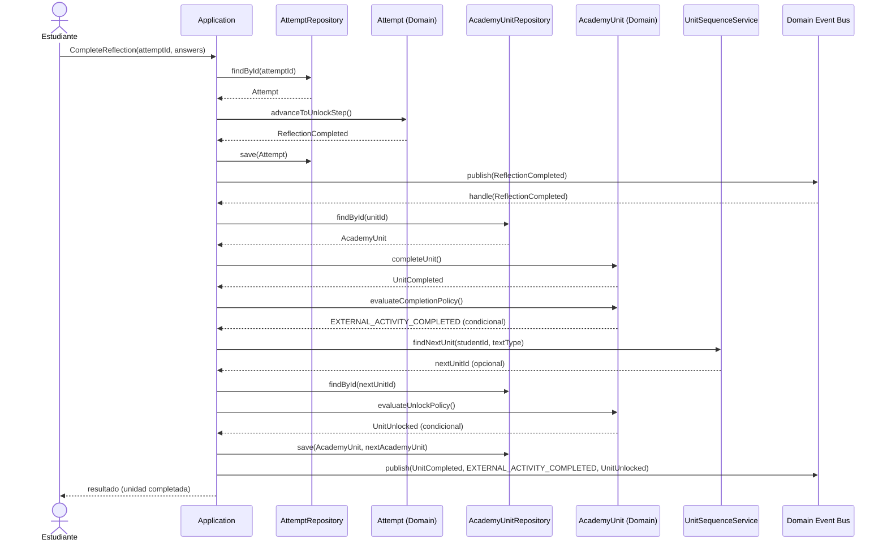
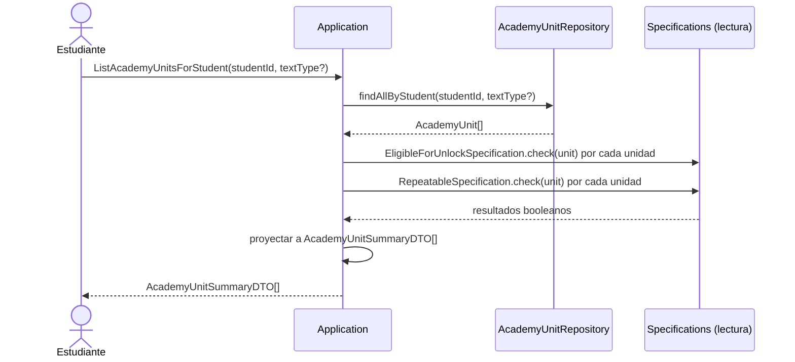
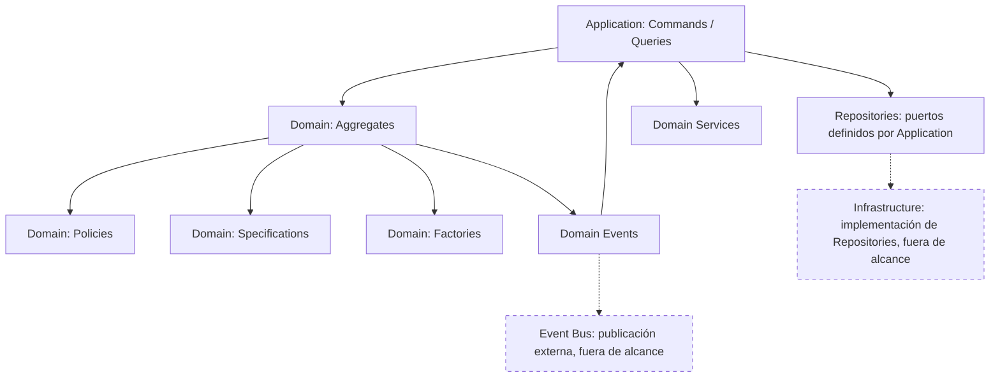

# Academia Application Model v1.3

**Contrato de dominio congelado (no modificado):** `docs/audits/academia-domain-model-v1.1-2026-07-19.md`. **Fecha original:** 2026-07-19. **Fecha de esta revisión:** 2026-07-20.
**Alcance:** exclusivamente el modelo de la capa Application (casos de uso, Commands, Queries, DTOs, orquestación, errores, transacciones, idempotencia, logging, auditoría, seguridad, performance). No contiene código, pseudocódigo, clases, NestJS ni Prisma. Toda ausencia de información en el Domain Model se marca explícitamente como **PENDIENTE DE DECISIÓN DE ARQUITECTURA**, sin inventar comportamiento.

**Historial de cambios**

| Versión | Fecha | ACP relacionado | Cambio |
|---|---|---|---|
| 1.0 | 2026-07-19 | — (versión inicial) | Documento original. |
| 1.1 | 2026-07-19 | ACP-001-A | Incorporados `CMD-16 AdvanceStep` y `CMD-17 VerifyComprehension`, cerrando el Hallazgo F-01 de la Coverage Audit (pasos 1–6 del recorrido de una unidad, CU-02, sin orquestación). Ningún Command, Query, DTO, Policy o Aggregate preexistente fue modificado. El Domain Model no fue tocado — `CMD-16`/`CMD-17` operan sobre la capacidad de transición de `UnitStep` que el propio `Attempt` ya debía sostener para que el enum de 11 valores y la precondición de comprensión ya referenciada en `CMD-02` ("puerta de comprensión del paso `COMPREHEND` satisfecha, RN-2") fueran coherentes desde v1.0. `CMD-11` (AssignUnitToStudent) y `QRY-08` (GetGroupProgressSummary) **no fueron modificados** en esta revisión — este documento no fue listado como afectado por ACP-001-B; ver "FUERA DEL ALCANCE DE ACP-001" en el Registro de Ejecución del ACP-001. |
| 1.2 | 2026-07-20 | ACP-002-A, ACP-002-B, ACP-002-C | **ACP-002-A:** `CMD-11 AssignUnitToStudent` alineado con la decisión oficial vigente (recomendación pedagógica, sin efecto de estado, ya reflejada en Functional Specification v1.2 CU-11 e API Contract v1.1 EP-08 desde ACP-001) — eliminado el marcador `PENDIENTE DE DECISIÓN DE ARQUITECTURA` y el texto que declaraba el Command no orquestable; documentados flujo, precondiciones, postcondiciones y referencias cruzadas usando el `TeacherRecommendationRepository` ya definido en el Infrastructure Model v1.1 (sin componente nuevo). **ACP-002-B:** retirado `QRY-08 GetGroupProgressSummary` — no existe `Group` ni `GroupId` como entidad; el progreso por selección múltiple se resuelve mediante invocaciones independientes de `QRY-07 GetStudentProgressSummary` por cada `studentId` seleccionado desde el Frontend (mismo patrón ya vigente para `EP-20` en el API Contract v1.1 y CU-09 en la Functional Specification v1.2). **ACP-002-C:** renombrado `aiCommentary` → `curatorialComment` en `CMD-12 CreateModelExample` y en `ModelExampleDTO` (Sección 6), alineando la nomenclatura con Infrastructure Model v1.1 y API Contract v1.1 (ambos ya usaban `curatorialComment` desde ACP-001-C). Ningún otro Command, Query, DTO, Policy, Aggregate o regla de negocio fue modificado; el Domain Model no fue tocado. |
| 1.3 | 2026-07-20 | ACP-003 | **Teacher Review Visibility.** Incorporado `QRY-10 GetStudentUnitHistory` — permite al Profesor consultar, para un estudiante y una unidad, el estado/progreso de la unidad y el historial completo de intentos con sus versiones y retroalimentación asociada (cierra la inconsistencia detectada durante el Frontend Contract entre el texto narrativo de la Functional Specification, Secciones 2/6, y la ausencia de Query/endpoint correspondiente). El Query reutiliza exclusivamente `AcademyUnitRepository` y `AttemptRepository`, ya existentes — ningún Repository, Aggregate, Value Object, Domain Event ni Command fue creado o modificado; el Domain Model no fue tocado. Nuevo DTO `StudentUnitHistoryDTO` (Sección 6), compuesto exclusivamente por campos ya existentes en `AttemptSummaryDTO`, `VersionDTO` y `FeedbackDTO`, sin introducir ningún concepto de dominio nuevo. |

---

## 1. Objetivo de la capa Application

**Responsabilidades.** Orquestar los casos de uso del módulo Academia: cargar Aggregates a través de puertos de Repository, invocar el comportamiento propio de cada Aggregate (nunca mutar su estado por fuera de sus propios métodos), coordinar la sincronización entre `AcademyUnit` y `Attempt` conforme a la Regla de Consistencia Eventual (Sección 8.1 del Domain Model), publicar los Domain Events que el Aggregate produce, verificar la autorización del actor que invoca el caso de uso, y traducir entre el mundo exterior (DTOs de entrada/salida) y el lenguaje del dominio (Value Objects, identidades).

**Qué puede hacer:** invocar métodos de comportamiento de `AcademyUnit`, `Attempt` y `ModelExample`; invocar `MasteryEvaluationService` y `UnitSequenceService`; construir Aggregates mediante `AcademyUnitFactory`/`AttemptFactory`; leer mediante puertos de Repository (consultas de solo lectura); publicar Domain Events tras una operación exitosa; aplicar reglas de autorización de actor (rol/propiedad del recurso) antes de invocar el dominio; componer respuestas en DTOs a partir de datos del dominio.

**Qué NO puede hacer:** contener reglas de negocio (esas viven exclusivamente en Domain: Aggregates, Policies, Specifications, Domain Services — el Domain Model está congelado y esta capa no puede añadir, quitar ni reinterpretar ninguna); mutar el estado interno de un Aggregate sin pasar por su propio comportamiento; conocer tecnología de persistencia (Prisma, SQL, RLS) — solo interactúa con interfaces de Repository que ella misma define; conocer tecnología de transporte/presentación (HTTP, React, Server Actions); decidir transiciones de `UnitState` de forma autónoma — solo dispara comportamiento ya definido por el dominio y reacciona a sus resultados; inventar Policies, Specifications o eventos no presentes en el Domain Model v1.1.

---

## 2. Dependencias permitidas

**Regla general:** `Application → Domain`. Nunca `Domain → Application`. El Domain Model ya declara "Persistencia ignorante" como criterio de calidad cumplido (Sección "Cumplimiento de criterios de calidad" del Domain Model) — ninguna clase de Domain puede, ni podrá nunca, importar ni conocer nada de Application.

| Application puede depender de | Application NO puede depender de |
|---|---|
| Aggregates (`AcademyUnit`, `Attempt`, `ModelExample`) | Prisma / cualquier ORM concreto |
| Entities, Value Objects, Enums del Domain Model | PostgreSQL / SQL / RLS |
| Domain Events (para publicarlos, no para redefinirlos) | Next.js / React / componentes UI |
| Domain Services (`MasteryEvaluationService`, `UnitSequenceService`) | HTTP / REST / GraphQL / Server Actions |
| Policies y Specifications ya nombradas en el Domain Model | El modelo interno de otro Bounded Context (Mi Plan, Dashboard, Coach IA, Motor Pedagógico, Gamificación) — solo sus contratos publicados (Sección 16 del Domain Model) |
| Factories (`AcademyUnitFactory`, `AttemptFactory`) | Cualquier Policy/Specification/evento no declarado en el Domain Model v1.1 |
| Interfaces de Repository que ella misma define (Dependency Inversion — Infrastructure las implementará en un sprint posterior) | Implementaciones concretas de Repository/Infrastructure |

**Puertos de Repository definidos por Application (uno por Aggregate, consistente con el patrón ya usado en Mi Plan — Sprint 3.3.3):**
- `AcademyUnitRepository` — port sobre `AcademyUnit`.
- `AttemptRepository` — port sobre `Attempt`.
- `ModelExampleRepository` — port sobre `ModelExample`.

**PENDIENTE DE DECISIÓN DE ARQUITECTURA:** si Academia reutiliza un puerto `UnitOfWork` equivalente al ya definido para Mi Plan (Resolución 18.24) para coordinar transacciones/RLS, o si define uno propio. Esa decisión pertenece a un sprint de Infrastructure (posterior a este), no a este documento.

---

## 3. Casos de uso

Cada caso de uso se documenta con: Propósito, Actor, Precondiciones, Flujo principal, Postcondiciones, Errores posibles, Eventos publicados, Aggregate involucrado, Repositories utilizados, Policies utilizadas, Specifications utilizadas. Cuando el Domain Model no nombra una Policy/Specification aplicable, se indica explícitamente "ninguna" en vez de inventar una.

### Commands

**CMD-01 — StartUnit**
- Propósito: iniciar el recorrido de una Unidad ya desbloqueada.
- Actor: Estudiante.
- Precondiciones: `AcademyUnit.state == UNLOCKED`; no existe `Attempt` activo para esa Unidad (invariantes 7 y 17).
- Flujo principal: cargar `AcademyUnit`; verificar estado `UNLOCKED`; invocar `AttemptFactory` para crear un nuevo `Attempt` en paso `CONTEXTUALIZE`; persistir el `Attempt`; el evento `UnitStarted` dispara, de forma eventual (ver Sección 7), la transición `UNLOCKED → IN_PROGRESS` de `AcademyUnit`.
- Postcondiciones: existe un `Attempt` activo en paso `CONTEXTUALIZE`; `AcademyUnit.state` eventualmente `IN_PROGRESS`.
- Errores posibles: Unidad no encontrada; Unidad no está en `UNLOCKED`; ya existe un `Attempt` activo (violación de invariante 7/17).
- Eventos publicados: `UnitStarted`.
- Aggregate involucrado: `Attempt` (creación); `AcademyUnit` (lectura de precondición, actualización eventual).
- Repositories utilizados: `AcademyUnitRepository`, `AttemptRepository`.
- Policies utilizadas: ninguna (verificación directa de estado, ya cubierta por la máquina de estados oficial, A-07).
- Specifications utilizadas: ninguna.

**CMD-02 — SubmitProduction**
- Propósito: registrar la producción del estudiante al completar el paso `Producir` (primer envío del Intento).
- Actor: Estudiante.
- Precondiciones: `Attempt` en paso `PRODUCE`; puerta de comprensión del paso `COMPREHEND` satisfecha (RN-2).
- Flujo principal: cargar `Attempt`; congelar el `Draft` vigente en una nueva `Version` (RN-5); avanzar `Attempt` al paso `RECEIVE_FEEDBACK`; el `Attempt` emite `ProductionSubmitted` y, inmediatamente, `FeedbackRequested`; ambos disparan, de forma eventual, la transición `IN_PROGRESS → AWAITING_FEEDBACK` de `AcademyUnit`.
- Postcondiciones: existe una nueva `Version` inmutable; `Attempt` en paso `RECEIVE_FEEDBACK`; `AcademyUnit.state` eventualmente `AWAITING_FEEDBACK`.
- Errores posibles: `Attempt` no encontrado; puerta de comprensión no satisfecha; `Attempt` no está en el paso `PRODUCE`; `Draft` vacío.
- Eventos publicados: `ProductionSubmitted`, `FeedbackRequested`.
- Aggregate involucrado: `Attempt`.
- Repositories utilizados: `AttemptRepository`, `AcademyUnitRepository` (actualización eventual).
- Policies utilizadas: ninguna directamente (RN-2 y RN-5 son reglas protegidas por el propio Aggregate, no Policies nombradas).
- Specifications utilizadas: ninguna.

**CMD-03 — AutosaveDraft**
- Propósito: guardar de forma continua el contenido en curso del Borrador durante los pasos `PRODUCE`/`REWRITE`, soportando el mecanismo de continuidad (A-06).
- Actor: Estudiante (disparado por el cliente durante la edición; frecuencia exacta **PENDIENTE DE DECISIÓN DE ARQUITECTURA**, el Domain Model no fija un intervalo).
- Precondiciones: `Attempt` en paso `PRODUCE` o `REWRITE`.
- Flujo principal: cargar `Attempt`; reemplazar el `DraftContent` vigente por el nuevo contenido y marca de tiempo; persistir.
- Postcondiciones: `Draft.autosavedAt` actualizado; ningún cambio de paso ni de `UnitState`.
- Errores posibles: `Attempt` no encontrado; `Attempt` no está en un paso que admita edición de Borrador.
- Eventos publicados: ninguno (operación de bajo nivel, no representa un hecho de negocio significativo — consistente con el criterio de granularidad de eventos del Domain Model).
- Aggregate involucrado: `Attempt`.
- Repositories utilizados: `AttemptRepository`.
- Policies utilizadas: ninguna.
- Specifications utilizadas: ninguna.

**CMD-04 — RecordFeedbackDelivered**
- Propósito: registrar la Retroalimentación formativa recibida (vía el contrato Customer-Supplier con Coach IA, Sección 16 del Domain Model) para la `Version` enviada.
- Actor: Sistema (callback del contrato con Coach IA — Academia es cliente aguas abajo, no genera la Retroalimentación por sí misma).
- Precondiciones: `Attempt` en paso `RECEIVE_FEEDBACK`; existe una `Version` pendiente de Retroalimentación.
- Flujo principal: cargar `Attempt`; validar la Retroalimentación entrante contra `FeedbackPolicy` (exclusivamente las 10 `FeedbackCategory`, nunca la rúbrica DELF — RN-3); registrar la `Feedback` asociada a la `Version`; avanzar `Attempt` al paso `REWRITE`; el `Attempt` emite `FeedbackDelivered`, que dispara, de forma eventual, la transición `AWAITING_FEEDBACK → REVISION` de `AcademyUnit`.
- Postcondiciones: `Feedback` registrada e inmutable; `Attempt` en paso `REWRITE`; `AcademyUnit.state` eventualmente `REVISION`.
- Errores posibles: `Attempt` no encontrado; Retroalimentación con formato/categoría inválida (violación de `FeedbackPolicy`); no existe `Version` pendiente.
- Eventos publicados: `FeedbackDelivered`.
- Aggregate involucrado: `Attempt`.
- Repositories utilizados: `AttemptRepository`, `AcademyUnitRepository` (actualización eventual).
- Policies utilizadas: `FeedbackPolicy`.
- Specifications utilizadas: ninguna.

**CMD-05 — SubmitRevision**
- Propósito: registrar una nueva `Version` tras un ciclo de reescritura (puede repetirse sin límite superior — `RevisionPolicy`, RN-4).
- Actor: Estudiante.
- Precondiciones: `Attempt` en paso `REWRITE`.
- Flujo principal: cargar `Attempt`; el `Attempt` emite `RevisionStarted` (registro de auditoría interna, sin consumidor externo); congelar el `Draft` vigente en una nueva `Version`; el `Attempt` emite `ProductionSubmitted`/`FeedbackRequested` (mismo hecho que CMD-02, reutilizado); vuelve a paso `RECEIVE_FEEDBACK`; ciclo `REVISION ⇄ AWAITING_FEEDBACK` (Sección 9 del Domain Model), sin límite de repeticiones.
- Postcondiciones: nueva `Version`; `Attempt` de vuelta en `RECEIVE_FEEDBACK`; `AcademyUnit.state` eventualmente `AWAITING_FEEDBACK`.
- Errores posibles: `Attempt` no encontrado; `Attempt` no está en paso `REWRITE`; `Draft` vacío.
- Eventos publicados: `RevisionStarted`, `ProductionSubmitted`, `FeedbackRequested`.
- Aggregate involucrado: `Attempt`.
- Repositories utilizados: `AttemptRepository`, `AcademyUnitRepository` (actualización eventual).
- Policies utilizadas: ninguna en este comando específico (el gate mínimo de un ciclo se verifica en CMD-06, no aquí).
- Specifications utilizadas: ninguna.

**CMD-06 — AdvanceToReflection**
- Propósito: avanzar del ciclo de reescritura al paso de reflexión, una vez cumplido el mínimo exigido.
- Actor: Estudiante.
- Precondiciones: `Attempt` en paso `REWRITE`; al menos un ciclo `REVISION` completo ya ejecutado (RN-4).
- Flujo principal: cargar `Attempt`; evaluar `RevisionPolicy` (mínimo un ciclo cumplido); si procede, avanzar `Attempt` al paso `REFLECT`; el `Attempt` emite `ReflectionStarted` (registro de auditoría interna).
- Postcondiciones: `Attempt` en paso `REFLECT`; `AcademyUnit.state` eventualmente `REFLECTION`.
- Errores posibles: `Attempt` no encontrado; `RevisionPolicy` no satisfecha (ningún ciclo de reescritura completado todavía).
- Eventos publicados: `ReflectionStarted`.
- Aggregate involucrado: `Attempt`.
- Repositories utilizados: `AttemptRepository`, `AcademyUnitRepository` (actualización eventual).
- Policies utilizadas: `RevisionPolicy`.
- Specifications utilizadas: ninguna.

**CMD-07 — CompleteReflection**
- Propósito: cerrar el Intento respondiendo las preguntas metacognitivas del paso 10, finalizando la Unidad.
- Actor: Estudiante.
- Precondiciones: `Attempt` en paso `REFLECT`.
- Flujo principal: cargar `Attempt`; avanzar al paso `UNLOCK`; el `Attempt` emite `ReflectionCompleted`; este evento dispara, de forma eventual, la transición `REFLECTION → COMPLETED` de `AcademyUnit`; `AcademyUnit` emite `UnitCompleted`; `AcademyUnit` evalúa `CompletionPolicy` (RN-10) y, si existe tarea de Mi Plan vinculada, emite `EXTERNAL_ACTIVITY_COMPLETED`; `AcademyUnit` (vía `UnitSequenceService`) identifica la Unidad siguiente en la progresión, evalúa `UnlockPolicy`/`EligibleForUnlockSpecification` sobre esa Unidad siguiente, y si procede, esa Unidad siguiente transiciona `LOCKED → UNLOCKED` y emite `UnitUnlocked`.
- Postcondiciones: `AcademyUnit.state == COMPLETED`; posible `EXTERNAL_ACTIVITY_COMPLETED` emitido; posible Unidad siguiente en `UNLOCKED`.
- Errores posibles: `Attempt` no encontrado; `Attempt` no está en paso `REFLECT`; no se encuentra la Unidad siguiente en la progresión (caso válido: última Unidad de la secuencia — no es un error, no hay desbloqueo).
- Eventos publicados: `ReflectionCompleted`, `UnitCompleted`, `EXTERNAL_ACTIVITY_COMPLETED` (condicional), `UnitUnlocked` (condicional, sobre otra instancia de `AcademyUnit`).
- Aggregate involucrado: `Attempt`, `AcademyUnit` (la propia Unidad y, condicionalmente, la Unidad siguiente).
- Repositories utilizados: `AttemptRepository`, `AcademyUnitRepository`.
- Policies utilizadas: `CompletionPolicy`, `UnlockPolicy`.
- Specifications utilizadas: `EligibleForUnlockSpecification`.

**CMD-08 — EvaluateMastery**
- Propósito: evaluar si una `AcademyUnit` ya `COMPLETED` satisface el criterio de `MASTERED` (RN-8).
- Actor: Sistema (disparador exacto **PENDIENTE DE DECISIÓN DE ARQUITECTURA** — el Domain Model, Riesgo 2, reconoce que la evidencia de competencia proviene de otro Bounded Context y difiere su mecanismo exacto al Domain Layer de detalle).
- Precondiciones: `AcademyUnit.state ∈ {COMPLETED, MASTERED}` (solo tiene sentido evaluar sobre una Unidad ya completada; si ya es `MASTERED`, la operación es no-op por invariante 3).
- Flujo principal: cargar `AcademyUnit`; invocar `MasteryEvaluationService` con la evidencia de competencia disponible (fuente exacta: PENDIENTE DE DECISIÓN DE ARQUITECTURA); evaluar `MasteryPolicy`/`MasteryEligibleSpecification`; si se satisface, transicionar `AcademyUnit` a `MASTERED` y emitir `UnitMastered`.
- Postcondiciones: `AcademyUnit.state == MASTERED` si el criterio se satisface; sin cambio en caso contrario.
- Errores posibles: `AcademyUnit` no encontrada; evidencia de competencia no disponible/incompleta (dependencia externa no resuelta — Riesgo 2 del Domain Model).
- Eventos publicados: `UnitMastered` (condicional).
- Aggregate involucrado: `AcademyUnit`.
- Repositories utilizados: `AcademyUnitRepository`.
- Policies utilizadas: `MasteryPolicy`.
- Specifications utilizadas: `MasteryEligibleSpecification`.

**CMD-09 — RepeatUnit**
- Propósito: iniciar un nuevo Intento sobre una Unidad ya `COMPLETED`/`MASTERED` (A-09).
- Actor: Estudiante (o Profesor, como reinicio supervisado — ver CMD-10).
- Precondiciones: `AcademyUnit.state ∈ {COMPLETED, MASTERED}` (`RepeatableSpecification`).
- Flujo principal: cargar `AcademyUnit`; evaluar `RepetitionPolicy`/`RepeatableSpecification`; invocar `AttemptFactory` para crear un nuevo `Attempt` en paso `CONTEXTUALIZE`; `AcademyUnit` emite `UnitRepeated`. **`UnitState` no transiciona** (confirmado por la corrección H-03 del Domain Model v1.1 — se conserva `COMPLETED`/`MASTERED` como logro histórico).
- Postcondiciones: nuevo `Attempt` activo; `AcademyUnit.state` sin cambio; historial de Intentos anteriores conservado sin modificación (RN-12).
- Errores posibles: `AcademyUnit` no encontrada; `AcademyUnit` no está en `COMPLETED`/`MASTERED`.
- Eventos publicados: `UnitRepeated`.
- Aggregate involucrado: `AcademyUnit` (lectura/emisión), `Attempt` (creación).
- Repositories utilizados: `AcademyUnitRepository`, `AttemptRepository`.
- Policies utilizadas: `RepetitionPolicy`.
- Specifications utilizadas: `RepeatableSpecification`.

**CMD-10 — ApplyTeacherOverride**
- Propósito: forzar `LOCKED` o reiniciar una Unidad, como excepción manual del Profesor (A-10).
- Actor: Profesor.
- Precondiciones: para `FORCE_LOCK`, `AcademyUnit.state` en cualquier estado activo (`UNLOCKED` a `REFLECTION` inclusive); para `FORCE_RESTART`, `AcademyUnit.state ∈ {COMPLETED, MASTERED}` (`TeacherOverridePolicy`).
- Flujo principal: cargar `AcademyUnit`; verificar autorización de rol (Profesor, con relación docente-estudiante establecida — mecanismo exacto de verificación de esa relación: **PENDIENTE DE DECISIÓN DE ARQUITECTURA**, no modelado en el Domain Model); evaluar `TeacherOverridePolicy`; registrar `TeacherOverride` (acción, autor, motivo, marca de tiempo) dentro de `AcademyUnit`; aplicar el efecto (`FORCE_LOCK` → transición a `LOCKED`; `FORCE_RESTART` → equivalente a CMD-09 más desbloqueo forzado); emitir `TeacherOverrideApplied`. El `Attempt` activo, si existe, **no se modifica directamente** — queda huérfano (invariante 10).
- Postcondiciones: `AcademyUnit.state` actualizado según la acción; `TeacherOverride` registrado.
- Errores posibles: `AcademyUnit` no encontrada; acción no válida para el estado actual (violación de `TeacherOverridePolicy`); Profesor no autorizado sobre ese estudiante.
- Eventos publicados: `TeacherOverrideApplied`.
- Aggregate involucrado: `AcademyUnit`.
- Repositories utilizados: `AcademyUnitRepository`.
- Policies utilizadas: `TeacherOverridePolicy`.
- Specifications utilizadas: ninguna.

**CMD-11 — AssignUnitToStudent** *(v1.2, ACP-002-A — recomendación pedagógica, sin efecto de estado)*
- Propósito: registrar una recomendación pedagógica de una `AcademyUnit` hacia un estudiante, a iniciativa del Profesor (A-10; CU-11 de la Functional Specification v1.2; EP-08 del API Contract v1.1). Decisión oficial vigente: "Assign Unit" = recomendación pedagógica — no desbloquea unidades, no modifica `UnitState`, no requiere nuevo Aggregate, no requiere `TeacherOverride`, no altera el Domain Model.
- Actor: Profesor.
- Precondiciones: `AcademyUnit` existente; relación docente-estudiante establecida con el estudiante destinatario (mecanismo exacto de verificación de esa relación: **PENDIENTE DE DECISIÓN DE ARQUITECTURA**, ya registrado como tal en `CMD-10` — no es una condición nueva introducida por este Command).
- Flujo principal: el Profesor selecciona una `AcademyUnit` y un estudiante destinatario (cuando el Panel del Profesor ofrece selección múltiple, el Frontend invoca este Command una vez por cada estudiante seleccionado — no existe `Group` ni `GroupId`, ver Sección 15); el sistema registra una recomendación (`unitId`, `studentId`, `teacherId`, marca de tiempo) sin cargar ni invocar comportamiento del Aggregate `AcademyUnit`, sin crear ni modificar ningún `Attempt`.
- Postcondiciones: una recomendación registrada para el estudiante indicado; ningún estado de `AcademyUnit` ni de `Attempt` alterado. El contrato de datos de la recomendación se documenta como `TeacherRecommendationDTO` en el API Contract v1.1 (EP-08).
- Errores posibles: `AcademyUnit` no encontrada; estudiante no encontrado; Profesor no autorizado sobre el estudiante destinatario.
- Eventos publicados: ninguno — registro puramente informativo, sin efecto de dominio observable (mismo criterio de granularidad que `CMD-03`/`CMD-16`/`CMD-17`).
- Aggregate involucrado: ninguno. La recomendación no pertenece al Aggregate `AcademyUnit` ni a ningún otro Aggregate del Domain Model — consistente con la resolución ARB de CU-11 ("asignar" = recomendar, sin efecto de dominio) y con el Infrastructure Model v1.1, que ya define `TeacherRecommendationRepository` como Repository de infraestructura puro, independiente de `AcademyUnit`.
- Repositories utilizados: `TeacherRecommendationRepository` (puerto ya definido en el Infrastructure Model v1.1, Sección 5 — ningún componente nuevo).
- Policies utilizadas: ninguna.
- Specifications utilizadas: ninguna.
- Referencias cruzadas: Functional Specification v1.2, CU-11; API Contract v1.1, EP-08; Infrastructure Model v1.1, Sección 5 (`TeacherRecommendationRepository`).

**CMD-12 — CreateModelExample**
- Propósito: crear un nuevo `ModelExample` en la Biblioteca de Modelos.
- Actor: Administrador (§6.15; autorizado a operar sobre `ModelExample` dentro del Bounded Context Academia — H-04 del Domain Model v1.1).
- Precondiciones: ninguna más allá de autorización de rol Administrador.
- Flujo principal: construir `ModelExample` (constructor simple, sin Factory dedicada — Sección 12 del Domain Model); asignar `TextType`; persistir.
- Postcondiciones: nuevo `ModelExample` disponible para lectura por `Attempt` en los pasos Observar/Analizar.
- Errores posibles: `TextType` inválido; actor no autorizado.
- Eventos publicados: ninguno (el Domain Model no define eventos para el ciclo de vida editorial de `ModelExample`).
- Aggregate involucrado: `ModelExample`.
- Repositories utilizados: `ModelExampleRepository`.
- Policies utilizadas: ninguna.
- Specifications utilizadas: ninguna.

**CMD-13 — UpdateModelExample**
- Propósito: editar el contenido o comentario curatorial *(v1.2, ACP-002-C — antes "comentario de IA")* de un `ModelExample` existente.
- Actor: Administrador.
- Precondiciones: `ModelExample` existente.
- Flujo principal: cargar `ModelExample`; aplicar cambios; persistir.
- Postcondiciones: `ModelExample` actualizado.
- Errores posibles: `ModelExample` no encontrado; actor no autorizado (RN-14: el Profesor no puede ejecutar este comando).
- Eventos publicados: ninguno.
- Aggregate involucrado: `ModelExample`.
- Repositories utilizados: `ModelExampleRepository`.
- Policies utilizadas: ninguna.
- Specifications utilizadas: ninguna.

**CMD-14 — RetireModelExample**
- Propósito: retirar un `ModelExample` de la Biblioteca de Modelos (baja lógica; el Domain Model no especifica si es baja física o lógica — **PENDIENTE DE DECISIÓN DE ARQUITECTURA**).
- Actor: Administrador.
- Precondiciones: `ModelExample` existente.
- Flujo principal: cargar `ModelExample`; marcar como retirado / eliminar (mecanismo exacto pendiente); persistir.
- Postcondiciones: `ModelExample` deja de ser referenciable por nuevos Intentos.
- Errores posibles: `ModelExample` no encontrado; actor no autorizado; `ModelExample` referenciado por un `Attempt` activo (tratamiento de ese caso: **PENDIENTE DE DECISIÓN DE ARQUITECTURA**).
- Eventos publicados: ninguno.
- Aggregate involucrado: `ModelExample`.
- Repositories utilizados: `ModelExampleRepository`.
- Policies utilizadas: ninguna.
- Specifications utilizadas: ninguna.

**CMD-15 — ProvisionAcademyUnitsForStudent** — parcialmente **PENDIENTE DE DECISIÓN DE ARQUITECTURA**
- Propósito: crear las instancias iniciales de `AcademyUnit` (una por `TextType`/posición de progresión) para un Estudiante, con estado inicial determinado por `AcademyUnitFactory` (`UNLOCKED` para la primera Unidad de cada `TextType`, `LOCKED` para el resto).
- Actor: Sistema.
- Precondiciones: Estudiante existente (identidad externa, `StudentId`).
- Flujo principal: para cada `TextType`/posición del catálogo, invocar `UnitSequenceService` para determinar la posición; invocar `AcademyUnitFactory` para crear cada `AcademyUnit` con su estado inicial; persistir.
- Postcondiciones: el Estudiante tiene su catálogo completo de `AcademyUnit` provisionado.
- Errores posibles: Estudiante no encontrado; catálogo de Unidades no disponible.
- Eventos publicados: ninguno definido en el Domain Model para este momento (no hay un evento "AcademyUnitProvisioned" en la lista congelada — si se necesitara, sería una extensión del Domain Model, fuera de alcance de este documento).
- Aggregate involucrado: `AcademyUnit` (creación en lote).
- Repositories utilizados: `AcademyUnitRepository`.
- Policies utilizadas: ninguna.
- Specifications utilizadas: ninguna.
- **PENDIENTE DE DECISIÓN DE ARQUITECTURA:** el disparador exacto (¿onboarding del estudiante, publicación de un nuevo catálogo, ambos?) no está definido en el Domain Model ni en las resoluciones A-01–A-10.

**CMD-16 — AdvanceStep** *(incorporado en v1.1, ACP-001-A)*
- Propósito: avanzar el Intento de un paso de contenido sin puerta de validación propia al siguiente paso de la secuencia, dentro de los pasos previos a la producción (A-02, CU-02).
- Actor: Estudiante.
- Precondiciones: `Attempt.currentStep` ∈ {`CONTEXTUALIZE`, `DEFINE_OBJECTIVES`, `OBSERVE`, `ANALYZE`, `PRACTICE`} — los únicos pasos que este Command avanza; `COMPREHEND` se avanza exclusivamente vía `CMD-17`, nunca vía `CMD-16`, por exigir verificación explícita (RN-2, CU-02).
- Flujo principal: cargar `Attempt`; verificar que `currentStep` es uno de los pasos elegibles; invocar el comportamiento de `Attempt` para avanzar al siguiente paso de la secuencia oficial de 11 pasos (A-02); persistir.
- Postcondiciones: `Attempt.currentStep` avanza exactamente un paso, respetando el orden oficial, sin omisión (Regla funcional 1 de la Functional Specification v1.1).
- Errores posibles: `Attempt` no encontrado; `currentStep` no es uno de los pasos elegibles para este Command (p. ej., se encuentra en `COMPREHEND`, `PRODUCE` o cualquier paso posterior).
- Eventos publicados: ninguno — mismo criterio de granularidad que `AutosaveDraft` (CMD-03): un avance de paso de contenido no representa, por sí mismo, un hecho de negocio significativo a nivel de Domain Event; el paso avanzado queda reflejado en el estado persistido de `Attempt`, consultable vía QRY-02/QRY-03.
- Aggregate involucrado: `Attempt`.
- Repositories utilizados: `AttemptRepository`.
- Policies utilizadas: ninguna (el orden de los 11 pasos ya está protegido como invariante del propio Aggregate `Attempt`, consistente con el enum `UnitStep` ya Frozen).
- Specifications utilizadas: ninguna.

**CMD-17 — VerifyComprehension** *(incorporado en v1.1, ACP-001-A)*
- Propósito: registrar la verificación de comprensión de la consigna exigida por CU-02 antes de habilitar la producción, satisfaciendo la puerta ya referenciada por RN-2 y ya precondicionada — sin orquestación previa — en `CMD-02` desde v1.0.
- Actor: Estudiante.
- Precondiciones: `Attempt.currentStep == COMPREHEND`.
- Flujo principal: cargar `Attempt`; evaluar la respuesta de verificación de comprensión del estudiante; si es satisfactoria, invocar el comportamiento de `Attempt` para marcar la puerta de comprensión como satisfecha (RN-2) y avanzar `currentStep` a `OBSERVE`; persistir.
- Postcondiciones: puerta de comprensión (RN-2) satisfecha; `Attempt.currentStep == OBSERVE`.
- Errores posibles: `Attempt` no encontrado; `Attempt` no está en el paso `COMPREHEND`; verificación de comprensión insuficiente (no avanza; el estudiante permanece en `COMPREHEND` para reintentar — CU-02: "no se permite el envío" hasta comprensión verificada).
- Eventos publicados: ninguno — mismo criterio que `CMD-16`; la puerta RN-2 queda reflejada en el estado persistido de `Attempt`, consumida internamente por la precondición de `CMD-02`, sin necesidad de un Domain Event dedicado.
- Aggregate involucrado: `Attempt`.
- Repositories utilizados: `AttemptRepository`.
- Policies utilizadas: ninguna (RN-2 es una regla ya protegida directamente por el Aggregate, no una Policy nombrada en el Domain Model — mismo tratamiento que `CMD-02` ya le daba a la misma regla desde v1.0).
- Specifications utilizadas: ninguna.

### Queries

**QRY-01 — ListAcademyUnitsForStudent**
- Objetivo: obtener el mapa completo de Unidades de Academia de un Estudiante, con su estado.
- Filtros: `studentId` (obligatorio); `textType` (opcional).
- Ordenamiento: por posición de progresión dentro de cada `TextType` (vía `UnitSequenceService`, en modo lectura).
- Paginación: **PENDIENTE DE DECISIÓN DE ARQUITECTURA** (el catálogo de Unidades por estudiante es previsiblemente pequeño y acotado por `TextType`; se deja abierto si se pagina).
- DTO de respuesta: `AcademyUnitSummaryDTO[]`, anotado opcionalmente con el resultado de `EligibleForUnlockSpecification`/`RepeatableSpecification` por Unidad (uso de consulta ya anticipado en la Sección 14 del Domain Model).

**QRY-02 — GetAcademyUnitDetail**
- Objetivo: obtener el detalle de una `AcademyUnit` específica.
- Filtros: `unitId`.
- Ordenamiento: no aplica (recurso único).
- Paginación: no aplica.
- DTO de respuesta: `AcademyUnitDetailDTO`.

**QRY-03 — GetContinuationState**
- Objetivo: soportar "Continúa donde te quedaste" (A-06) — recuperar la Unidad activa, el paso actual y el contenido del Borrador.
- Filtros: `studentId`.
- Ordenamiento: no aplica.
- Paginación: no aplica.
- DTO de respuesta: `ContinuationStateDTO` (o vacío si no hay ningún `Attempt` activo).

**QRY-04 — GetAttemptHistory**
- Objetivo: listar todos los Intentos (original y repeticiones) de una `AcademyUnit`.
- Filtros: `unitId`.
- Ordenamiento: cronológico ascendente por número de Intento.
- Paginación: **PENDIENTE DE DECISIÓN DE ARQUITECTURA** (dado que `RevisionPolicy` no limita el número de ciclos ni `RepetitionPolicy` limita el número de repeticiones — Hallazgo H-06 del Domain Model — el historial puede crecer sin límite superior).
- DTO de respuesta: `AttemptSummaryDTO[]`.

**QRY-05 — GetVersionFeedback**
- Objetivo: obtener el contenido de una `Version` y su `Feedback` asociada.
- Filtros: `attemptId`, `versionNumber`.
- Ordenamiento: no aplica.
- Paginación: no aplica.
- DTO de respuesta: `VersionDTO` + `FeedbackDTO`.

**QRY-06 — ListModelExamplesByTextType**
- Objetivo: obtener los `ModelExample` disponibles para un `TextType`, usados en los pasos Observar/Analizar.
- Filtros: `textType` (obligatorio).
- Ordenamiento: **PENDIENTE DE DECISIÓN DE ARQUITECTURA** (el Domain Model no define un criterio de orden editorial).
- Paginación: **PENDIENTE DE DECISIÓN DE ARQUITECTURA**.
- DTO de respuesta: `ModelExampleDTO[]`.

**QRY-07 — GetStudentProgressSummary**
- Objetivo: exponer al Profesor el progreso agregado de Academia de un Estudiante (A-10: "observar el progreso agregado... unidades bloqueadas, desbloqueadas, en curso, completadas y dominadas").
- Filtros: `studentId`.
- Ordenamiento: por `TextType`/posición.
- Paginación: no aplica (agregado, no lista extensa).
- DTO de respuesta: `StudentProgressSummaryDTO`.

**QRY-08 — *(retirada, v1.2, ACP-002-B)***
- Retirada: esta Query, originalmente definida como `GetGroupProgressSummary`, describía una capacidad ("progreso agregado de un grupo completo") que depende de `Group`/`GroupId` como entidad de dominio — decisión oficial: **no existe `Group` ni `GroupId`** en Rédaction Lab v1.x. No existe, ni existirá bajo esta decisión, un cálculo agregado nativo de "grupo" en el Backend.
- Equivalencia funcional: el progreso de una selección múltiple de estudiantes se obtiene mediante invocaciones independientes de `QRY-07 GetStudentProgressSummary` (una por cada `studentId` seleccionado), orquestadas por el Frontend — mismo patrón ya vigente para CU-09 (Functional Specification v1.2) y `EP-20` (API Contract v1.1), que nunca definieron un endpoint de grupo.
- Este identificador (`QRY-08`) queda reservado y no reutilizado, para no renumerar `QRY-09`.

**QRY-09 — GetTeacherOverrideHistory**
- Objetivo: auditar las anulaciones docentes aplicadas sobre una `AcademyUnit` o un Estudiante.
- Filtros: `unitId` o `studentId`.
- Ordenamiento: cronológico descendente.
- Paginación: **PENDIENTE DE DECISIÓN DE ARQUITECTURA**.
- DTO de respuesta: `TeacherOverrideDTO[]`.

**QRY-10 — GetStudentUnitHistory** *(v1.3, ACP-003 — Teacher Review Visibility)*
- Objetivo: exponer al Profesor, para un estudiante y una unidad específicos, el estado y progreso de la unidad junto con el historial completo de intentos — cada uno con sus versiones enviadas y la retroalimentación recibida en cada una (Functional Specification v1.3, CU-12; cierra la inconsistencia entre el texto narrativo de las Secciones 2/6 y la ausencia previa de Query/endpoint correspondiente).
- Actor: Profesor.
- Filtros: `studentId` (obligatorio), `unitId` (obligatorio).
- Precondiciones: relación docente-estudiante establecida con el estudiante consultado (mecanismo exacto de verificación: **PENDIENTE DE DECISIÓN DE ARQUITECTURA**, ya registrado como tal para `CMD-10`/`CMD-11`/`QRY-07`/`QRY-09` — no es una condición nueva introducida por este Query).
- Fuente de datos: exclusivamente `AcademyUnitRepository` (estado y progreso de la `AcademyUnit`) y `AttemptRepository` (intentos de esa unidad, con sus `Version` y `Feedback` — Entities ya incluidas dentro del Aggregate `Attempt` en el Domain Model, Sección 3) — ningún Repository nuevo, ningún Aggregate nuevo, ninguna lógica de dominio nueva.
- Ordenamiento: intentos en orden cronológico; versiones dentro de cada intento por `versionNumber` ascendente (mismo criterio ya usado en `VersionDTO`).
- Paginación: **PENDIENTE DE DECISIÓN DE ARQUITECTURA** (mismo criterio aún abierto para `QRY-04 GetAttemptHistory`, del cual este Query reutiliza el patrón de acceso a intentos por unidad — no es una decisión nueva).
- DTO de respuesta: `StudentUnitHistoryDTO` (Sección 6) — compuesto exclusivamente por campos ya existentes en `AttemptSummaryDTO`, `VersionDTO` y `FeedbackDTO`; ningún campo nuevo de dominio.

---

## 4. Commands (referencia consolidada)

| Command | Intención | Parámetros | Validaciones | Aggregate objetivo | Resultado esperado |
|---|---|---|---|---|---|
| StartUnit | Iniciar unidad desbloqueada | `unitId`, `studentId` | `state == UNLOCKED`; sin Intento activo | `Attempt` (creación), `AcademyUnit` (eventual) | `Attempt` creado en `CONTEXTUALIZE` |
| SubmitProduction | Registrar producción inicial | `attemptId`, `content` | paso `PRODUCE`; comprensión satisfecha (RN-2) | `Attempt` | Nueva `Version`; paso `RECEIVE_FEEDBACK` |
| AutosaveDraft | Autoguardar borrador | `attemptId`, `content` | paso `PRODUCE`/`REWRITE` | `Attempt` | `Draft` actualizado |
| RecordFeedbackDelivered | Registrar retroalimentación | `attemptId`, `versionNumber`, `observations[]` | paso `RECEIVE_FEEDBACK`; `FeedbackPolicy` | `Attempt` | `Feedback` registrada; paso `REWRITE` |
| SubmitRevision | Registrar nueva versión tras reescritura | `attemptId`, `content` | paso `REWRITE` | `Attempt` | Nueva `Version`; paso `RECEIVE_FEEDBACK` |
| AdvanceToReflection | Avanzar a reflexión | `attemptId` | `RevisionPolicy` (mínimo 1 ciclo) | `Attempt` | Paso `REFLECT` |
| CompleteReflection | Cerrar el intento | `attemptId`, `reflectionAnswers` | paso `REFLECT` | `Attempt`, `AcademyUnit` (propia y siguiente) | `COMPLETED`; posible `EXTERNAL_ACTIVITY_COMPLETED`/`UnitUnlocked` |
| EvaluateMastery | Evaluar dominio sostenido | `unitId` | `MasteryPolicy` | `AcademyUnit` | Posible `MASTERED` |
| RepeatUnit | Repetir unidad completada | `unitId` | `RepetitionPolicy`/`RepeatableSpecification` | `AcademyUnit` (lectura), `Attempt` (creación) | Nuevo `Attempt`; `UnitState` sin cambio |
| ApplyTeacherOverride | Forzar bloqueo/reinicio | `unitId`, `action`, `reason` | `TeacherOverridePolicy` | `AcademyUnit` | `TeacherOverride` registrado; estado ajustado |
| AssignUnitToStudent *(v1.2, ACP-002-A)* | Recomendar unidad (sin efecto de estado) | `unitId`, `studentId` | actor Profesor; relación docente-estudiante | Ninguno | Recomendación registrada; `AcademyUnit`/`Attempt` sin cambio |
| CreateModelExample | Crear ejemplo modelo | `textType`, `content`, `rating`, `curatorialComment` *(v1.2, ACP-002-C — antes `aiCommentary`)* | actor Administrador | `ModelExample` | Nuevo `ModelExample` |
| UpdateModelExample | Editar ejemplo modelo | `modelExampleId`, cambios | actor Administrador; existencia | `ModelExample` | `ModelExample` actualizado |
| RetireModelExample | Retirar ejemplo modelo | `modelExampleId` | actor Administrador; existencia | `ModelExample` | `ModelExample` retirado (mecanismo PENDIENTE) |
| ProvisionAcademyUnitsForStudent | Provisionar catálogo inicial | `studentId` | Estudiante existente | `AcademyUnit` (lote) | Catálogo completo provisionado |
| AdvanceStep *(v1.1, ACP-001-A)* | Avanzar paso de contenido | `attemptId` | `currentStep` ∈ pasos elegibles (excluye `COMPREHEND`) | `Attempt` | `currentStep` avanza un paso |
| VerifyComprehension *(v1.1, ACP-001-A)* | Verificar comprensión | `attemptId`, `comprehensionResponse` | `currentStep == COMPREHEND` | `Attempt` | Puerta RN-2 satisfecha; `currentStep == OBSERVE` |

---

## 5. Queries (referencia consolidada)

| Query | Objetivo | Filtros | Ordenamiento | Paginación | DTO de respuesta |
|---|---|---|---|---|---|
| ListAcademyUnitsForStudent | Mapa de unidades | `studentId`, `textType?` | Posición de progresión | PENDIENTE | `AcademyUnitSummaryDTO[]` |
| GetAcademyUnitDetail | Detalle de una unidad | `unitId` | — | — | `AcademyUnitDetailDTO` |
| GetContinuationState | Continuidad ("donde te quedaste") | `studentId` | — | — | `ContinuationStateDTO` |
| GetAttemptHistory | Historial de intentos | `unitId` | Cronológico | PENDIENTE | `AttemptSummaryDTO[]` |
| GetVersionFeedback | Versión + retroalimentación | `attemptId`, `versionNumber` | — | — | `VersionDTO` + `FeedbackDTO` |
| ListModelExamplesByTextType | Biblioteca de Modelos | `textType` | PENDIENTE | PENDIENTE | `ModelExampleDTO[]` |
| GetStudentProgressSummary | Progreso agregado (Profesor) — también cubre selección múltiple mediante invocación repetida por `studentId` *(v1.2, ACP-002-B)* | `studentId` | Por `TextType` | — | `StudentProgressSummaryDTO` |
| ~~GetGroupProgressSummary~~ *(retirada, v1.2, ACP-002-B)* | — | — | — | — | — |
| GetTeacherOverrideHistory | Auditoría de anulaciones | `unitId`/`studentId` | Cronológico descendente | PENDIENTE | `TeacherOverrideDTO[]` |
| GetStudentUnitHistory *(v1.3, ACP-003)* | Historial académico detallado (Profesor) | `studentId`, `unitId` | Cronológico (intentos); `versionNumber` (versiones) | PENDIENTE | `StudentUnitHistoryDTO` |

---

## 6. DTOs (contratos, sin código)

**AcademyUnitSummaryDTO** — `unitId`, `studentId`, `textType`, `state` (`UnitState`), `unlockedAt?`, `completedAt?`, `masteredAt?`, `attemptCount`, `eligibleForUnlock?` (booleano, cuando aplica a la Unidad siguiente), `repeatable?` (booleano).

**AcademyUnitDetailDTO** — extiende `AcademyUnitSummaryDTO` + `currentAttemptId?`, `teacherOverrideCount`.

**AttemptSummaryDTO** — `attemptId`, `unitId`, `currentStep` (`UnitStep`), `startedAt`, `isCurrent` (booleano), `versionCount`.

**ContinuationStateDTO** — `unitId?`, `attemptId?`, `currentStep?`, `draftContent?` (texto + conteo de palabras/caracteres), `lastSavedAt?`. Vacío/nulo si no existe continuidad activa.

**DraftDTO** — `content`, `wordCount`, `characterCount`, `autosavedAt`.

**VersionDTO** — `versionNumber`, `content`, `createdAt`.

**FeedbackObservationDTO** — `category` (`FeedbackCategory`), `priority` (entero 1–10, H-07 del Domain Model), `strength` (`FeedbackStrength`), `explanation`, `suggestion`.

**FeedbackDTO** — `versionNumber`, `observations: FeedbackObservationDTO[]`, `deliveredAt`.

**ModelExampleDTO** — `modelExampleId`, `textType`, `content`, `rating` (excelente/con errores), `curatorialComment` *(v1.2, ACP-002-C — antes `aiCommentary`; contenido curatorial estático, autoría del Administrador vía `CMD-12`/`CMD-13`, no generado dinámicamente por IA en el alcance actual — nombre ya alineado con Infrastructure Model v1.1 y API Contract v1.1 desde ACP-001-C)*.

**TeacherOverrideDTO** — `action` (`OverrideAction`), `authorId`, `reason`, `appliedAt`.

**StudentProgressSummaryDTO** — `studentId`, contadores por `UnitState` (`locked`, `unlocked`, `inProgress`, `completed`, `mastered`), desglosado por `textType`.

**StudentUnitHistoryDTO** *(v1.3, ACP-003 — Teacher Review Visibility)* — `studentId`, `unitId`, `unitState` (uno de los 8 valores de `UnitState`), `attemptsCount`; `attempts`: lista de entradas compuestas exclusivamente por `AttemptSummaryDTO` (ya existente, sin cambio) acompañado de sus `versions` — lista de `VersionDTO` (ya existente) con `feedback` embebido cuando existe, mismo patrón ya usado en el Response contract de `EP-03`/`CMD-02`/`CMD-05`. Ningún campo de este DTO proviene de un concepto de dominio no expuesto previamente por otro DTO ya Frozen.

Todos los DTOs son contratos de lectura/escritura entre Application y el exterior — ninguno expone Value Objects ni comportamiento del dominio directamente; son proyecciones planas de solo datos.

---

## 7. Orquestación

**Patrón general (aplicable a todo Command que cruce el límite `AcademyUnit`/`Attempt`):** dado que la consistencia entre ambos Aggregates es eventual (Sección 8.1 y Sección 15 del Domain Model), ningún Command escribe ambos Aggregates en una única transacción compartida. El flujo es siempre: (1) Application invoca comportamiento sobre el Aggregate "de origen" (normalmente `Attempt`); (2) ese Aggregate se persiste atómicamente, dentro de su propia transacción; (3) el Domain Event resultante se publica; (4) un manejador de evento (todavía en la capa Application, en una unidad de trabajo separada) carga el Aggregate "de destino" (`AcademyUnit`), aplica la transición correspondiente invocando su propio comportamiento, y lo persiste en su propia transacción. `RepeatUnit` (CMD-09) y `ApplyTeacherOverride` (CMD-10) son excepciones de un único Aggregate (`AcademyUnit` solamente), por lo que sí son atómicos de punta a punta.

**Recorrido detallado — CMD-07 CompleteReflection (el caso más complejo, en cascada):**

1. **Application** recibe la solicitud (`attemptId`, respuestas de reflexión) y verifica autorización (Estudiante propietario del `Attempt`).
2. **Application → Repositories:** `AttemptRepository.findById(attemptId)`.
3. **Application → Domain:** invoca el comportamiento de `Attempt` para avanzar al paso `UNLOCK`; `Attempt` valida sus propias invariantes (paso previo era `REFLECT`).
4. **Domain → Domain Events:** `Attempt` emite `ReflectionCompleted`.
5. **Application → Persistence:** `AttemptRepository.save(attempt)` (transacción 1, solo `Attempt`).
6. **Application (manejador de `ReflectionCompleted`) → Repositories:** `AcademyUnitRepository.findById(unitId)`.
7. **Application → Domain:** invoca el comportamiento de `AcademyUnit` para transicionar `REFLECTION → COMPLETED`.
8. **Domain → Domain Events:** `AcademyUnit` emite `UnitCompleted`.
9. **Application → Domain → Policies:** `AcademyUnit` invoca `CompletionPolicy` (RN-10) consultando (vía puerto de solo lectura hacia Mi Plan, contrato ya definido en Sección 16 del Domain Model) si existe tarea vinculada.
10. **Domain → Domain Events (condicional):** si `CompletionPolicy` se satisface, `AcademyUnit` emite `EXTERNAL_ACTIVITY_COMPLETED`.
11. **Application → Domain Services:** invoca `UnitSequenceService` para identificar la Unidad siguiente de la misma progresión.
12. **Application → Domain → Policies/Specifications:** si existe Unidad siguiente, se evalúa `UnlockPolicy`/`EligibleForUnlockSpecification` sobre ella.
13. **Domain → Domain Events (condicional):** la Unidad siguiente emite `UnitUnlocked`.
14. **Application → Persistence:** `AcademyUnitRepository.save(academyUnit)` y, si aplica, `AcademyUnitRepository.save(nextAcademyUnit)` (transacción 2, separada de la transacción 1).
15. **Application → Event Bus (fuera de este documento, Infrastructure):** publicación de `UnitCompleted`, `EXTERNAL_ACTIVITY_COMPLETED`, `UnitUnlocked` hacia los consumidores externos (Mi Plan, Gamificación, Dashboard, Motor Pedagógico).

**Recorrido — QRY-01 ListAcademyUnitsForStudent:**

1. **Application** recibe la solicitud (`studentId`, `textType?`).
2. **Application → Repositories:** `AcademyUnitRepository.findAllByStudent(studentId, textType?)` (operación de solo lectura, sin invocar comportamiento de escritura del Aggregate).
3. **Application → Domain (opcional, solo lectura):** para cada Unidad, evaluar `EligibleForUnlockSpecification`/`RepeatableSpecification` en modo consulta (sin efecto de escritura).
4. **Application:** proyecta los resultados a `AcademyUnitSummaryDTO[]`.
5. **Application → exterior:** retorna el DTO. Ninguna Policy se invoca en modo mutación; ningún evento se publica (las Queries nunca publican Domain Events).

---

## 8. Manejo de errores

| Categoría | Ejemplos en Academia | Origen | Tratamiento en Application |
|---|---|---|---|
| **Errores funcionales** (violación de regla/invariante de dominio) | Intentar `StartUnit` sobre una Unidad `LOCKED`; `SubmitProduction` sin comprensión satisfecha (RN-2); `AdvanceToReflection` sin ciclo de revisión (RN-4); `RepeatUnit` sobre Unidad no `COMPLETED`/`MASTERED` | Domain (Aggregate/Policy rechaza la operación) | Application captura el rechazo del dominio y lo traduce a un resultado de error de caso de uso, sin reintentar automáticamente ni alterar el estado. |
| **Errores técnicos** (infraestructura, fuera del alcance de este documento pero deben clasificarse en el contrato) | Fallo de persistencia; fallo de publicación de evento; timeout de un puerto externo (p. ej. consulta a Mi Plan para `CompletionPolicy`) | Infrastructure (propagado a Application) | Application no interpreta el error, lo propaga como error técnico distinto del funcional, para que la capa de presentación lo trate de forma diferenciada (reintento posible, a diferencia de un error funcional). |
| **Errores de autorización** | Profesor sin relación docente-estudiante intentando `ApplyTeacherOverride`; Profesor intentando `UpdateModelExample` (RN-14); actor no autenticado | Application (verificación de actor antes de invocar Domain) | Rechazo previo a cualquier carga de Aggregate — no se ejecuta ninguna operación de dominio. |
| **Errores de validación** (forma/tipo de los datos de entrada, no reglas de negocio) | `textType` fuera del enum; `versionNumber` no numérico; parámetros faltantes | Application (validación de DTO de entrada, antes de tocar el dominio) | Rechazo previo a cualquier interacción con Repository/Domain. |

**Regla general:** un error funcional nunca deja al Aggregate en un estado intermedio inválido (las invariantes del Domain Model garantizan esto dentro de cada agregado); un error técnico durante la fase 2 del patrón de sincronización eventual (Sección 7) puede dejar temporalmente desincronizados `Attempt` y `AcademyUnit` — comportamiento ya reconocido como Riesgo 3 del Domain Model, no un defecto de este documento.

---

## 9. Transacciones

| Operación | Atomicidad | Consistencia | Eventos publicados |
|---|---|---|---|
| Cambios dentro de un único `Attempt` (CMD-02 a CMD-06, CMD-16, CMD-17) | Atómica (una transacción por Aggregate `Attempt`) | Fuerte, dentro del propio agregado | Sí, tras commit exitoso (CMD-16/CMD-17 no publican evento, ver Sección 3) |
| Cambios dentro de un único `AcademyUnit` (CMD-08, CMD-09, CMD-10) | Atómica (una transacción por Aggregate `AcademyUnit`) | Fuerte, dentro del propio agregado | Sí, tras commit exitoso |
| Sincronización `Attempt → AcademyUnit` (parte 2 del patrón de la Sección 7, en CMD-01, CMD-02, CMD-04, CMD-05, CMD-06, CMD-07) | Dos transacciones separadas, nunca una compartida | **Eventual** (Sección 8.1 y Sección 15 del Domain Model) | Sí, el evento de `Attempt` dispara la segunda transacción |
| Publicación hacia otros Bounded Context (`EXTERNAL_ACTIVITY_COMPLETED`, `UnitCompleted`, `UnitMastered`, `UnitUnlocked`) | Fuera de la transacción de dominio — capa de Infrastructure/Event Bus (fuera de alcance de este documento) | Eventual, con garantías de entrega **PENDIENTE DE DECISIÓN DE ARQUITECTURA** (a definir en Sprint de Infrastructure) | — |
| Todas las Queries (Sección 5) | De solo lectura, sin necesidad de transacción de escritura | N/A | Ninguna |

---

## 10. Idempotencia

- **RecordFeedbackDelivered (CMD-04):** debe ser idempotente frente a reintentos del contrato con Coach IA (Customer-Supplier) — una segunda entrega de la misma Retroalimentación para la misma `Version` no debe duplicar la `Feedback` ni volver a avanzar el paso si ya se avanzó. Mecanismo exacto de deduplicación (clave de idempotencia): **PENDIENTE DE DECISIÓN DE ARQUITECTURA**.
- **EXTERNAL_ACTIVITY_COMPLETED (emisión, dentro de CMD-07):** RN-9 ya garantiza, a nivel de regla de dominio, que se emite como máximo una vez por Unidad — la idempotencia de la *entrega* (en caso de reintento de publicación del evento) es responsabilidad de Infrastructure/Event Bus, fuera de este documento; Application debe garantizar que no se re-evalúa `CompletionPolicy` dos veces para la misma transición a `COMPLETED`.
- **AutosaveDraft (CMD-03):** naturalmente idempotente (cada llamada reemplaza el `DraftContent` vigente; llamadas repetidas con el mismo contenido no tienen efecto adicional).
- **ApplyTeacherOverride (CMD-10):** no debe tratarse como idempotente sin más — cada invocación es un evento de auditoría distinto (`TeacherOverride` con su propia identidad, Sección 4 del Domain Model); un reintento accidental generaría un registro de anulación duplicado. Mecanismo de protección ante doble clic/reintento: **PENDIENTE DE DECISIÓN DE ARQUITECTURA**.
- **StartUnit (CMD-01) y RepeatUnit (CMD-09):** protegidos naturalmente por las invariantes 7/17 (un único `Attempt` activo) y por `RepetitionPolicy` — un reintento que llegue después de que el primer intento ya tuvo éxito debe fallar como error funcional (ya existe `Attempt` activo), no crear un segundo.
- **AdvanceStep (CMD-16) y VerifyComprehension (CMD-17)** *(v1.1, ACP-001-A)*: no son naturalmente idempotentes — cada llamada exitosa mueve `currentStep` exactamente un paso; un reintento tras un éxito no confirmado por el cliente movería el paso una segunda vez. Requieren la misma protección por clave de idempotencia ya exigida a nivel de contrato de API para el resto de Commands de escritura con efecto — mecanismo exacto de deduplicación: mismo tratamiento ya marcado **PENDIENTE DE DECISIÓN DE ARQUITECTURA** para `CMD-04` (no se introduce un mecanismo nuevo ni distinto para estos dos Commands).

---

## 11. Logging

**Qué registrar:** identidad del caso de uso invocado (nombre del Command/Query); identificadores (`unitId`, `attemptId`, `studentId` como referencia, no como dato sensible expuesto en texto libre); resultado (éxito/error) y categoría de error (Sección 8); transiciones de `UnitState` ejecutadas; Policies evaluadas y su resultado (para trazabilidad de decisiones automáticas, especialmente `CompletionPolicy`, `UnlockPolicy`, `MasteryPolicy`, `TeacherOverridePolicy`); marcas de tiempo de cada evento de dominio publicado.

**Qué NO registrar:** el contenido textual completo de `Draft`/`Version`/`Feedback` en logs de aplicación (dato pedagógico del estudiante, no un dato técnico de operación — coherente con la política general de protección de datos ya establecida en el proyecto, §15.2); ningún dato que permita reconstruir la identidad real de un `TeacherOverride.reason` fuera del registro de auditoría formal (Sección 12); claves o tokens de los contratos con Coach IA/Motor Pedagógico.

**Niveles:** `INFO` para transiciones de estado exitosas y eventos publicados; `WARN` para errores funcionales esperables (p. ej., intento de acción sobre estado no elegible); `ERROR` para errores técnicos (fallo de persistencia, fallo de publicación de evento, fallo de contrato externo). Umbral exacto de verbosidad por entorno: **PENDIENTE DE DECISIÓN DE ARQUITECTURA**.

---

## 12. Auditoría

**Operaciones auditables:** toda transición de `UnitState`; toda `TeacherOverride` (ya modelada como entidad de auditoría propia en el Domain Model, Sección 4); toda mutación editorial de `ModelExample` (CMD-12/13/14); toda emisión de `EXTERNAL_ACTIVITY_COMPLETED` (contrato crítico con Mi Plan).

**Usuario responsable:** `StudentId` para operaciones iniciadas por el Estudiante; `TeacherId` (dato no formalmente definido como Value Object en el Domain Model — **PENDIENTE DE DECISIÓN DE ARQUITECTURA** su tipo exacto) para `ApplyTeacherOverride`; identidad de Administrador para operaciones sobre `ModelExample`; "Sistema" para operaciones automáticas (`EvaluateMastery`, `ProvisionAcademyUnitsForStudent`).

**Timestamps:** cada operación auditable registra su marca de tiempo de ejecución, coherente con los campos ya existentes en el Domain Model (`Draft.autosavedAt`, `Version.createdAt`, `TeacherOverride.timestamp`). El mecanismo de persistencia del registro de auditoría (tabla `AuditLog` ya existente en el proyecto, §13.11, u otro mecanismo específico de Academia) es una decisión de Infrastructure — **PENDIENTE DE DECISIÓN DE ARQUITECTURA** si Academia reutiliza `AuditLog` o define su propio registro.

---

## 13. Seguridad

**Autenticación:** fuera del alcance de Application (delegada al proveedor ya establecido en el proyecto, Clerk, §12.3) — Application recibe un actor ya autenticado con su identidad resuelta.

**Autorización:** verificada en el límite de cada caso de uso (Sección 3), antes de cargar cualquier Aggregate:
- Estudiante: solo puede invocar Commands/Queries sobre sus propias `AcademyUnit`/`Attempt` (ownership por `StudentId`).
- Profesor: solo puede invocar `ApplyTeacherOverride`/`AssignUnitToStudent`/consultar `GetStudentProgressSummary` (incluida la invocación repetida por selección múltiple, *v1.2, ACP-002-B*)/consultar `GetStudentUnitHistory` (*v1.3, ACP-003*) sobre estudiantes con relación docente ya establecida — mecanismo exacto de verificación de esa relación: **PENDIENTE DE DECISIÓN DE ARQUITECTURA** (pertenece al dominio de Organización Académica, §13.3, no a Academia).
- Administrador: únicamente puede invocar CMD-12/13/14 sobre `ModelExample` (RN-14); no tiene acceso de escritura sobre `AcademyUnit`/`Attempt`.
- Ningún actor humano puede invocar `RecordFeedbackDelivered` (CMD-04) — reservado exclusivamente al contrato de sistema con Coach IA.

**Permisos:** alineados al RBAC ya establecido en el proyecto (§12.5–12.6: roles `STUDENT`, `TEACHER`, `ADMIN`); Academia no introduce roles nuevos. El mecanismo técnico exacto de aplicación (verificación en Application vs. políticas de RLS en Infrastructure, siguiendo el patrón ya resuelto para Mi Plan en la Resolución 18.24) es una decisión de Infrastructure — **PENDIENTE DE DECISIÓN DE ARQUITECTURA** si Academia sigue exactamente el mismo patrón `withStudentContext`/`withServiceContext`.

---

## 14. Performance

**Estrategias de lectura:** las Queries (Sección 5) son proyecciones de solo lectura, independientes de la carga completa de un Aggregate transaccional — no requieren invocar comportamiento de dominio salvo en el uso explícito de Specifications ya anticipado (Sección 14 del Domain Model). `ListAcademyUnitsForStudent` y `GetStudentProgressSummary` son candidatas naturales a modelo de lectura desnormalizado (proyección), dado que agregan datos de múltiples instancias de `AcademyUnit` — mecanismo exacto (proyección materializada vs. cálculo en el momento): **PENDIENTE DE DECISIÓN DE ARQUITECTURA**.

**Estrategias de escritura:** cada Command opera sobre un único Aggregate por transacción (Sección 9), lo que limita el alcance de bloqueo/contención a nivel de una sola `AcademyUnit` o un solo `Attempt` a la vez — consistente con el límite de tamaño de agregado ya corregido en el Domain Model (H-06: el historial de `Version`/`Feedback` se trata fuera del límite estricto de consistencia, evitando cargar colecciones completas en cada escritura).

**Caché:** candidatos razonables — `ListModelExamplesByTextType` (contenido editorial, cambia con poca frecuencia) y el catálogo de progresión de `UnitSequenceService` (estructura de posiciones por `TextType`, estable salvo cambios editoriales). Política de invalidación exacta: **PENDIENTE DE DECISIÓN DE ARQUITECTURA**.

**Paginación:** ver columna "Paginación" de la Sección 5 — la mayoría de las Queries de Academia operan sobre conjuntos acotados por estudiante/unidad, salvo `GetAttemptHistory` (potencialmente creciente sin límite, H-06), que queda marcada **PENDIENTE DE DECISIÓN DE ARQUITECTURA** en cuanto a estrategia concreta de paginación. *(v1.2, ACP-002-B: `GetGroupProgressSummary` fue retirada — su nota de paginación de "grupo no acotado" queda sin objeto.)*

---

## 15. Diagramas

### 15.1 — Flujo de un Command (CompleteReflection, CMD-07)

### 15.2 — Flujo de una Query (ListAcademyUnitsForStudent, QRY-01)

### 15.3 — Interacción Application → Domain (vista de capas)

---

## 16. Checklist de verificación

- [ ] Ningún Command/Query invocado por Application muta un Aggregate sin pasar por su propio método de comportamiento.
- [ ] Ninguna regla de negocio, Policy, Specification o evento existe en Application que no esté ya nombrado en el Domain Model v1.1.
- [ ] Todo cruce del límite `AcademyUnit`/`Attempt` sigue el patrón de dos transacciones separadas (Sección 7), nunca una transacción compartida.
- [ ] `RepeatUnit` y `ApplyTeacherOverride` son las únicas operaciones de un solo Aggregate de punta a punta (sin sincronización eventual).
- [ ] `EXTERNAL_ACTIVITY_COMPLETED` se evalúa exactamente una vez por transición a `COMPLETED`, nunca en `MASTERED` ni en `RepeatUnit` (RN-9, RN-11).
- [ ] `UnitState` nunca transiciona durante `RepeatUnit` (verificación directa de H-03).
- [ ] Los 7 Policies y las 3 Specifications del Domain Model son invocados exclusivamente por el Aggregate correspondiente, nunca de forma autónoma por Application (Tell-Don't-Ask, H-02).
- [ ] Ningún Repository, DTO o Command referencia Prisma, SQL o cualquier tecnología de persistencia concreta.
- [ ] Todo caso de uso marcado **PENDIENTE DE DECISIÓN DE ARQUITECTURA** en este documento (disparadores de CMD-08/CMD-15; paginación de QRY-01/04/06/09 — *QRY-08 retirada en v1.2, ACP-002-B*; mecanismo de idempotencia de CMD-04/CMD-10; mecanismo de relación docente-estudiante; tipo de `TeacherId`; reutilización o no del puerto `UnitOfWork` de Mi Plan; reutilización o no de `AuditLog`) queda resuelto explícitamente antes de iniciar la implementación — ninguna de estas decisiones debe tomarse implícitamente durante el desarrollo. `CMD-11` queda resuelto desde v1.2 (ACP-002-A) — retirado de esta lista.
- [ ] Todo error se clasifica en una de las cuatro categorías de la Sección 8 antes de propagarse fuera de Application.
- [ ] Ningún log de Application contiene el contenido textual completo de `Draft`/`Version`/`Feedback`.
- [ ] Toda `TeacherOverride` queda registrada con autor, motivo y marca de tiempo, sin excepción (Sección 12).
- [ ] La autorización de cada actor (Estudiante, Profesor, Administrador, Sistema) se verifica antes de cargar cualquier Aggregate, no después.
- [ ] Los tres diagramas de la Sección 15 son consistentes entre sí y con las tablas de las Secciones 3–5 (mismos nombres de Command/Query/evento/Aggregate).
- [ ] Ninguna resolución A-01 a A-10 ni ninguna sección del Domain Model v1.1 fue modificada, reinterpretada ni contradicha por este documento.
- [ ] `CMD-16 AdvanceStep` y `CMD-17 VerifyComprehension` (v1.1) cubren exactamente los 5 pasos de contenido y el paso de verificación de comprensión que CU-02 ya exigía desde v1.0 de la Functional Specification — ninguna experiencia ni paso nuevo fue introducido.

**Resolución de residuos de ACP-001 (v1.2, ACP-002):** los dos elementos previamente registrados como "Fuera del alcance de ACP-001" quedan resueltos en esta revisión. `CMD-11 AssignUnitToStudent` fue alineado con la resolución ARB de "recomendar" (ACP-002-A). `QRY-08 GetGroupProgressSummary` fue retirada, dado que no existe `GroupId` en el proyecto (ACP-002-B). El campo `aiCommentary` fue renombrado a `curatorialComment` (ACP-002-C), residuo no registrado explícitamente en el Registro de Ejecución del ACP-001 pero detectado y confirmado en la Auditoría de Certificación previa a este ACP-002.

**FUERA DEL ALCANCE DE ACP-002 (registrado, no resuelto en esta revisión):** durante la ejecución de ACP-002-A se observó que el `ModelExampleDTO` de este documento incluye el campo `rating` (ausente del `ModelExampleDTO` del API Contract v1.1) y que el API Contract v1.1 incluye el campo `status` (`ACTIVE`/`RETIRED`, ausente de este documento) — discrepancia de forma entre ambos DTOs, preexistente a ACP-001 y ACP-002, ya señalada como OBSERVACIÓN en la Auditoría de Certificación previa. No fue autorizada por ACP-002 (cuyo alcance se limita a CMD-11, Group/GroupId y la nomenclatura del comentario) y por tanto no se modifica aquí. Asimismo, se observó que el Objetivo de este documento (Sección 1 del API Contract v1.1) y la nota de trazabilidad de `EP-08` referencian "Application Model v1.0" y "15 Commands/9 Queries" — cifras desactualizadas tras las revisiones v1.1/v1.2 de este documento (ahora 17 Commands, 8 Queries activas). Es una referencia editorial en el API Contract, no en este documento; queda fuera del alcance de ACP-002 (que no autoriza tocar el API Contract salvo lo ya verificado como innecesario) y se registra para un futuro ACP de sincronización editorial.
