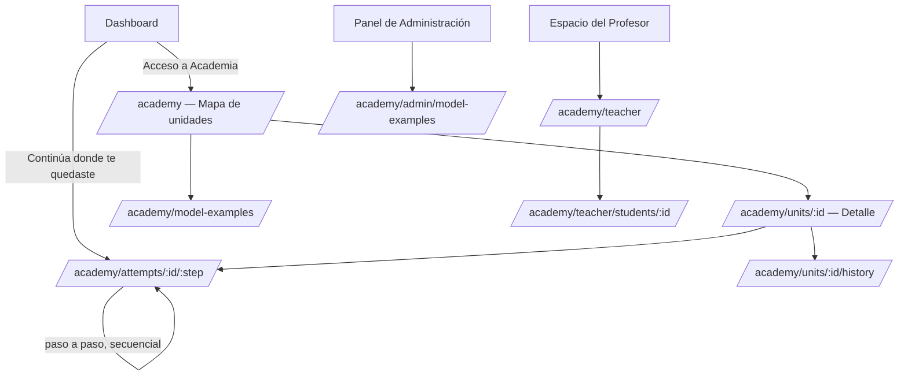
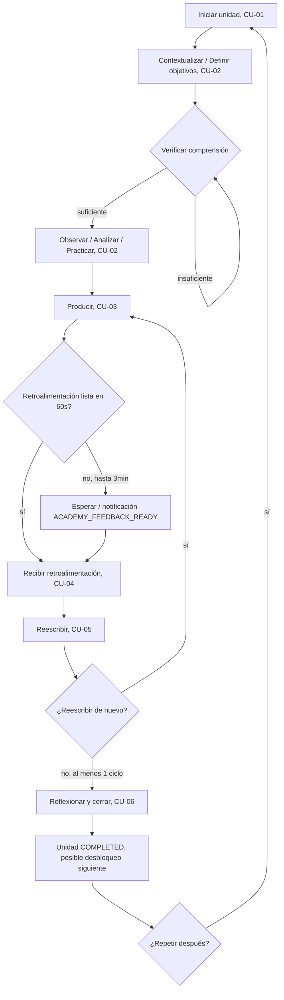
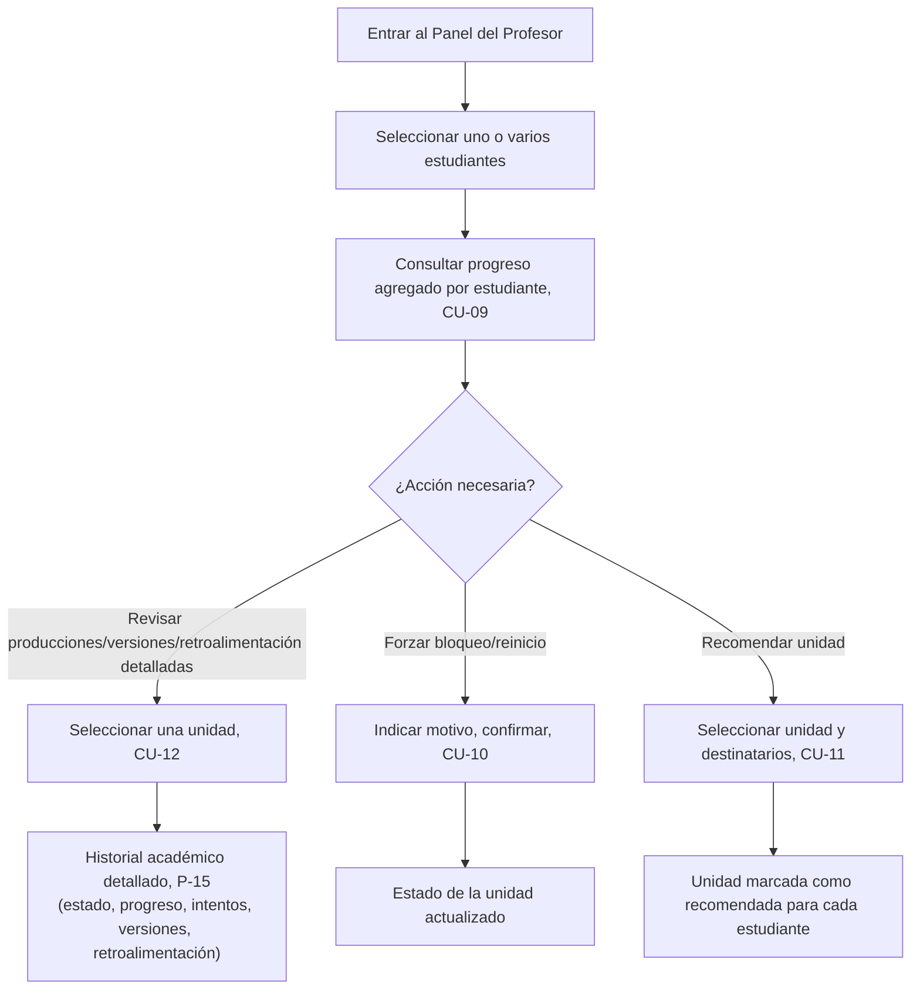
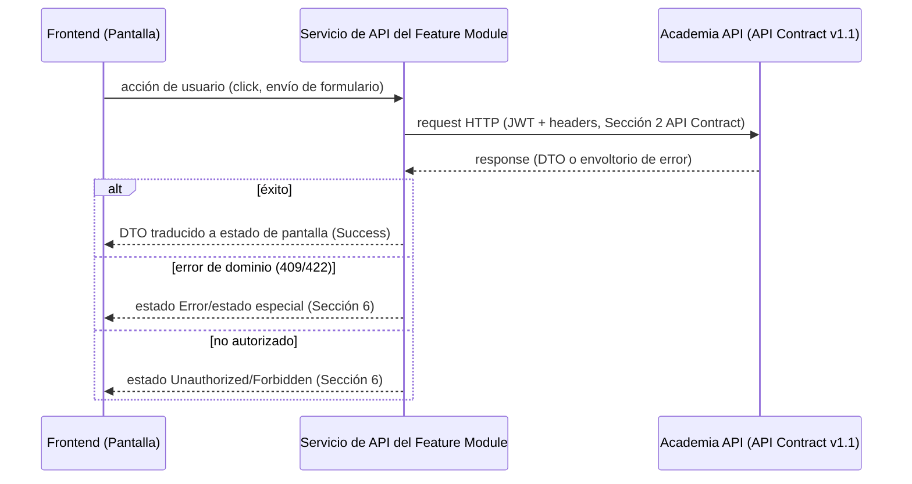

# ACADEMIA — FRONTEND CONTRACT v1.1

**Rol:** Principal Frontend Architect / UX Systems Designer, Rédaction Lab. No diseñador gráfico, no desarrollador React — este documento no contiene código, componentes, HTML ni CSS.
**Fecha original:** 2026-07-20. **Fecha de esta revisión:** 2026-07-20.
**Estado:** Ver dictamen al cierre del documento.

**Documentos Frozen consumidos como contrato obligatorio (ninguno modificado):** Product Blueprint, Arquitectura General, Domain Model v1.1, Application Model v1.3, Academia Functional Specification v1.3, Academia Infrastructure Model v1.1, Academia API Contract v1.2, Platform Core Foundation v1.0 (Notification Catalog), Academia Architecture Certified (`academia-architecture-certification-2026-07-19.md`), ACP-003 — Teacher Review Visibility (Executed).

**Historial de cambios**

| Versión | Fecha | ACP relacionado | Cambio |
|---|---|---|---|
| 1.0 | 2026-07-20 | — (versión inicial) | Documento original. Dictamen: `B) REQUIRES FRONTEND REVIEW`, por la ausencia de endpoint para "revisar producciones/versiones/retroalimentación de un estudiante" (P-13, Nota de alcance). |
| 1.1 | 2026-07-20 | ACP-003 | **Teacher Review Visibility.** Añadida `P-15 — Historial académico detallado (Profesor)` y la ruta `/academy/teacher/students/{studentId}/units/{unitId}/history`, consumiendo `EP-23` (API Contract v1.2) — cierra la Nota de alcance de P-13 en v1.0. Actualizadas las Secciones 3 (navegación), 4 (P-13, P-15), 5 (dos componentes nuevos), 7 (integración con `EP-23`), 13.3 (diagrama de flujo del Profesor) y 14 (checklist). Ningún otro componente, pantalla, estado o ruta fue modificado; ninguna experiencia existente fue rediseñada. |

---

## 1. Objetivo del Frontend Contract

**Propósito.** Definir, sin ambigüedad y sin reinterpretar la Functional Specification, el contrato completo de interacción entre el usuario y el módulo Academia: qué pantallas existen, qué navegación las conecta, qué componentes las componen, qué estados puede observar el usuario, y cómo cada una se comunica exclusivamente a través del API Contract v1.1. Es el puente entre "qué debe poder hacer el usuario" (Functional Specification) y "cómo se implementa la interfaz" (fase posterior, fuera de este documento).

**Qué problemas resuelve:**
- Elimina la necesidad de que cualquier equipo de implementación reinterprete la Functional Specification o el API Contract al construir pantallas — toda decisión de estructura, navegación y estado ya está tomada aquí.
- Evita la construcción de pantallas, componentes o flujos no derivados de un caso de uso o endpoint ya Frozen.
- Establece un lenguaje común de estados de UI, accesibilidad y responsive que cualquier implementación puede auditar contra este documento.

**Qué NO resuelve:**
- Ninguna decisión visual (paleta, tipografía, espaciado, íconos) — eso pertenece al Design System general del proyecto (§14.9, referenciado pero no definido aquí).
- Ninguna elección de librería, framework o tecnología de implementación.
- Ninguna regla de negocio — todas ya están fijadas por el Domain Model y el Application Model.
- Ningún endpoint, DTO ni contrato de datos nuevo — este documento consume el API Contract v1.1 tal como está, sin extenderlo.
- El diseño visual de estados de carga/error (spinners, animaciones concretas) — solo su existencia funcional obligatoria.

---

## 2. Arquitectura del Frontend

Organización conceptual del módulo, sin implementación:

**Layouts.** Dos layouts distintos, derivados de los tres actores de la Sección 2 de la Functional Specification:
- **Layout Estudiante:** contenedor de navegación del recorrido de Academia (mapa de unidades, recorrido de una unidad, Biblioteca de Modelos, historial). Persiste el punto de continuidad (CU de "Continúa donde te quedaste") en cada entrada.
- **Layout Profesor/Administrador:** contenedor de panel de gestión (progreso agregado, acciones docentes, gestión editorial). Distinto del layout de recorrido — el Profesor y el Administrador nunca "recorren" una unidad, solo la observan o la editan desde fuera.

**Pages.** Un Page por ruta documentada en la Sección 3 — responsable exclusivamente de: resolver parámetros de ruta, invocar los Feature Modules correspondientes, y componer el layout con el contenido. No contiene lógica de negocio ni llamadas directas a la API.

**Feature Modules.** Agrupaciones por capacidad funcional, alineadas 1:1 con los bloques de la Functional Specification:
- `unit-map` (mapa de unidades, CU-01, CU-07)
- `unit-attempt` (recorrido de los 11 pasos, CU-01 a CU-06)
- `model-library` (Biblioteca de Modelos, CU-08)
- `attempt-history` (historial de intentos, soporte de continuidad)
- `teacher-panel` (progreso agregado, anulaciones, recomendaciones — CU-09, CU-10, CU-11)
- `model-library-admin` (gestión editorial de `ModelExample`, Administrador)

Cada Feature Module encapsula sus propios servicios de API, estado compartido interno y componentes específicos — ningún Feature Module importa directamente del estado interno de otro (consistente con la Arquitectura Feature-Driven ya vigente, §5.4: "una feature nunca accederá directamente a otra").

**Shared Components.** Componentes reutilizables entre Feature Modules de Academia, pero no necesariamente fuera de Academia (p. ej. `UnitStatusBadge`, `ProgressSummaryChart`) — ver clasificación completa en la Sección 5.

**UI Components.** Primitivos visuales genéricos (botón, campo de texto, tarjeta, chip, spinner) que Academia consume del Design System general del proyecto — este documento no los redefine, solo declara cuáles usa conceptualmente.

**Hooks (conceptualmente).** Unidades de lógica reutilizable sin acoplarse a un componente visual concreto: obtención de datos de un endpoint (con sus estados de carga/error), gestión del ciclo de autoguardado del borrador, suscripción a la notificación `ACADEMY_FEEDBACK_READY`, gestión de la selección múltiple de estudiantes en el Panel del Profesor. Descritos por responsabilidad, no por firma ni implementación.

**Estado global (conceptualmente).** Ver desarrollo completo en la Sección 8. Resumen: el estado de sesión/identidad (rol, `studentId`/`teacherId` autenticado) es global a toda la plataforma, no propio de Academia; el estado de un `Attempt` en curso es compartido dentro de `unit-attempt`, nunca fuera de ese Feature Module; el resto es local a cada pantalla.

**Servicios de comunicación con API.** Una capa de servicio por Feature Module, responsable exclusivamente de invocar los endpoints del API Contract v1.1 que le corresponden (ver mapeo completo en la Sección 7) y traducir la respuesta a los DTOs ya definidos — ningún Feature Module invoca `fetch`/HTTP directamente desde un componente visual.

**Gestión de errores.** Centralizada por un manejador único que interpreta el envoltorio uniforme de error del API Contract (`code`, `message`, `correlationId`, `details`, Sección 11 del API Contract) y lo traduce a uno de los estados de UI de la Sección 6 — ningún Feature Module implementa su propio formato de error.

---

## 3. Navegación

Convención de rutas: prefijo `/academy` (alineado al recurso raíz del API Contract, `academy/...`, y a la convención de rutas en inglés ya vigente en la plataforma).

| Ruta | Objetivo | Actor | Permisos | Punto de entrada | Navegación posible | Rutas hijas |
|---|---|---|---|---|---|---|
| `/academy` | Mapa de unidades por tipo de texto (Sección 4 FS) | Estudiante | `STUDENT` | Dashboard (bloque "Acceso a los ecosistemas" o "Continúa donde te quedaste") | A `/academy/units/{unitId}` (unidad desbloqueada/en curso); a `/academy/model-examples` | `/academy/units/{unitId}`, `/academy/model-examples` |
| `/academy/units/{unitId}` | Detalle de una unidad: estado, progreso, historial, acción de iniciar/continuar/repetir (CU-01, CU-07) | Estudiante | `STUDENT` + RLS | `/academy` (tarjeta de unidad) | A `/academy/attempts/{attemptId}/{step}` (al iniciar/continuar); a `/academy/units/{unitId}/history` | `/academy/units/{unitId}/history` |
| `/academy/units/{unitId}/history` | Historial de intentos previos de la unidad | Estudiante | `STUDENT` + RLS | `/academy/units/{unitId}` | Regreso a `/academy/units/{unitId}` | — |
| `/academy/attempts/{attemptId}/{step}` | Pantalla de un paso del recorrido de 11 pasos (CU-02 a CU-06); `{step}` ∈ los 10 pasos con pantalla propia (ver Sección 4 — `UNLOCK` no tiene pantalla independiente) | Estudiante | `STUDENT` + RLS | `/academy/units/{unitId}` (al iniciar/continuar) o Dashboard ("Continúa donde te quedaste") | Secuencial hacia el siguiente `{step}` únicamente (sin navegación libre entre pasos de un mismo intento, Functional Spec Sección 11: "estrictamente secuencial dentro de una unidad") | — |
| `/academy/model-examples` | Biblioteca de Modelos, consulta independiente (CU-08) | Estudiante | `STUDENT` | `/academy` (menú); también embebida dentro de los pasos Observar/Analizar | Ninguna (pantalla hoja) | — |
| `/academy/teacher` | Panel del Profesor: progreso agregado, por estudiante o selección múltiple (CU-09) | Profesor | `TEACHER` | Espacio del Profesor (módulo externo a Academia, que enlaza aquí — Functional Spec Sección 9) | A `/academy/teacher/students/{studentId}` | `/academy/teacher/students/{studentId}` |
| `/academy/teacher/students/{studentId}` | Progreso de un estudiante + acciones docentes: bloqueo/reinicio (CU-10), recomendar unidad (CU-11) | Profesor | `TEACHER` + verificación de relación docente-estudiante | `/academy/teacher` (selección de un estudiante) | A `/academy/teacher/students/{studentId}/units/{unitId}/history` (por unidad); regreso a `/academy/teacher` | `/academy/teacher/students/{studentId}/units/{unitId}/history` |
| `/academy/teacher/students/{studentId}/units/{unitId}/history` *(v1.1, ACP-003)* | Historial académico detallado de una unidad del estudiante: producciones, versiones, retroalimentación, estado y progreso (CU-12) | Profesor | `TEACHER` + verificación de relación docente-estudiante | `/academy/teacher/students/{studentId}` (selección de una unidad) | Regreso a `/academy/teacher/students/{studentId}` | — |
| `/academy/admin/model-examples` | Gestión editorial de la Biblioteca de Modelos: listar, crear, editar, retirar | Administrador | `ADMIN` | Panel de Administración general de la plataforma (fuera del alcance del Functional Spec de Academia — este contrato solo define lo que ocurre una vez dentro) | A formulario de creación/edición (modal o sub-vista, sin ruta propia — operación de ciclo corto) | — |

**Nota de alcance de navegación:** ninguna ruta permite a un actor acceder a una pantalla fuera de su matriz de permisos (Sección 2 de la Functional Specification) — toda ruta de Profesor/Administrador está fuera del árbol de navegación del Estudiante y viceversa.

---

## 4. Pantallas

### P-01 — Mapa de unidades (`/academy`)
- **Propósito:** CU-01 (punto de entrada), CU-07 (acceso a repetición). Visualizar el estado de todas las unidades del estudiante, organizadas por tipo de texto.
- **Información mostrada:** por tipo de texto (`LETTER`, `ARTICLE`, `ESSAY`, `EMAIL`, `REPORT`), la lista de unidades con su `state` (uno de los 8 valores), posición en la progresión, marca `isRecommended` cuando aplica (CU-11).
- **Acciones disponibles:** seleccionar una unidad desbloqueada (inicia o continúa, CU-01); seleccionar una unidad `COMPLETED`/`MASTERED` (ofrece repetir, CU-07); navegar a la Biblioteca de Modelos.
- **Componentes utilizados:** `UnitMapContainer`, `UnitCard` (× N), `UnitStatusBadge`, `RecommendationBadge`, `TextTypeSectionHeader`.
- **Estados posibles:** ver Sección 6 (Loading/Empty/Success/Error/Offline/Retry — no aplica Unauthorized/Forbidden, ya filtrado por el layout de sesión).
- **Dependencias con API:** `EP-13` (mapa de unidades), `EP-15` (estado de continuidad, para ofrecer el atajo "Continúa donde te quedaste" si existe).
- **Validaciones visibles:** ninguna de entrada de usuario (pantalla de solo lectura + navegación).

### P-02 — Detalle de unidad (`/academy/units/{unitId}`)
- **Propósito:** CU-01 (iniciar), CU-07 (repetir). Confirmar la acción antes de entrar al recorrido.
- **Información mostrada:** `state`, cantidad de intentos previos (`attemptsCount`), intento activo si existe (`activeAttemptId`).
- **Acciones disponibles:** iniciar (si `UNLOCKED`, CU-01); continuar (si existe intento activo); repetir (si `COMPLETED`/`MASTERED`, CU-07); ver historial.
- **Componentes utilizados:** `UnitDetailContainer`, `UnitStatusBadge`, `AttemptActionButton`.
- **Estados posibles:** Loading, Success, Error, Retry; **Forbidden** si la unidad no pertenece al estudiante (RLS); estado especial "bloqueada" (unidad `LOCKED`, sin acción disponible salvo visualización — CU-01, excepción).
- **Dependencias con API:** `EP-14` (detalle), `EP-01` (iniciar), `EP-06` (repetir).
- **Validaciones visibles:** intento de iniciar una unidad `LOCKED` — botón deshabilitado con explicación (nunca una llamada a la API que retorne `409`, la UI ya lo previene — pero el manejo de `409` sigue siendo obligatorio como red de seguridad ante condiciones de carrera).

### P-03 — Historial de intentos (`/academy/units/{unitId}/history`)
- **Propósito:** soporte de transparencia sobre repeticiones (CU-07, Regla funcional 4: "ninguna versión anterior se modifica ni se pierde").
- **Información mostrada:** lista paginada de intentos (`AttemptSummaryDTO`): estado, paso alcanzado, fecha de inicio, si es el intento vigente.
- **Acciones disponibles:** ninguna (solo lectura); regreso al detalle de unidad.
- **Componentes utilizados:** `AttemptHistoryList`, `AttemptHistoryRow`.
- **Estados posibles:** Loading, Empty (unidad nunca iniciada — no debería ser alcanzable desde la navegación, pero se contempla como red de seguridad), Success, Error, Retry.
- **Dependencias con API:** `EP-16`.
- **Validaciones visibles:** ninguna.

### P-04 — Pasos previos a la producción (`/academy/attempts/{attemptId}/{step}`, step ∈ {contextualize, define-objectives})
- **Propósito:** CU-02 — presentar el contenido de contextualización y definición de objetivos, sin gate de validación propia.
- **Información mostrada:** contenido editorial del paso (propiedad del Administrador, fuera del alcance de este documento su origen exacto).
- **Acciones disponibles:** avanzar al siguiente paso.
- **Componentes utilizados:** `AttemptStepContainer`, `StepProgressTracker`, `StepContentPanel`, `StepAdvanceButton`.
- **Estados posibles:** Loading, Success, Error, Retry; **Forbidden** si el `attemptId` no pertenece al estudiante.
- **Dependencias con API:** `EP-14`/estado del intento vía `AttemptSummaryDTO` embebido en la navegación previa; `EP-21` (avanzar paso).
- **Validaciones visibles:** ninguna de entrada — el paso es de solo lectura y avance.

### P-05 — Comprender, con verificación (`/academy/attempts/{attemptId}/comprehend`)
- **Propósito:** CU-02, gate obligatorio (Regla funcional 2: "no se puede escribir sin antes demostrar comprensión").
- **Información mostrada:** la consigna; campo de respuesta de verificación.
- **Acciones disponibles:** enviar la verificación de comprensión.
- **Componentes utilizados:** `AttemptStepContainer`, `ComprehensionGate`, `StepAdvanceButton` (deshabilitado hasta verificación satisfactoria).
- **Estados posibles:** Loading, Success (avanza a Observar), Error, **Retry específico** (verificación insuficiente — el estudiante permanece en el paso, CU-02 excepción — ver Sección 6), Forbidden.
- **Dependencias con API:** `EP-22`.
- **Validaciones visibles:** respuesta de verificación no vacía (validación de formulario, previa a la llamada); resultado insuficiente mostrado inline, sin penalización ni lenguaje de fracaso (Regla funcional 9).

### P-06 — Observar / Analizar (`/academy/attempts/{attemptId}/{step}`, step ∈ {observe, analyze})
- **Propósito:** CU-02, con consumo de la Biblioteca de Modelos (CU-08) embebida.
- **Información mostrada:** modelos ejemplares del `textType` correspondiente, cada uno con su comentario curatorial.
- **Acciones disponibles:** consultar ejemplos; avanzar al siguiente paso.
- **Componentes utilizados:** `AttemptStepContainer`, `ModelExampleCard` (× N, reutilizado de `model-library`), `StepAdvanceButton`.
- **Estados posibles:** Loading, Success, Empty (sin ejemplos activos para el `textType` — CU-08 excepción: "se omite sin bloquear el flujo"), Error, Retry, Forbidden.
- **Dependencias con API:** `EP-19` (filtrado por `textType`), `EP-21` (avanzar).
- **Validaciones visibles:** ninguna.

### P-07 — Practicar (`/academy/attempts/{attemptId}/practice`)
- **Propósito:** CU-02, última etapa antes de producir.
- **Información mostrada:** actividad corta de práctica ("Actividades IA", Functional Spec Sección 10).
- **Acciones disponibles:** completar la actividad; avanzar.
- **Componentes utilizados:** `AttemptStepContainer`, `PracticeActivityPanel`, `StepAdvanceButton`.
- **Estados posibles:** Loading, Success, Error, Retry, Forbidden.
- **Dependencias con API:** `EP-21`.
- **Validaciones visibles:** ninguna adicional a la lógica ya cubierta por el paso.

### P-08 — Producir / Reescribir (`/academy/attempts/{attemptId}/produce`, reutilizada para `rewrite`)
- **Propósito:** CU-03 (primera producción) y CU-05 (reescritura) — mismo Editor de Escritura (Functional Spec Sección 4).
- **Información mostrada:** contenido del borrador en curso (`DraftDTO`), contador de palabras, marca de último autoguardado; si es reescritura, la retroalimentación recibida permanece visible como referencia.
- **Acciones disponibles:** escribir (autoguardado continuo); enviar producción/reescritura.
- **Componentes utilizados:** `WritingEditor`, `AutosaveIndicator`, `WordCountIndicator`, `SubmitButton`.
- **Estados posibles:** Loading, Success (envío aceptado), Error (`422` contenido vacío/fuera de rango — Regla funcional, CU-03 excepción), Retry, Forbidden, **estado especial "enviando"** (feedback inmediato de envío en curso, distinto del estado de espera de retroalimentación de P-09).
- **Dependencias con API:** `EP-02` (autoguardado, en cada pausa de escritura — ver momento de invocación en Sección 7), `EP-17` (recuperar borrador al entrar), `EP-03` (enviar).
- **Validaciones visibles:** contenido no vacío antes de habilitar "Enviar" (validación de cliente, redundante y no sustitutiva del `422` del servidor); longitud dentro del rango visible al usuario mediante el contador de palabras.

### P-09 — Recibir retroalimentación (`/academy/attempts/{attemptId}/feedback`)
- **Propósito:** CU-04 — entrega de retroalimentación formativa.
- **Información mostrada:** si `READY`: observaciones ordenadas macro→micro (10 categorías, Functional Spec CU-04), cada una con fortaleza/debilidad, explicación y sugerencia; si `PROCESSING`: indicador de espera.
- **Acciones disponibles:** si `READY`, continuar a Reescribir; si `PROCESSING`, esperar (sin bloquear la navegación fuera de Academia — el estudiante puede abandonar y ser notificado, A-06).
- **Componentes utilizados:** `FeedbackPanel`, `FeedbackObservationItem` (× N, ordenado por `priority`), `ProcessingIndicator`.
- **Estados posibles:** Loading, Success (`READY`), **estado especial "procesando"** (`PROCESSING`, con reintento automático vía notificación o polling — ver Sección 7), Error, Retry, Forbidden.
- **Dependencias con API:** `EP-18`; recepción de la notificación `ACADEMY_FEEDBACK_READY` (Sección 11) cuando `PROCESSING` se resuelve fuera de la sesión activa.
- **Validaciones visibles:** ninguna (pantalla de solo lectura).

### P-10 — Reflexionar y cerrar (`/academy/attempts/{attemptId}/reflect`)
- **Propósito:** CU-06 — preguntas metacognitivas y cierre de la unidad (incluye la presentación del resumen de cierre, paso 11 `UNLOCK`, dentro de la misma pantalla, ya que `EP-05` retorna el estado final en una única respuesta).
- **Información mostrada:** preguntas metacognitivas; tras el envío, resumen del aprendizaje, evidencias de progreso, próximo paso, mensaje de cierre del Coach IA (Functional Spec, flujo del estudiante, punto 7).
- **Acciones disponibles:** responder y enviar; tras el cierre, navegar a la siguiente unidad recomendada o al mapa de unidades (nunca al menú principal sin orientación, Sección 11 FS).
- **Componentes utilizados:** `ReflectionForm`, `ReflectionSummaryPanel`, `NextStepSuggestion`.
- **Estados posibles:** Loading, Success (con el resumen de cierre embebido), Error (`409`, no está en fase `REFLECTION`), Retry, Forbidden.
- **Dependencias con API:** `EP-05`.
- **Validaciones visibles:** al menos una respuesta por pregunta metacognitiva antes de habilitar el envío (validación de formulario).

### P-11 — Biblioteca de Modelos, consulta independiente (`/academy/model-examples`)
- **Propósito:** CU-08, acceso directo (fuera del recorrido de una unidad).
- **Información mostrada:** lista paginada de `ModelExampleDTO` (`status: ACTIVE`), filtrable por `textType`.
- **Acciones disponibles:** filtrar por tipo de texto; consultar el comentario curatorial de cada ejemplo.
- **Componentes utilizados:** `ModelLibraryContainer`, `ModelExampleCard`, `TextTypeFilter`.
- **Estados posibles:** Loading, Empty (sin ejemplos activos), Success, Error, Retry.
- **Dependencias con API:** `EP-19`.
- **Validaciones visibles:** ninguna.

### P-12 — Panel del Profesor (`/academy/teacher`)
- **Propósito:** CU-09 — progreso agregado de uno o varios estudiantes, mediante selección múltiple.
- **Información mostrada:** lista de estudiantes con relación docente establecida (fuente fuera del alcance de Academia, ver Sección 15 FS); para cada estudiante seleccionado, `unitsByState`/`unitsByTextType`.
- **Acciones disponibles:** seleccionar uno o varios estudiantes (checkbox múltiple); consultar su progreso; navegar al detalle de un estudiante.
- **Componentes utilizados:** `TeacherPanelContainer`, `StudentSelectionList`, `StudentProgressRow`, `MultiSelectToolbar`.
- **Estados posibles:** Loading, Empty (sin estudiantes con relación establecida), Success, **Forbidden parcial** (algún estudiante seleccionado sin relación docente establecida — CU-09 excepción: "acceso denegado únicamente para ese estudiante, sin bloquear la consulta del resto"), Error, Retry.
- **Dependencias con API:** `EP-20`, invocado una vez por cada `studentId` seleccionado (no existe endpoint de lote — ver Sección 7 y Nota de alcance más abajo).
- **Validaciones visibles:** ninguna de entrada; el resultado por estudiante se muestra de forma independiente incluso si alguno falla.

### P-13 — Detalle de estudiante y acciones docentes (`/academy/teacher/students/{studentId}`)
- **Propósito:** CU-10 (forzar bloqueo/reinicio), CU-11 (recomendar unidad).
- **Información mostrada:** progreso del estudiante (`StudentProgressSummaryDTO`); mapa de unidades del estudiante en modo lectura, con acción disponible por unidad según su estado.
- **Acciones disponibles:** forzar bloqueo (unidad en estado activo) o reinicio (unidad `COMPLETED`/`MASTERED`), con motivo obligatorio; recomendar una unidad (cualquier estado, incluido `LOCKED`); seleccionar una unidad para consultar su historial académico detallado (navega a `P-15`, *v1.1, ACP-003*).
- **Componentes utilizados:** `StudentDetailContainer`, `TeacherOverrideDialog`, `RecommendUnitDialog`, `UnitStatusBadge`.
- **Estados posibles:** Loading, Success, Error (`409` acción no válida para el estado, `403` sin relación docente), Retry, Forbidden.
- **Dependencias con API:** `EP-20`, `EP-07` (anulación), `EP-08` (recomendación).
- **Validaciones visibles:** `reason` obligatorio y no vacío antes de habilitar el envío de `EP-07` (Regla funcional 8); confirmación explícita antes de aplicar `FORCE_LOCK`/`FORCE_RESTART` (acción con efecto inmediato sobre el estudiante, Sección 12).

**Resolución de la Nota de alcance de v1.0 (ACP-003):** en la v1.0 de este documento, la capacidad narrativa de la Functional Specification ("revisar todas las producciones, versiones e historial de retroalimentación de sus estudiantes") no tenía endpoint ni Query correspondiente, y quedó explícitamente fuera de este contrato. ACP-003 — Teacher Review Visibility formalizó esa capacidad como **CU-12** (Functional Specification v1.3), añadió `QRY-10` (Application Model v1.3) y `EP-23` (API Contract v1.2) — ver **P-15** a continuación, que la implementa completamente.

### P-14 — Gestión de la Biblioteca de Modelos (`/academy/admin/model-examples`)
- **Propósito:** soporte administrativo de CU-08 (creación/edición/retiro del contenido consumido por el estudiante).
- **Información mostrada:** lista paginada de `ModelExampleDTO` (todos los `status`, incluidos `RETIRED`, visible solo para `ADMIN`); formulario de creación/edición.
- **Acciones disponibles:** crear, editar, retirar un `ModelExample`.
- **Componentes utilizados:** `AdminModelLibraryContainer`, `ModelExampleAdminRow`, `ModelExampleForm`, `RetireConfirmDialog`.
- **Estados posibles:** Loading, Empty, Success, Error (`422` `textType` inválido, `404` en edición/retiro), Retry.
- **Dependencias con API:** `EP-19` (listar, incluyendo retirados), `EP-09` (crear), `EP-10` (editar), `EP-11` (retirar).
- **Validaciones visibles:** `textType` restringido a los 5 valores válidos (selector cerrado, no campo libre); `content` y `curatorialComment` no vacíos antes de habilitar el envío; confirmación explícita antes de retirar (acción con efecto sobre estudiantes que consultan la biblioteca).

### P-15 — Historial académico detallado (`/academy/teacher/students/{studentId}/units/{unitId}/history`) *(v1.1, ACP-003 — Teacher Review Visibility)*
- **Propósito:** CU-12 — consultar, para un estudiante y una unidad específicos, el estado/progreso de la unidad y el historial completo de intentos, con sus versiones y la retroalimentación recibida en cada una.
- **Información mostrada:** `unitState`, `attemptsCount`; por cada intento (`AttemptSummaryDTO`, reutilizado): `currentStep`/paso alcanzado, `startedAt`, `isCurrent`; por cada versión de cada intento (`VersionDTO`, reutilizado): contenido, `submittedAt`, y su retroalimentación (`FeedbackDTO`, reutilizado) cuando existe.
- **Acciones disponibles:** ninguna (pantalla de solo lectura, consistente con CU-12: "ningún dato del estudiante es modificado por esta consulta"); regreso a `P-13`.
- **Componentes utilizados:** `StudentUnitHistoryContainer`, `AttemptHistoryRow` (reutilizado de `P-03`), `VersionWithFeedbackPanel`, `FeedbackObservationItem` (reutilizado de `P-09`).
- **Estados posibles:** Loading, Empty (unidad seleccionada sin ningún intento iniciado — CU-12 excepción: "se presenta el estado de la unidad sin historial de intentos, no un error"), Success, Error, Forbidden (sin relación docente establecida), Retry.
- **Dependencias con API:** `EP-23`.
- **Validaciones visibles:** ninguna (pantalla de solo lectura).

---

## 5. Componentes

Solo responsabilidades — sin diseño visual.

**Atómicos**
- `UnitStatusBadge` — representa uno de los 8 `UnitState` con su etiqueta textual.
- `RecommendationBadge` — indica que una unidad fue recomendada por el Profesor (CU-11), distinguible de "desbloqueada".
- `StepProgressTracker` (elemento visual mínimo) — indicador de posición dentro de los 11 pasos.
- `AutosaveIndicator` — comunica el momento del último autoguardado exitoso.
- `WordCountIndicator` — refleja el conteo de palabras del contenido en curso.
- `ProcessingIndicator` — comunica una operación asíncrona en curso (retroalimentación diferida).

**Compuestos**
- `UnitCard` — tarjeta de una unidad dentro del mapa (compone `UnitStatusBadge` + `RecommendationBadge`).
- `ModelExampleCard` — un ejemplo de la Biblioteca de Modelos con su comentario curatorial.
- `FeedbackObservationItem` — una observación de retroalimentación (categoría, fortaleza/debilidad, explicación, sugerencia).
- `StudentProgressRow` — fila de progreso de un estudiante en el Panel del Profesor.
- `AttemptHistoryRow` — fila de un intento previo en el historial (reutilizada por `P-03` y `P-15`).
- `VersionWithFeedbackPanel` *(v1.1, ACP-003)* — una versión de una producción junto con su retroalimentación asociada, dentro del historial académico detallado (`P-15`); compone `FeedbackObservationItem` cuando la versión tiene retroalimentación entregada.

**Contenedores**
- `UnitMapContainer` — orquesta la obtención del mapa de unidades y el estado de continuidad.
- `AttemptStepContainer` — orquesta la obtención/actualización del `Attempt` activo y determina qué pantalla de paso renderizar según `currentStep`.
- `TeacherPanelContainer` — orquesta la selección múltiple de estudiantes y sus consultas de progreso independientes.
- `ModelLibraryContainer` / `AdminModelLibraryContainer` — orquestan la consulta (y, en el caso admin, mutación) de `ModelExample`.
- `StudentDetailContainer` — orquesta el progreso de un estudiante y las acciones docentes disponibles.
- `StudentUnitHistoryContainer` *(v1.1, ACP-003)* — orquesta la obtención del historial académico detallado de un estudiante para una unidad específica (`P-15`).

**Específicos de Academia**
- `ComprehensionGate` — encapsula la lógica de presentación del gate de comprensión (Regla funcional 2), incluyendo el estado de verificación insuficiente sin lenguaje de fracaso.
- `WritingEditor` — encapsula el ciclo borrador/versión/envío (Editor de Escritura, Functional Spec Sección 4) con autoguardado continuo.
- `TeacherOverrideDialog` — encapsula el formulario de bloqueo/reinicio forzado con motivo obligatorio (Regla funcional 8).
- `RecommendUnitDialog` — encapsula la selección de unidad y de uno o varios estudiantes destinatarios de una recomendación.
- `MultiSelectToolbar` — encapsula la selección múltiple de estudiantes desde el Panel del Profesor (mecanismo exclusivo de Frontend, decisión oficial ACP-001-B: "toda selección múltiple pertenece exclusivamente al Frontend").

---

## 6. Estados de UI

Aplicables, salvo excepción explícita, a toda pantalla de la Sección 4.

| Estado | Definición para Academia |
|---|---|
| **Loading** | Se muestra mientras se resuelve la llamada inicial de la pantalla (Sección 7). Nunca bloquea más de la operación en curso — el resto de la interfaz ya renderizada permanece interactiva cuando es técnicamente posible. |
| **Empty** | Aplica a: mapa de unidades sin unidades provisionadas (caso excepcional, no un flujo esperado); Biblioteca de Modelos sin ejemplos activos para un `textType` (CU-08 excepción); Panel del Profesor sin estudiantes con relación establecida; historial de intentos sin intentos previos. |
| **Success** | Estado normal de una pantalla con datos cargados y accionables. |
| **Error** | Cualquier respuesta `4xx`/`5xx` no cubierta por un estado más específico (Unauthorized/Forbidden) — se presenta el `message` del envoltorio de error (Sección 11 API Contract), nunca el `code` crudo, y se ofrece Retry cuando la operación es de lectura. |
| **Unauthorized** | JWT ausente o inválido (`401`) — redirige al flujo de autenticación ya vigente a nivel de plataforma; no es responsabilidad de Academia definir ese flujo, solo reaccionar a él. |
| **Forbidden** | Autenticado pero sin autorización sobre el recurso (`403`) — p. ej., Profesor sin relación docente establecida (CU-09/CU-10/CU-11 excepción), o intento de acceder a una unidad/intento que no pertenece al actor (RLS). Se presenta como mensaje explicativo, nunca como error técnico genérico. |
| **Offline** | Aplica únicamente a `P-08` (Producir/Reescribir): el `WritingEditor` debe comunicar la pérdida de conectividad sin descartar el contenido en curso (consistente con A-06, "el trabajo en curso del estudiante nunca se pierde por abandono") — el autoguardado reintenta al recuperar conexión. No aplica como estado formal a pantallas de solo lectura, que simplemente transicionan a Error/Retry. |
| **Retry** | Disponible en toda pantalla que dependa de una lectura (`GET`) fallida; para escrituras (`POST`/`PUT`/`PATCH`), el reintento reutiliza la misma `Idempotency-Key` cuando el endpoint la exige (Sección 2 del API Contract), nunca genera una nueva — evita duplicar el efecto de negocio. |

**Estados especiales, no genéricos:**
- **Verificación insuficiente** (`P-05`): el estudiante permanece en el paso `COMPREHEND`, sin penalización visible, con la oportunidad de reintentar — no es un Error genérico, es un resultado funcional esperado (CU-02 excepción).
- **Procesando** (`P-09`): retroalimentación diferida (`202 Accepted`/`feedbackStatus: PROCESSING`) — no es Loading (que implica una respuesta inminente en segundos), es una espera potencialmente de hasta 3 minutos con comunicación explícita al usuario (Sección 11 FS) y liberación de la sesión (el estudiante puede navegar fuera).

---

## 7. Integración con API

Mapeo completo de los 22 endpoints del API Contract v1.1 (`EP-01` a `EP-22`), incluidas las tres exclusiones deliberadas (sin pantalla ni componente consumidor, por diseño).

| Endpoint | Pantalla consumidora | Componente consumidor | Momento de invocación | Comportamiento esperado | Tratamiento de errores |
|---|---|---|---|---|---|
| `EP-01` Iniciar unidad | P-02 | `AttemptActionButton` | Click en "Iniciar" | Redirige a `P-04` (primer paso) con el `attemptId` recibido | `409` (bloqueada) → mensaje explicativo, sin reintento; `404` → Error |
| `EP-02` Autoguardar borrador | P-08 | `WritingEditor` | Automático, tras una pausa de escritura (debounce) — nunca en cada pulsación | Actualiza `AutosaveIndicator` en silencio, sin interrumpir la escritura | Fallo silencioso reintentable en segundo plano; tras 3 fallos consecutivos, se muestra el estado Offline |
| `EP-03` Enviar producción/reescritura | P-08 | `WritingEditor` (botón Enviar) | Click explícito en "Enviar" | `201`/`READY` → navega a P-09 con retroalimentación embebida; `202`/`PROCESSING` → navega a P-09 en estado "procesando" | `422` → Error inline, contenido no descartado; `409` → Error |
| `EP-04` Avanzar a reflexión | (transición interna previa a P-10, sin pantalla propia) | `AttemptStepContainer` | Al confirmar el cierre del ciclo de reescritura desde P-08/P-09 | Navega a P-10 | `409` → impide la navegación, permanece en el ciclo de reescritura |
| `EP-05` Completar reflexión | P-10 | `ReflectionForm` | Click en "Enviar reflexión" | Renderiza `ReflectionSummaryPanel` con el resultado embebido | `409` → Error |
| `EP-06` Repetir unidad | P-02 | `AttemptActionButton` | Click en "Repetir" | Redirige a `P-04` con el nuevo `attemptId` | `409` → Error |
| `EP-07` Anulación docente | P-13 | `TeacherOverrideDialog` | Envío del formulario (tras confirmación) | Actualiza el estado de la unidad mostrado; cierra el diálogo | `403` → Forbidden; `409` → Error inline en el diálogo |
| `EP-08` Recomendar unidad | P-13 | `RecommendUnitDialog` | Envío del formulario, una vez por cada estudiante destinatario si se invoca desde selección múltiple | Marca la unidad como recomendada en la vista del estudiante correspondiente | `403` → Forbidden solo para ese destinatario, sin interrumpir el resto |
| `EP-09` Crear ejemplo | P-14 | `ModelExampleForm` | Envío del formulario de creación | Añade el nuevo ejemplo a la lista | `422` → Error inline por campo |
| `EP-10` Actualizar ejemplo | P-14 | `ModelExampleForm` | Envío del formulario de edición | Actualiza la fila correspondiente | `404` → Error |
| `EP-11` Retirar ejemplo | P-14 | `RetireConfirmDialog` | Confirmación explícita | Marca `status: RETIRED` en la lista, sin eliminarla visualmente | `404` → Error |
| `EP-12` Mi resumen de progreso | (no consumido directamente — P-01 usa `EP-13`; reservado para un futuro bloque de resumen propio si se requiere) | — | — | — | — |
| `EP-13` Mapa de unidades | P-01 | `UnitMapContainer` | Al entrar a `/academy` | Renderiza `UnitCard` por unidad | Error/Retry estándar |
| `EP-14` Detalle de unidad | P-02 | `UnitDetailContainer` | Al entrar a `/academy/units/{unitId}` | Renderiza el detalle | Error/Retry, `404` si no pertenece al estudiante |
| `EP-15` Estado de continuidad | P-01 (y Dashboard, fuera de este contrato) | `UnitMapContainer` | Al entrar a `/academy` | Si existe, ofrece el atajo "Continúa donde te quedaste" | `204` → simplemente no se muestra el atajo, no es un error |
| `EP-16` Historial de intentos | P-03 | `AttemptHistoryList` | Al entrar a `/academy/units/{unitId}/history` | Renderiza la lista paginada | Error/Retry estándar |
| `EP-17` Consultar borrador | P-08 | `WritingEditor` | Al entrar al paso Producir/Reescribir | Precarga el contenido existente | `404` → se asume borrador vacío, no es un Error visible |
| `EP-18` Consultar retroalimentación | P-09 | `FeedbackPanel` | Al entrar a P-09; en modo `PROCESSING`, reintentado tras recibir la notificación `ACADEMY_FEEDBACK_READY` | Renderiza las observaciones cuando `status: READY` | Error/Retry estándar |
| `EP-19` Consultar Biblioteca de Modelos | P-06, P-11, P-14 | `ModelExampleCard` / `AdminModelLibraryContainer` | Al entrar a la pantalla correspondiente, o al cambiar el filtro `textType` | Renderiza la lista filtrada | Empty si no hay resultados; Error/Retry estándar |
| `EP-20` Progreso de estudiante (vista docente) | P-12, P-13 | `StudentProgressRow` / `StudentDetailContainer` | Al seleccionar uno o varios estudiantes (P-12, una invocación por `studentId`); al entrar a P-13 | Renderiza el progreso agregado por estudiante | `403` → Forbidden solo para ese estudiante, sin bloquear el resto de la selección |
| `EP-21` Avanzar paso | P-04, P-06, P-07 | `StepAdvanceButton` | Click en "Continuar" | Avanza a la pantalla del siguiente paso | `409` → no debería ocurrir si la UI ya oculta el botón fuera de rango; tratado como Error de red de seguridad |
| `EP-22` Verificar comprensión | P-05 | `ComprehensionGate` | Envío del formulario de verificación | `200` → navega a P-06 (Observar); `422` → permanece en P-05, estado "verificación insuficiente" | `409` → Error |
| `EP-23` Historial académico detallado (docente) *(v1.1, ACP-003)* | P-15 | `StudentUnitHistoryContainer` | Al entrar a `/academy/teacher/students/{studentId}/units/{unitId}/history` | Renderiza el estado/progreso de la unidad y la lista de intentos con `VersionWithFeedbackPanel` por versión | `403` → Forbidden; `404` → Error (unidad inexistente para el estudiante); Empty si la unidad existe sin intentos |

**Exclusiones deliberadas (sin pantalla ni componente):** `CMD-04`/`CMD-08`/`CMD-15` no tienen endpoint público (ver API Contract, "Exclusiones deliberadas") — en consecuencia, tampoco tienen representación en este Frontend Contract. El estudiante observa sus efectos indirectamente: `CMD-04` a través de P-09 (`EP-18`), `CMD-08` a través del cambio de `state` a `MASTERED` reflejado en `EP-13`/`EP-14`, `CMD-15` no es observable por el estudiante (proceso de alta, previo a cualquier pantalla de Academia).

---

## 8. Gestión de estado

Conceptual, sin elección de librería.

**Estado local (propio de una pantalla, descartado al salir de ella):**
- Contenido del formulario de reflexión (P-10) antes del envío.
- Contenido del formulario de creación/edición de `ModelExample` (P-14) antes del envío.
- Selección de `textType` en el filtro de la Biblioteca de Modelos (P-06, P-11, P-14).
- Estado de apertura/cierre de `TeacherOverrideDialog`/`RecommendUnitDialog` (P-13).

**Estado compartido (dentro de un Feature Module, entre sus pantallas):**
- El `Attempt` activo (`attemptId`, `currentStep`, contenido del borrador) es compartido por todas las pantallas de paso de `unit-attempt` (P-04 a P-10) — se obtiene una vez al entrar al recorrido y se actualiza tras cada `EP-21`/`EP-22`/`EP-03`, sin volver a solicitarlo completo en cada paso salvo invalidación explícita.
- La selección múltiple de estudiantes (P-12) es compartida entre `StudentSelectionList` y `StudentProgressRow` dentro de `teacher-panel`, pero nunca sale de ese Feature Module.

**Estado derivado (calculado, nunca solicitado directamente a la API):**
- `isRecommended` combinado con el mapa de unidades para decidir si `RecommendationBadge` se muestra (el DTO ya lo expone calculado — Frontend no recalcula, solo lo consume).
- Porcentaje o resumen visual de progreso en P-12/P-13, derivado de `unitsByState`/`unitsByTextType` — ninguna suma ni indicador se solicita como endpoint propio (Functional Spec Sección 13: "el cálculo de indicadores agregados es responsabilidad exclusiva de Evolución", por lo que Academia/Frontend no inventa indicadores más allá de los conteos ya expuestos por `StudentProgressSummaryDTO`).
- Habilitación/deshabilitación de botones de acción (p. ej. "Enviar" en P-08) derivada de validaciones de cliente sobre el estado local, nunca de una llamada anticipada a la API.

**Caché:**
- El mapa de unidades (`EP-13`) y la Biblioteca de Modelos (`EP-19`) son candidatos naturales a caché de lectura de corta duración, consistente con la nota de `Cache-Control` ya definida en el API Contract v1.1 (Sección 13: caché habilitada explícitamente en `EP-19`).
- Ningún endpoint que refleje estado en curso de un `Attempt`/`AcademyUnit` (`EP-03` a `EP-08`, `EP-12` a `EP-18`) se cachea — mismo principio ya fijado en el API Contract (Sección 13): nunca cachear una lectura que participe en una decisión de negocio en curso.

**Invalidación:**
- Tras `EP-01`/`EP-06` (iniciar/repetir), se invalida la caché del mapa de unidades (`EP-13`) y del estado de continuidad (`EP-15`).
- Tras `EP-03`/`EP-05`/`EP-21`/`EP-22` (progreso dentro de un intento), se invalida únicamente el estado compartido del `Attempt` en curso — no el mapa de unidades completo, hasta que la unidad realmente se complete (`EP-05` exitoso).
- Tras `EP-07`/`EP-08` (acciones docentes), se invalida la consulta de progreso del estudiante afectado (`EP-20`) dentro de `teacher-panel` — nunca la de otros estudiantes no afectados.
- Tras `EP-09`/`EP-10`/`EP-11` (gestión editorial), se invalida la lista de `ModelExample` en ambos contextos donde se consume: `model-library` y `model-library-admin`.

---

## 9. Accesibilidad

Requisito mínimo obligatorio: **WCAG 2.1 nivel AA**, sin excepción, tal como lo fija la Functional Specification (Sección 11) — este documento traduce ese requisito a comportamiento de Frontend concreto, sin reducirlo.

**Navegación por teclado.** Los 11 pasos del recorrido (P-04 a P-10), la producción de texto (`WritingEditor`) y la navegación del mapa de unidades (P-01) deben ser completamente operables sin mouse — todo control interactivo (botones, campos, `MultiSelectToolbar`, diálogos) alcanzable y accionable por teclado.

**Foco.** Orden de foco alineado a la secuencia de 11 pasos — al transicionar de un paso al siguiente (`EP-21`/`EP-22`/`EP-03`), el foco se traslada de forma predecible al primer elemento accionable de la nueva pantalla, sin trampas de foco (ningún diálogo modal — `TeacherOverrideDialog`, `RecommendUnitDialog`, `RetireConfirmDialog` — permite que el foco escape accidentalmente fuera de él mientras está abierto).

**Contraste.** Mínimo 4.5:1 para texto normal, 3:1 para texto grande, en todo el recorrido y en la retroalimentación (`FeedbackObservationItem` incluido, sin excepción por tratarse de contenido generado dinámicamente).

**Lectores de pantalla.** Estructura semántica navegable por paso; todo cambio de estado (avance de paso, verificación insuficiente, retroalimentación lista, error) se anuncia mediante regiones vivas (`aria-live`) — en particular, la transición de P-09 de "procesando" a "listo" debe anunciarse aunque el estudiante haya navegado fuera de la pantalla y regresado.

**Mensajes de error.** Todo mensaje de error (Sección 6) debe asociarse explícitamente a su control de origen (p. ej., el campo `reason` vacío en `TeacherOverrideDialog`) mediante mecanismos de descripción accesible — nunca solo color o posición visual como único indicador.

**Sin límites de tiempo forzados.** Ninguna pantalla del recorrido impone un límite de tiempo de sesión (ya garantizado por A-06 y por el tono no punitivo, Functional Spec §8.6) — el estado "procesando" de P-09 (hasta 3 minutos) nunca cierra la sesión del estudiante ni descarta su progreso.

**Consistencia con el Design System general.** Este nivel de accesibilidad es un piso, no un techo — no sustituye ni reduce ningún estándar igual o superior que el Design System general del proyecto (§14.9) ya establezca; los valores exactos de esa referencia no forman parte de los documentos Frozen consumidos por este contrato y quedan fuera de su alcance de definición.

---

## 10. Responsive

Principio general: **Mobile First**, con comportamiento heredado del estándar de plataforma "sin excepción" (Functional Spec, Sección 11) — este documento no encuentra, en ningún documento Frozen consumido, breakpoints ni valores de diseño concretos; se documenta el comportamiento esperado por tipo de pantalla, sin inventar valores de píxel.

**Móvil (base):**
- P-01 (mapa de unidades): una columna por tipo de texto, navegación por scroll vertical, sin tablas.
- P-04 a P-10 (recorrido): un único objetivo/paso por pantalla ya es la norma funcional (NeuroUX, principio de segmentación) — el diseño mobile-first es, en este caso, el diseño natural de todo el recorrido, no una adaptación.
- P-08 (Editor de Escritura): el editor ocupa el máximo de superficie disponible; controles secundarios (contador de palabras, autoguardado) se colapsan a una barra compacta.
- P-12 (Panel del Profesor): la tabla de estudiantes se presenta como tarjetas apiladas, no como tabla tabular.

**Tablet:** introduce vistas de dos columnas donde el contenido lo permite sin violar el principio de un objetivo por pantalla (p. ej., P-06/Observar puede mostrar el modelo y su comentario curatorial lado a lado en vez de apilados); P-12 puede introducir una tabla simplificada.

**Escritorio:** aprovecha el espacio horizontal para paneles auxiliares no intrusivos (p. ej., `StepProgressTracker` visible de forma permanente como indicador lateral, en vez de solo un encabezado compacto); P-12/P-13 usan tabla completa con acciones inline.

**Nota de alcance:** los valores exactos de breakpoint, la unidad de medida y el comportamiento pixel-a-pixel del Design System general (§14.9) no están definidos en los documentos Frozen consumidos por este contrato — se marca como **PENDIENTE DE DECISIÓN DE FRONTEND**, a resolver por referencia directa al Design System general del proyecto en la fase de implementación, sin que esto bloquee la construcción de las pantallas ya definidas en la Sección 4 (el comportamiento funcional por breakpoint ya está descrito arriba, de forma independiente del valor exacto).

---

## 11. Notificaciones

Academia, a través de este Frontend Contract, consume exclusivamente el Notification Catalog ya definido en el Platform Core Foundation v1.0 — no define ningún canal, mecanismo de entrega ni tipo de notificación propio.

**Tipo consumido:** `ACADEMY_FEEDBACK_READY` (audiencia `STUDENT`, naturaleza `ACTION_REQUIRED`, Platform Core Foundation Sección 4). Se emite cuando una retroalimentación solicitada en modo `PROCESSING` (`EP-03`) queda lista.

**Cómo lo consume el Frontend:** el Frontend se suscribe a este tipo de notificación a través del mecanismo de entrega de notificaciones ya vigente a nivel de plataforma — este documento no define ese mecanismo (push/in-app/correo), consistente con el principio del Notification Catalog de que "los módulos consumen el catálogo exclusivamente por identificador simbólico... nunca conocen el canal de entrega real" (Platform Core Foundation, Sección 4). Al recibir `ACADEMY_FEEDBACK_READY`, si el estudiante se encuentra en P-09 (o regresa a ella), la pantalla transiciona del estado "procesando" a `EP-18`/Success sin requerir una acción manual de recarga; si el estudiante no está en Academia, la notificación se presenta mediante el mecanismo general de la plataforma (fuera del alcance de este documento) y, al abrirla, navega a P-09.

**Ningún otro tipo de notificación.** Consistente con el API Contract v1.1 (Sección 9): "ningún otro tipo de `NotificationEvent` es emitido por Academia según los documentos Frozen revisados" — este Frontend Contract no inventa notificaciones adicionales (p. ej., no existe una notificación de "unidad recomendada" o "unidad bloqueada por el profesor" en ningún documento Frozen; esos cambios se reflejan únicamente al recargar/consultar la pantalla correspondiente, nunca vía push).

---

## 12. Experiencia de usuario

**Mensajes de éxito.** Breves, en tono acorde a los 6 principios de motivación ya establecidos (Functional Spec Sección 11: propósito visible, progreso visible, objetivos alcanzables, autonomía, reconocimiento del esfuerzo, formación de hábitos) — nunca comparativos entre estudiantes. Ejemplos de momento (no de copy exacto, fuera del alcance de este documento): al completar una unidad (P-10), al recibir retroalimentación (P-09), al registrar una recomendación (P-13).

**Mensajes de error.** Nunca lenguaje de fracaso categórico ("incorrecto", "fallaste") — regla vinculante para toda retroalimentación de IA (Regla funcional 9) que este contrato extiende, por consistencia, a todo mensaje de error de UI dentro del recorrido del estudiante (P-04 a P-10): un `422`/`409` se comunica como "esto necesita un ajuste" o equivalente funcional, nunca como fallo del usuario. Los mensajes de error de los paneles de Profesor/Administrador (P-12 a P-14) no están sujetos a esta misma restricción de tono pedagógico (no son retroalimentación al estudiante), pero sí deben seguir siendo claros y accionables.

**Confirmaciones.** Obligatorias antes de: `EP-07` (bloqueo/reinicio forzado, efecto inmediato sobre la sesión de un estudiante — Sección 14 FS); `EP-11` (retirar un `ModelExample`, afecta a todos los estudiantes que lo consultan). No obligatorias para acciones reversibles de bajo impacto (`EP-08` recomendar, `EP-21` avanzar paso).

**Operaciones largas.** Una sola: la generación de retroalimentación (`EP-03`, modelo híbrido, Functional Spec Sección 11) — ventana objetivo 60 segundos, máximo aceptable 3 minutos. Bajo ese umbral, se comunica como una espera breve con indicador de progreso indeterminado; por encima, como una espera diferida explícita, con liberación de la sesión (el estudiante puede navegar fuera sin perder el resultado) y notificación al finalizar (Sección 11 de este documento).

**Indicadores de progreso.** `StepProgressTracker` (posición dentro de los 11 pasos, siempre visible durante el recorrido); `AutosaveIndicator` (última vez guardado, durante la producción); `ProcessingIndicator` (retroalimentación en curso).

**Retroalimentación de IA.** Presentada siguiendo exactamente la secuencia de cuatro pasos ya establecida (Functional Spec Sección 11, §8.6): reconocer el esfuerzo, explicar el aspecto a mejorar, ofrecer una explicación adaptada, proponer una acción concreta — orden de las `FeedbackObservationDTO` ya resuelto por `priority` ascendente (macro antes que micro) desde el propio DTO, el Frontend no reordena. Debe quedar visualmente distinguible del contenido curatorial estático de la Biblioteca de Modelos (P-06, P-11) — ambos son "comentario sobre un texto", pero de naturaleza y autoría distintas (IA dinámica vs. Administrador estático, ACP-001-C), y este contrato exige que esa distinción sea perceptible por el usuario, no solo interna al dato.

---

## 13. Diagramas

### 13.1 Navegación del módulo

### 13.2 Flujo principal del estudiante

### 13.3 Flujo principal del profesor

### 13.4 Interacción Frontend ↔ API

---

## 14. Checklist

Verificación aplicable a cualquier implementación Frontend del módulo Academia:

- [ ] Toda ruta implementada existe en la tabla de la Sección 3 — ninguna ruta adicional fue creada.
- [ ] Toda pantalla implementada corresponde a una de las 14 pantallas (P-01 a P-14) de la Sección 4, con su propósito, información, acciones y dependencias respetadas.
- [ ] Ninguna pantalla invoca un endpoint fuera del API Contract v1.1 (`EP-01` a `EP-22`).
- [ ] Los tres Commands sin endpoint público (`CMD-04`, `CMD-08`, `CMD-15`) no tienen ninguna pantalla ni componente que intente invocarlos directamente.
- [ ] Todo componente listado en la Sección 5 tiene una responsabilidad única y trazable a al menos una pantalla de la Sección 4.
- [ ] Los 8 estados de UI de la Sección 6 están implementados en toda pantalla que dependa de una llamada a la API, salvo las excepciones explícitamente documentadas.
- [ ] Todo endpoint de escritura con efecto de negocio reutiliza la misma `Idempotency-Key` en un reintento, nunca genera una nueva.
- [ ] Ningún endpoint que refleje estado en curso de un `Attempt`/`AcademyUnit` es cacheado por el cliente (Sección 8).
- [ ] Los 11 pasos del recorrido, el `WritingEditor` y el mapa de unidades son completamente operables por teclado, con foco predecible y sin trampas.
- [ ] Todo contraste de texto cumple 4.5:1 (normal) / 3:1 (grande), incluida la retroalimentación de IA y el contenido curatorial.
- [ ] Ningún mensaje dirigido al estudiante usa lenguaje de fracaso categórico.
- [ ] El comportamiento responsive por pantalla respeta el principio Mobile First y el de un objetivo por pantalla en el recorrido, incluso si los valores exactos de breakpoint quedan pendientes del Design System general.
- [ ] La notificación `ACADEMY_FEEDBACK_READY` es el único tipo de notificación consumido por el Frontend de Academia.
- [ ] La capacidad "revisar producciones/versiones/retroalimentación detallada de un estudiante" (CU-12, Functional Specification v1.3, formalizada por ACP-003) está implementada exclusivamente en `P-15`, consumiendo `EP-23` — ninguna otra pantalla intenta cubrir esta capacidad por otro medio.
- [ ] Ninguna pantalla, componente o estado fue diseñado sin una referencia directa a un caso de uso, endpoint o componente ya Frozen citado en este documento.

---

## VALIDACIÓN FINAL — Auditoría automática *(revisada en v1.1, ACP-003)*

| Verificación | Resultado |
|---|---|
| ✓ Todas las pantallas derivan de la Functional Specification | **Cumple.** Las 15 pantallas (P-01 a P-15) trazan cada una a un CU explícito (CU-01 a CU-12) o a una función de soporte ya descrita (historial, continuidad, gestión editorial ya prevista para el Administrador en la Sección 2 FS). |
| ✓ Toda acción invoca un endpoint existente | **Cumple.** La totalidad de las pantallas/interacciones invocan exclusivamente `EP-01` a `EP-23` del API Contract v1.2. La excepción registrada en v1.0 (capacidad narrativa "revisar producciones/versiones/retroalimentación de un estudiante", sin endpoint) queda cerrada: `EP-23` la cubre completamente, y `P-15` la consume sin inventar comportamiento adicional. |
| ✓ No existen pantallas sin propósito | **Cumple.** Cada una de las 15 pantallas tiene un propósito trazado a un documento Frozen; ninguna fue añadida por conveniencia de diseño. |
| ✓ No existen componentes huérfanos | **Cumple.** Todo componente de la Sección 5 (incluidos `StudentUnitHistoryContainer` y `VersionWithFeedbackPanel`, v1.1) aparece referenciado desde al menos una pantalla de la Sección 4. |
| ✓ Toda navegación tiene respaldo funcional | **Cumple.** Cada ruta de la Sección 3 (incluida la nueva ruta de `P-15`) tiene un punto de entrada y una navegación posible derivados de la Sección 5/6 de la Functional Specification (flujo del estudiante/flujo del profesor). |
| ✓ No se inventaron funcionalidades | **Cumple.** Ninguna pantalla, componente o estado introduce una capacidad no descrita en algún documento Frozen. `P-15` no es una funcionalidad nueva: implementa `CU-12`, que la propia Functional Specification v1.3 formaliza como una capacidad ya narrativamente presente desde v1.0. |
| ✓ No se modificó ningún documento Frozen | **Cumple, dentro del alcance de este documento.** Este Frontend Contract en sí mismo no modificó Product Blueprint, Arquitectura General, Platform Core Foundation, Domain Model ni Infrastructure Model. Application Model, Functional Specification y API Contract fueron modificados, pero mediante ACP-003 — el mecanismo formalmente autorizado por el Architecture Change Management Standard v1.0 para modificar un documento Frozen — no por edición directa de este documento ni de este Release Engineer actuando fuera de ese proceso. |

---

## CONSISTENCY VALIDATION — "Teacher Review Visibility" *(ACP-003, no es una auditoría completa)*

| Capa | Estado de la capacidad |
|---|---|
| Functional Specification v1.3 | `CU-12` formalmente definida (Sección 7); Secciones 2 y 6 la referencian explícitamente; sin contradicción entre texto narrativo y definición formal. |
| Application Model v1.3 | `QRY-10 GetStudentUnitHistory` definida; reutiliza exclusivamente `AcademyUnitRepository`/`AttemptRepository`; `StudentUnitHistoryDTO` compuesto solo por campos ya existentes. |
| API Contract v1.2 | `EP-23` definido, con trazabilidad 1:1 a `QRY-10`; `StudentUnitHistoryDTO` documentado en la Sección 5; ningún endpoint preexistente alterado. |
| Frontend Contract v1.1 | `P-15` consume exclusivamente `EP-23`; navegación desde `P-13`; sin rediseño de ninguna pantalla existente. |

**Confirmación:** la cadena Functional Specification → Application Model → API Contract → Frontend Contract está completamente alineada para "Teacher Review Visibility" — misma capacidad, mismo nombre de recurso, mismo actor, mismas precondiciones, en las cuatro capas.

---

## RESULTADO

**A) ACP-003 EXECUTED SUCCESSFULLY — FRONTEND CONTRACT READY FOR IMPLEMENTATION**

**Justificación con evidencia:** el único motivo que sostenía el dictamen `B) REQUIRES FRONTEND REVIEW` de la v1.0 de este documento — la ausencia de endpoint para la capacidad narrativa de la Functional Specification "revisar producciones/versiones/retroalimentación de un estudiante" — queda cerrado mediante ACP-003: `CU-12` (Functional Specification v1.3, Sección 7), `QRY-10` (Application Model v1.3), `EP-23` (API Contract v1.2) y `P-15` (este documento, v1.1) forman una cadena de trazabilidad completa y consistente, verificada en la Consistency Validation de arriba. Ningún Aggregate, Value Object, Domain Event, Command o Endpoint preexistente fue modificado; el Domain Model, Platform Core Foundation e Infrastructure Model permanecen intactos. Las 15 pantallas del módulo (P-01 a P-15) y los 12 casos de uso de la Functional Specification (CU-01 a CU-12) quedan completamente cubiertos, con trazabilidad 1:1 hacia el API Contract v1.2, sin ninguna funcionalidad inventada y sin ningún rediseño de la experiencia ya definida en v1.0.
