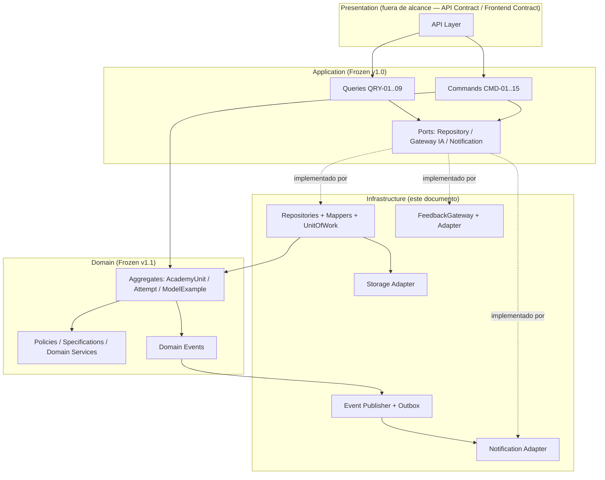
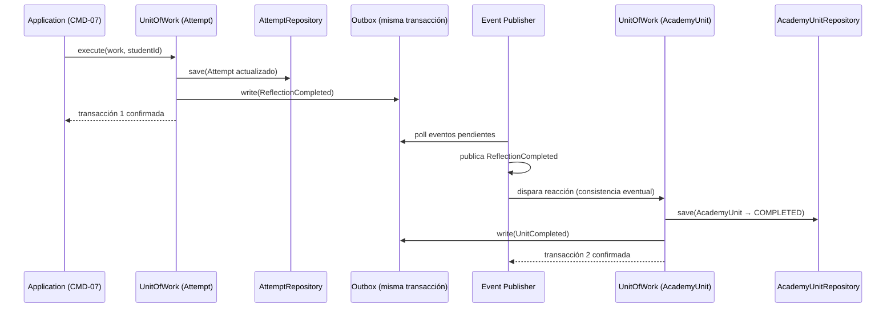
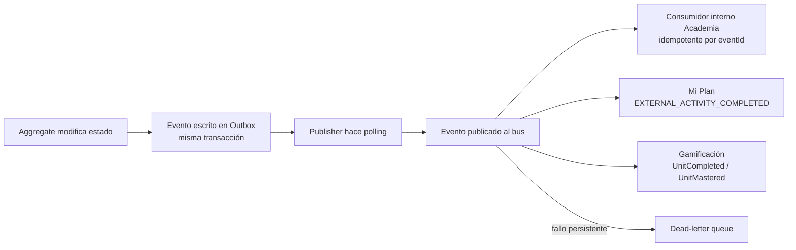
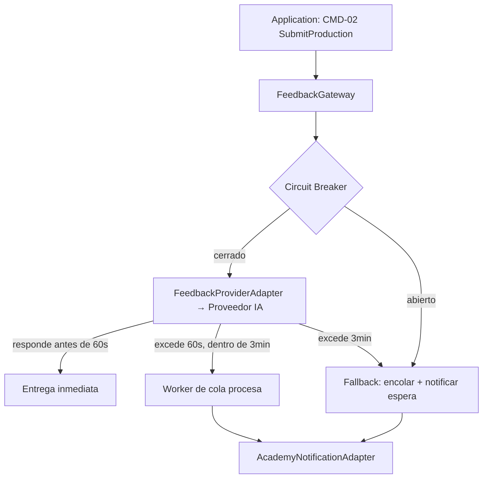
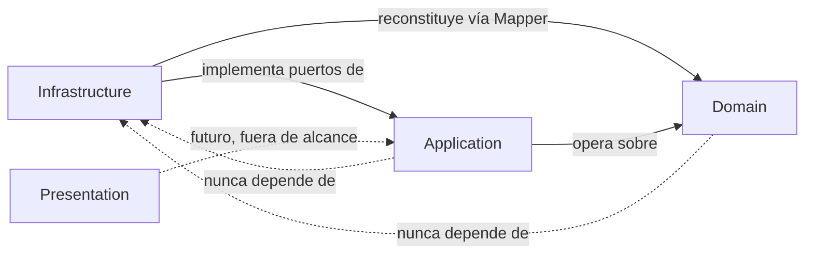

# ACADEMIA — INFRASTRUCTURE MODEL v1.1

**Estado:** DRAFT (pendiente de aprobación ARB antes de congelarse)
**Fecha original:** 2026-07-19
**Fecha de esta revisión:** 2026-07-19
**Autor:** Lead Software Architect / Lead Backend Engineer, Rédaction Lab

**Historial de cambios**

| Versión | Fecha | ACP relacionado | Cambio |
|---|---|---|---|
| 1.0 | 2026-07-19 | — (versión inicial) | Documento original. |
| 1.1 | 2026-07-19 | ACP-001-A, ACP-001-C | Confirmado que `CMD-16 AdvanceStep`/`CMD-17 VerifyComprehension` (nuevos en Application Model v1.1) no requieren ningún componente de infraestructura nuevo — reutilizan `AttemptRepository` sin modificación (Sección 5). Actualizada la nota sobre el campo de comentario de `ModelExample` en Persistencia (Sección 5) para reflejar el renombrado `aiCommentary` → `curatorialComment` (ACP-001-C, ver Registro de Ejecución del ACP-001). Ningún adaptador, Repository, patrón de eventos ni decisión ya resuelta por el IRB (Circuit Breaker, Outbox, cola, feature flags) fue modificado. |

**Documentos Frozen consumidos como contrato obligatorio (no modificados, no reinterpretados, no extendidos, salvo lo explícitamente registrado en el Historial de cambios de arriba):**
- Academia Functional Specification v1.1 (Frozen)
- Academia Domain Model — versión ratificada vigente (ver Nota de trazabilidad)
- Academia Application Model v1.1 (Frozen) — actualizado por ACP-001-A
- Resoluciones arquitectónicas A-01 a A-10 (Frozen)
- Resolución 18.24 del proyecto (RLS + `UnitOfWork` + `withStudentContext`/`withServiceContext`, ya aprobada para Mi Plan y reutilizada aquí como precedente vinculante, no como decisión nueva)

**Nota de trazabilidad (heredada de los documentos anteriores):** el encargo refiere "Academia Domain Model v1.2 (Frozen)". El documento ratificado y realmente Frozen en este proyecto es **v1.1**; existe además el Change Proposal **CH-01** (tipificación de `TeacherId`), aprobable pero aún no incorporado formalmente a un documento v1.2. Este Infrastructure Model se diseña contra v1.1, cuyo comportamiento es idéntico al que tendría v1.2 tras cerrar CH-01 (cambio de tipo sin efecto de comportamiento). Se señala por trazabilidad, sin bloquear este documento. El cierre de CH-01 sigue apareciendo en el checklist técnico (Sección 18) como acción pendiente, no como bloqueo de diseño.

---

## 1. Objetivo

**Responsabilidad de Infrastructure.** Proveer las implementaciones técnicas concretas que hacen ejecutable el Application Model de Academia, sin alterar ni una sola regla de negocio ya definida en el Domain Model, el Application Model o la Functional Specification. Infrastructure resuelve *cómo* se persiste, se comunica y se observa el sistema — nunca *qué* decide el sistema.

**Qué implementa:**
- Las implementaciones concretas de los puertos (Repositories) que el Application Model ya declaró como necesarios (ver Sección 3 del Application Model), usando Prisma sobre PostgreSQL.
- Los adaptadores de salida hacia sistemas externos: Coach IA (retroalimentación), sistema de notificaciones, bus de eventos de dominio, storage de la Biblioteca de Modelos.
- El mecanismo de persistencia transaccional (`UnitOfWork`) y de aislamiento por estudiante (RLS + `withStudentContext`/`withServiceContext`), reutilizando el patrón ya aprobado en Mi Plan (Resolución 18.24).
- El mecanismo de publicación/suscripción de Domain Events ya enumerados en el Domain Model.
- Logging, auditoría, observabilidad, configuración y seguridad de infraestructura del módulo.

**Qué nunca implementa:**
- Ninguna regla de negocio, invariante, Policy o Specification — esas ya están cerradas en el Domain Model y se ejecutan exclusivamente allí.
- Ningún caso de uso nuevo, comando o query no declarado en el Application Model.
- Ninguna decisión de UX/producto — esas ya están cerradas en la Functional Specification v1.1.
- El contrato de API (endpoints, verbos HTTP, rutas, DTOs de transporte) — eso corresponde a la fase siguiente, **API Contract**, explícitamente fuera de alcance de este documento.
- Componentes de interfaz de usuario — eso corresponde a **Frontend Contract**.

---

## 2. Límites

| Capa | Qué le pertenece en Academia | Qué NO le pertenece |
|---|---|---|
| **Domain** | `AcademyUnit`, `Attempt`, `ModelExample` (Aggregates); `Draft`, `Version`, `Feedback`, `TeacherOverride` (Entities); Value Objects, Enums, Invariantes, Máquina de estados, Domain Events, Domain Services, Factories, Policies, Specifications — todo ya Frozen en v1.1. | Nada de persistencia, nada de IA real, nada de HTTP, nada de infraestructura. |
| **Application** | Los 15 Commands y 9 Queries ya definidos, su orquestación (Repositories↓Domain↓Policies↓Specifications↓Events↓Persistencia), DTOs, manejo de errores funcionales — todo ya Frozen en el Application Model v1.0. | Implementación concreta de Repositories, ORM, colas, proveedores de IA, transporte HTTP. |
| **Infrastructure** *(este documento)* | Implementación concreta de los puertos declarados por Application: Repositories (Prisma), UnitOfWork, publicación de eventos, Gateway de IA, Gateway de notificaciones, storage de Biblioteca de Modelos, configuración, seguridad técnica, logging, observabilidad. | Cualquier regla de negocio, cualquier caso de uso nuevo, cualquier endpoint HTTP, cualquier componente visual. |
| **Presentation (API Contract / Frontend Contract)** | Endpoints REST/GraphQL, controladores, DTOs de transporte HTTP, validación de request, componentes de UI. *(Fuera de alcance de este documento — fase siguiente.)* | Ninguna lógica de persistencia ni de negocio. |

**Regla de dependencia (Dependency Inversion, ya vinculante para todo el proyecto):** Infrastructure depende de Application y de Domain (implementa sus puertos); Application y Domain nunca dependen de Infrastructure. Los Repositories son interfaces (puertos) definidos por Application/Domain e implementados por Infrastructure — nunca al revés.

---

## 3. Organización del módulo

Estructura de carpetas, siguiendo el mismo patrón de Arquitectura Feature-Driven + Clean Architecture ya usado en Mi Plan y Dashboard (§5.4, ya vinculante):

```
features/academy/
├── domain/                          # Ya implementado — Frozen. No se toca en este sprint.
│   ├── aggregates/
│   │   ├── academy-unit.ts
│   │   ├── attempt.ts
│   │   └── model-example.ts
│   ├── entities/
│   ├── value-objects/
│   ├── enums/
│   ├── events/
│   ├── services/
│   ├── factories/
│   ├── policies/
│   └── specifications/
│
├── application/                     # Ya implementado — Frozen. No se toca en este sprint.
│   ├── commands/                    # CMD-01 a CMD-15
│   ├── queries/                     # QRY-01 a QRY-09
│   ├── dtos/
│   └── ports/                       # Interfaces de Repository, Gateway de IA, Gateway de notificaciones — declaradas aquí, implementadas en infrastructure/
│
├── infrastructure/                  # OBJETO DE ESTE DOCUMENTO
│   ├── persistence/
│   │   ├── repositories/
│   │   │   ├── academy-unit.repository.ts
│   │   │   ├── attempt.repository.ts
│   │   │   ├── model-example.repository.ts
│   │   │   └── teacher-recommendation.repository.ts   # Ver Sección 5 — CU-11
│   │   ├── mappers/
│   │   │   ├── academy-unit.mapper.ts
│   │   │   ├── attempt.mapper.ts
│   │   │   └── model-example.mapper.ts
│   │   ├── unit-of-work/
│   │   │   └── academy-unit-of-work.ts                 # Reutiliza UnitOfWork.execute(work, studentId?) de Mi Plan
│   │   └── read-models/
│   │       └── academy-query.service.ts                # Resuelve QRY-01..09 directamente contra la BD, sin pasar por Aggregates
│   │
│   ├── events/
│   │   ├── publishers/
│   │   │   └── academy-event-publisher.ts
│   │   ├── subscribers/
│   │   │   └── academy-event-subscriber.ts              # Consume eventos externos (p. ej. de Mi Plan, si aplicara)
│   │   └── outbox/
│   │       └── academy-outbox.repository.ts             # Ver Sección 7 — patrón Outbox
│   │
│   ├── ai/
│   │   ├── feedback-gateway.ts                          # Puerto implementado — ver Sección 6
│   │   ├── feedback-provider.adapter.ts
│   │   └── feedback-queue.worker.ts                     # Procesamiento asíncrono cuando excede respuesta inmediata
│   │
│   ├── notifications/
│   │   └── academy-notification.adapter.ts
│   │
│   ├── storage/
│   │   └── model-example-storage.adapter.ts             # Biblioteca de Modelos (si incluye archivos, no solo texto)
│   │
│   ├── auth/
│   │   └── academy-authorization.guard.ts                # Aplica RLS context (withStudentContext / withServiceContext)
│   │
│   ├── observability/
│   │   ├── academy-logger.ts
│   │   └── academy-metrics.ts
│   │
│   └── config/
│       └── academy.config.ts
│
└── README.md
```

**Responsabilidad de cada carpeta:** cada subcarpeta de `infrastructure/` implementa exactamente un tipo de puerto ya declarado (implícita o explícitamente) por `application/ports/` — ninguna carpeta de infraestructura contiene lógica de decisión, solo mecanismo técnico (leer/escribir/serializar/transportar).

**Dependencias permitidas:** `infrastructure/*` → `application/ports/*` (implementa) y → `domain/*` (solo para reconstituir Aggregates vía Mapper, nunca para tomar decisiones). `infrastructure/*` nunca es importado por `domain/*` ni por `application/*` (Dependency Inversion). Ninguna carpeta de `infrastructure/academy` importa código de `features/mi-plan`, `features/laboratory` u otra feature — únicamente reutiliza *patrones* ya aprobados (RLS, `UnitOfWork`), no código compartido cruzado (consistente con §5.4: "una feature nunca accederá directamente a otra").

---

## 4. Adaptadores

**Aclaración de alcance:** los "adaptadores de entrada" descritos aquí son el punto de enganche técnico entre Application y la futura capa de Presentation (API Contract) — este documento no diseña rutas, verbos HTTP ni contratos de transporte; eso es explícitamente la fase siguiente.

| Tipo | Adaptador | Descripción |
|---|---|---|
| **Entrada** | `CommandBus` / `QueryBus` (reutilizado del patrón ya vigente en Mi Plan/Dashboard) | Punto único de entrada por el cual la futura capa de Presentation invoca los 15 Commands y 9 Queries de Academia. No decide nada — enruta al handler de Application correspondiente. |
| **Salida — Persistencia** | `AcademyUnitRepository`, `AttemptRepository`, `ModelExampleRepository`, `TeacherRecommendationRepository` | Implementan los puertos de persistencia declarados por Application, usando Prisma. Ver Sección 5. |
| **Salida — Eventos** | `AcademyEventPublisher` | Publica los Domain Events ya enumerados (13, Sección 10 del Domain Model) hacia el bus de eventos del proyecto. Ver Sección 7. |
| **Salida — IA** | `FeedbackGateway` | Adaptador hacia el proveedor de retroalimentación (Coach IA). Ver Sección 6. |
| **Salida — Notificaciones** | `AcademyNotificationAdapter` | Emite la notificación automática de retroalimentación diferida (Functional Spec v1.1, Sección 11) y la notificación de finalización hacia Mi Plan (evento `EXTERNAL_ACTIVITY_COMPLETED`, ya Domain-level). |
| **Salida — Storage** | `ModelExampleStorageAdapter` | Gestiona el contenido de la Biblioteca de Modelos si excede texto plano (archivos adjuntos, si el contenido editorial los requiere). |

---

## 5. Persistencia

**ORM y motor de base de datos:** Prisma sobre PostgreSQL — consistente con la base tecnológica ya usada en todo el proyecto (Dashboard, Mi Plan). No se documentan modelos Prisma concretos en este documento — solo contratos y responsabilidades.

**Repositories (contratos, sin código):**
- `AcademyUnitRepository`: `findById`, `findByStudentAndTextType`, `save` (persiste el Aggregate `AcademyUnit` completo, incluida su transición de estado). Alcance: un `AcademyUnit` por operación de escritura — nunca colecciones completas en una sola transacción de escritura, consistente con la ausencia de God Aggregate ya verificada en la auditoría DDD.
- `AttemptRepository`: `findById`, `findActiveByUnit`, `save` (persiste el Aggregate `Attempt`, incluyendo sus `Draft`/`Version`/`Feedback` internos). Debe soportar carga parcial para evitar el riesgo H-06 ya cerrado en el Domain Model v1.1 (no cargar indefinidamente todas las `Version`/`Feedback` de un `Attempt` — carga bajo demanda/paginada de historial). *(v1.1, ACP-001-A)*: `AttemptRepository.save` ya cubre, sin extensión, la persistencia de `currentStep` requerida por `CMD-16 AdvanceStep`/`CMD-17 VerifyComprehension` (Application Model v1.1) — no se agrega ningún método ni repositorio nuevo.
- `ModelExampleRepository`: `findByTextType`, `findById`, `save`, `retire` (soft-delete, consistente con "ejemplo retirado" ya contemplado en CU-08 de la Functional Spec). *(v1.1, ACP-001-C)*: el campo persistido anteriormente documentado como `aiCommentary` pasa a llamarse `curatorialComment` (contenido editorial estático, autoría del Administrador vía CMD-12/13 — nunca generado dinámicamente por IA en el alcance actual). `ModelExampleRepository.save` no cambia su firma, solo el nombre del campo transportado.
- `TeacherRecommendationRepository`: `create`, `findByStudent`. Repository independiente, sin relación con el Aggregate `AcademyUnit` — consecuencia directa de la resolución ARB de CU-11 ("asignar" = recomendar, sin efecto sobre `UnitState`). No es un Repository de Domain (no reconstituye ningún Aggregate); es un Repository de infraestructura puro para un registro informativo.

**Mappers:** uno por Aggregate (`AcademyUnitMapper`, `AttemptMapper`, `ModelExampleMapper`), responsables exclusivamente de traducir entre el modelo relacional (Prisma) y el Aggregate del Domain Model — sin lógica de negocio. Ningún Mapper decide nada; solo traduce.

**Transacciones:** cada Command que opera sobre un único Aggregate (p. ej. CMD-09 RepeatUnit, CMD-10 ApplyTeacherOverride) se ejecuta dentro de una única transacción atómica vía `UnitOfWork`. Los Commands que cruzan el límite `Attempt`↔`AcademyUnit` (p. ej. CMD-07 CompleteReflection) usan **dos transacciones separadas conectadas por un Domain Event**, exactamente como ya especifica el "Patrón de Sincronización Attempt→AcademyUnit" del Application Model v1.0 — este Infrastructure Model no modifica ese patrón, solo lo implementa.

**Unit of Work:** se reutiliza exactamente el contrato ya aprobado en Mi Plan (Resolución 18.24): `UnitOfWork.execute(work, studentId?)`. Cuando `studentId` está presente, la ejecución ocurre bajo `withStudentContext` (RLS activo, el estudiante solo puede leer/escribir su propio `AcademyUnit`/`Attempt`); las operaciones del Profesor/Administrador (CU-10, CU-11, gestión de `ModelExample`) ejecutan bajo `withServiceContext` con verificación de autorización explícita en el adaptador de seguridad (Sección 8), no vía RLS de estudiante.

**Row-Level Security (RLS):** se reutiliza el mismo patrón que Mi Plan — políticas RLS a nivel de PostgreSQL sobre las tablas que respaldan `AcademyUnit` y `Attempt`, filtrando por `student_id`. Esta reutilización es una decisión de infraestructura legítima en este documento: ambos módulos comparten la misma forma estructural (agregados propiedad exclusiva de un estudiante), y el patrón ya está aprobado y probado (Resolución 18.24) — no se introduce un patrón nuevo.

**Eventos y consistencia eventual:** la consistencia entre `Attempt` y `AcademyUnit` es **eventual por diseño**, tal como quedó formalmente reclasificado en el Domain Model v1.1 (corrección H-01: "Regla de consistencia eventual", no invariante estricta). Infrastructure implementa esto mediante el patrón **Outbox**: cada transacción que modifica un Aggregate y necesita notificar al otro escribe su Domain Event en una tabla Outbox dentro de la misma transacción atómica; un proceso separado publica esos eventos al bus y los marca como entregados. Esto garantiza que ningún evento se pierda aunque el bus de eventos falle momentáneamente (at-least-once delivery, ver Sección 7).

**Auditoría:** toda operación de `ApplyTeacherOverride` (CU-10) y `AssignUnitToStudent`/recomendación (CU-11) se registra en la entidad `AuditLog` ya existente a nivel de proyecto (§13.11, reutilizada, no redefinida), con autor, acción, unidad afectada, motivo y fecha — consistente con la Regla funcional 8 y 13 de la Functional Spec v1.1.

---

## 6. Integración IA

**Proveedor:** **PENDIENTE DE DECISIÓN DE INFRAESTRUCTURA.**
- *Problema:* ninguno de los documentos Frozen (Domain Model, Application Model, Functional Specification, resoluciones A-01–A-10) especifica qué proveedor de IA concreto implementa el Coach IA/Feedback Engine que Academia consume. La Functional Spec v1.1 define *qué* decide la IA (Sección 10) pero no *con qué proveedor* se ejecuta.
- *Impacto:* bloquea el diseño concreto del adaptador `FeedbackProviderAdapter` (formato de prompt, límites de tokens, costos reales, SLA real del proveedor).
- *Alternativas:* (a) reutilizar el proveedor y el contrato de Coach IA ya configurado a nivel de plataforma para otros módulos que también lo consumen (si existiera uno ya operativo), evitando una integración duplicada; (b) introducir un proveedor de IA exclusivo para Academia, con el costo de mantener dos integraciones distintas para la misma capacidad transversal.
- *Recomendación:* opción (a) — Coach IA es una capacidad transversal ya declarada como tal en la Functional Specification (Sección 1, "no es un Corrector Inteligente independiente"); introducir un proveedor exclusivo de Academia violaría esa misma definición. Se recomienda que esta decisión se resuelva a nivel de plataforma, no de módulo, antes de continuar con API Contract.

**Gateway (`FeedbackGateway`, puerto ya implícito en el Application Model):** interfaz única que Application invoca para solicitar retroalimentación sobre una producción — recibe el contenido y el contexto ya definidos en la Functional Spec Sección 10 ("qué información consume"), devuelve el conjunto de `FeedbackObservation` ya tipado en el Domain Model. El Gateway es el único punto de la infraestructura que conoce la existencia de un proveedor de IA concreto; Application y Domain nunca lo conocen.

**Adapter (`FeedbackProviderAdapter`):** implementación concreta del Gateway contra el proveedor elegido (pendiente, ver arriba). Traduce la solicitud del Gateway al formato del proveedor y su respuesta de vuelta al contrato de `FeedbackObservation`.

**Timeouts:** alineados con la decisión ya congelada en la Functional Spec v1.1, Sección 11 — ventana objetivo de 60 segundos, techo máximo de 3 minutos. El Adapter debe cortar cualquier llamada al proveedor que exceda ese techo y devolver el control al flujo asíncrono (worker de cola).

**Retry:** reintentos automáticos con backoff exponencial ante fallos técnicos transitorios del proveedor (timeout de red, error 5xx), máximo 3 intentos, dentro del techo total de 3 minutos — nunca reintentos indefinidos, para no violar el límite ya congelado.

**Circuit Breaker:** si el proveedor de IA falla de forma sostenida (umbral: **PENDIENTE DE DECISIÓN DE INFRAESTRUCTURA** — ningún documento Frozen define el umbral exacto de fallos consecutivos o la ventana de tiempo para abrir el circuito), el Gateway debe dejar de invocar al proveedor temporalmente y activar el Fallback. Se recomienda definir este umbral junto con la elección de proveedor (ver punto anterior), ya que depende del SLA real del servicio elegido.

**Fallback:** cuando el Circuit Breaker está abierto o se agota el techo de 3 minutos, el sistema debe encolar la solicitud para reintento diferido y notificar al estudiante mediante `AcademyNotificationAdapter` (Sección 4) que la retroalimentación llegará más tarde — esto es la aplicación literal del comportamiento ya congelado en Functional Spec v1.1 (CU-04, excepción). No existe un fallback que genere retroalimentación sin IA (ningún documento Frozen lo permite; inventarlo violaría A-05, que exige que la retroalimentación sea siempre generada por el Coach IA formativo, nunca por un mecanismo alterno no evaluado).

**Observabilidad de la integración IA:** cada llamada al proveedor debe registrar: tiempo de respuesta, éxito/fallo, motivo de fallo si aplica, si se usó ruta síncrona o asíncrona — sin registrar el contenido textual completo de la producción del estudiante ni de la retroalimentación en logs de bajo nivel (ver Sección 10, restricciones de logging).

---

## 7. Infraestructura de eventos

**Eventos internos (Domain Events ya enumerados en el Domain Model v1.1 — no se modifica la lista):** `UnitUnlocked`, `UnitStarted`, `ProductionSubmitted`, `FeedbackRequested`, `FeedbackDelivered`, `RevisionStarted`, `ReflectionStarted`, `ReflectionCompleted`, `UnitCompleted`, `UnitMastered`, `UnitRepeated`, `TeacherOverrideApplied`. Se publican y consumen exclusivamente dentro de los límites de Academia (comunicación entre los Aggregates `AcademyUnit` y `Attempt`, y disparo de Policies/Domain Services).

**Eventos externos (los que otros módulos consumen, ya definidos en A-08 y en la Functional Spec Sección 9):** `EXTERNAL_ACTIVITY_COMPLETED` (consumido por Mi Plan), y los eventos que Gamificación consume de forma independiente (`UnitCompleted`, `UnitMastered`, ya listados arriba — Gamificación se suscribe a los mismos eventos de dominio, no requiere un evento externo distinto).

**Publicación:** vía el patrón Outbox ya descrito en la Sección 5 — todo evento se escribe primero en la tabla Outbox dentro de la misma transacción que modifica el Aggregate, luego un publicador separado lo entrega al bus de eventos del proyecto.

**Suscripción:** cada módulo consumidor (Mi Plan, Gamificación) se suscribe de forma independiente al bus — Academia no conoce ni invoca directamente a esos módulos (consistente con Regla funcional 11 de la Functional Spec: "Academia nunca escribe directamente sobre datos de Mi Plan, Gamificación...").

**Garantías:** *at-least-once delivery*. El publicador reintenta la entrega hasta confirmación; los consumidores deben ser idempotentes (ver abajo). No se garantiza *exactly-once* — introducirlo exigiría infraestructura adicional (deduplicación distribuida) no aprobada en ningún documento Frozen ni solicitada aquí.

**Orden:** se garantiza orden **por agregado** (todos los eventos de una misma instancia de `AcademyUnit` o `Attempt` se entregan en el orden en que ocurrieron), no un orden global entre agregados distintos — suficiente para las garantías ya exigidas por el Domain Model (ninguna regla exige orden global entre estudiantes distintos).

**Reintentos:** igual que en la Sección 6 — backoff exponencial, con un máximo de reintentos configurable (ver Sección 9). Tras agotar los reintentos, el evento se mueve a una cola de eventos fallidos (dead-letter) para revisión manual — no se descarta silenciosamente.

**Idempotencia:** cada evento lleva un identificador único (`eventId`); los consumidores (incluidos los propios manejadores internos de Academia, p. ej. el paso `CompleteReflection` que reacciona a `ReflectionCompleted`) deben verificar si ya procesaron ese `eventId` antes de aplicar efectos — evita duplicar notificaciones, duplicar transiciones de estado o duplicar el aviso a Mi Plan (consistente con Regla funcional 12: notificación única por unidad).

---

## 8. Seguridad

**Autenticación:** Academia no implementa autenticación propia — reutiliza el mecanismo de autenticación ya vigente a nivel de plataforma (fuera del alcance de este módulo). Infrastructure de Academia únicamente consume la identidad ya autenticada (Estudiante/Profesor/Administrador) provista por el contexto de ejecución.

**Autorización:** aplicada en dos niveles, sin excepción:
1. **RLS a nivel de base de datos** para todo acceso de Estudiante a su propio `AcademyUnit`/`Attempt` (reutilizando `withStudentContext`, Resolución 18.24).
2. **Verificación explícita en el adaptador de seguridad (`AcademyAuthorizationGuard`)** para las acciones de Profesor (CU-09, CU-10, CU-11): confirma la relación docente-estudiante/grupo antes de permitir la operación. Esta verificación consume el contrato de Organización Académica ya señalado como dependencia en la Functional Spec (Sección 15) — el contrato exacto de esa verificación sigue siendo un pendiente técnico ya listado en el checklist de la Functional Spec v1.1 (Sección 17), no inventado aquí.
3. Las operaciones del Administrador sobre `ModelExample` (CU-08 soporte editorial) ejecutan bajo `withServiceContext` con verificación de rol `ADMIN`, sin relación con RLS de estudiante.

**Secrets:** las credenciales del proveedor de IA (una vez decidido, ver Sección 6) y cualquier credencial de infraestructura de Academia se gestionan mediante el mecanismo de secrets ya vigente a nivel de plataforma (variables de entorno inyectadas de forma segura en cada ambiente) — Academia no introduce un mecanismo de secrets propio.

**Configuración:** ver Sección 9.

**Permisos:** alineados exactamente con la matriz de la Functional Spec v1.1, Sección 2 — ningún permiso adicional se introduce a nivel de infraestructura. La tabla RBAC ya vigente a nivel de proyecto (§12.5–12.6: STUDENT/TEACHER/ADMIN/SUPER_ADMIN/REVIEWER/AI_SERVICE/SYSTEM) se reutiliza sin extensión: Academia usa STUDENT, TEACHER, ADMIN, y AI_SERVICE (para las llamadas del Gateway de IA hacia adentro, si el proveedor requiere un rol de servicio para registrar retroalimentación).

---

## 9. Configuración

**Variables de entorno (nombres ilustrativos, sin valores):**
- `ACADEMY_FEEDBACK_TIMEOUT_TARGET_MS` (objetivo 60000, ya congelado en Functional Spec).
- `ACADEMY_FEEDBACK_TIMEOUT_MAX_MS` (máximo 180000, ya congelado).
- `ACADEMY_FEEDBACK_RETRY_MAX_ATTEMPTS`.
- `ACADEMY_EVENT_OUTBOX_POLL_INTERVAL_MS`.
- `ACADEMY_AI_PROVIDER_ENDPOINT` / `ACADEMY_AI_PROVIDER_API_KEY` (dependen de la decisión pendiente de la Sección 6).

**Configuración por ambiente:** desarrollo/staging/producción difieren únicamente en destino de conexión (BD, proveedor de IA, bus de eventos) y en umbrales de timeout/retry — nunca en reglas de negocio ni en comportamiento funcional (ningún flag cambia una regla ya congelada).

**Feature Flags:** Academia requiere, como mínimo, banderas para: habilitar/deshabilitar la evaluación de `MASTERED` de forma independiente (permite desplegar la máquina de estados sin activar el criterio de dominio si su contrato de evidencia — pendiente en el checklist de la Functional Spec — aún no está cerrado), y para alternar el modo de retroalimentación entre síncrono-preferente e íntegramente asíncrono durante etapas tempranas de rollout. El mecanismo/proveedor concreto de feature flags (librería o servicio) **no está definido en ningún documento Frozen** — **PENDIENTE DE DECISIÓN DE INFRAESTRUCTURA**: *problema:* no hay precedente documentado en este proyecto; *impacto:* bajo, no bloquea el resto del diseño; *alternativas:* flags basados en configuración de entorno simple vs. un servicio dedicado de feature flags; *recomendación:* iniciar con configuración de entorno simple (sin servicio dedicado) dado el bajo número de flags necesarios, revisitando si el número crece.

---

## 10. Logging

**Qué registrar:** inicio/fin de cada Command y Query (nombre, duración, resultado éxito/error), cada evento de dominio publicado y consumido (nombre, `eventId`, agregado origen), cada llamada al Gateway de IA (ver Sección 6), cada acción de auditoría (CU-10, CU-11).

**Qué NO registrar:** contenido íntegro de las producciones del estudiante (`DraftContent`) ni el texto completo de la retroalimentación en logs de aplicación de nivel INFO/DEBUG — esta información vive en la base de datos (con sus propios controles de acceso), no en el sistema de logs. Ningún dato personal más allá del identificador del estudiante (nunca nombre, correo, ni contenido) en logs de bajo nivel.

**Formato:** JSON estructurado, consistente con el formato ya usado en Mi Plan/Dashboard (reutilizado, no redefinido).

**Niveles:** `ERROR` (fallos técnicos, incluidos fallos del Gateway de IA tras agotar reintentos), `WARN` (circuit breaker abierto, evento movido a dead-letter), `INFO` (Commands/Queries ejecutados, eventos publicados), `DEBUG` (detalle de orquestación, solo en entornos no productivos).

**Correlation Id / Trace Id:** todo Command y Query recibe un `correlationId` desde la capa de Presentation (fuera de alcance aquí, pero el contrato de propagación sí es responsabilidad de Infrastructure); ese `correlationId` se propaga a través de toda la orquestación, incluidas las dos transacciones separadas del patrón Attempt→AcademyUnit y la llamada al Gateway de IA, permitiendo reconstruir el flujo completo de una operación aunque cruce varias transacciones.

---

## 11. Observabilidad

**Métricas:** tasa de éxito/fallo de retroalimentación IA por ventana de tiempo; latencia p50/p95/p99 de generación de retroalimentación (contra los umbrales de 60s/3min ya congelados); número de unidades completadas/dominadas por período; tasa de eventos en dead-letter; tiempo de propagación de la consistencia eventual Attempt→AcademyUnit.

**Health Checks:** verificación de conectividad a PostgreSQL, verificación de conectividad al proveedor de IA (cuando esté decidido), verificación de que el publicador de Outbox está procesando (no acumulando backlog sin publicar).

**Tracing:** trazas distribuidas que cubran el ciclo completo de un Command, incluida la llamada externa al Gateway de IA — reutilizando la infraestructura de tracing ya vigente a nivel de plataforma (no se introduce una nueva).

**Alertas:** backlog de Outbox por encima de un umbral (**PENDIENTE DE DECISIÓN DE INFRAESTRUCTURA** el umbral exacto — ningún documento Frozen lo define; se recomienda fijarlo empíricamente durante el primer mes de operación real, no antes); circuit breaker de IA abierto por más de N minutos; tasa de fallo de retroalimentación por encima de un umbral operativo.

---

## 12. Caché

**Dónde aplica:** lecturas de la Biblioteca de Modelos (`ModelExample`) — contenido editorial de baja frecuencia de cambio, apto para caché con invalidación por escritura del Administrador (CU-08, CMD-12/13/14). También aplica a QRY-01 (resumen de progreso del estudiante) con un TTL corto, dado que es una lectura frecuente desde el Dashboard ("Continúa donde te quedaste").

**Dónde está prohibida:** cualquier lectura que participe en una decisión de negocio en curso (p. ej., el estado exacto de `AcademyUnit` antes de aplicar una transición) — el Aggregate siempre se reconstituye desde la fuente de verdad transaccional, nunca desde caché, para no violar ninguna invariante ni la máquina de estados. Prohibida también sobre el contenido de retroalimentación en curso (`AWAITING_FEEDBACK`), dado el requisito de notificación oportuna ya congelado.

**Invalidaciones:** invalidación activa (no solo TTL) en `ModelExampleRepository.save/retire` para la Biblioteca de Modelos; invalidación activa del resumen de progreso (QRY-01) ante cualquier evento que cambie `UnitState` del estudiante correspondiente.

---

## 13. Archivos

**Storage:** si el contenido editorial de una unidad o de un `ModelExample` incluye archivos (más allá de texto plano — p. ej. material de apoyo), se almacena en el servicio de storage de objetos ya vigente a nivel de plataforma (reutilizado, no uno nuevo para Academia). Ningún documento Frozen especifica si el contenido de la Biblioteca de Modelos es texto puro o incluye archivos adjuntos — **PENDIENTE DE DECISIÓN DE INFRAESTRUCTURA**: *problema:* la Functional Spec (Sección 4) describe la Biblioteca de Modelos como "producciones ejemplares con análisis comparativo", sin precisar formato de almacenamiento; *impacto:* bajo — no afecta el Domain Model (que ya trata `ModelExample` como contenido, sin especificar su forma física); *alternativas:* texto enriquecido almacenado directamente en base de datos, o archivo en storage de objetos referenciado por URL; *recomendación:* texto enriquecido en base de datos mientras el contenido no incluya multimedia — más simple y suficiente para el alcance actual.

**Versionado:** las `Version` de una producción del estudiante (entidad ya definida en el Domain Model) se versionan íntegramente en base de datos, no en storage de archivos — son texto, y el Domain Model ya exige conservar todas las versiones sin sobrescritura (Regla funcional 4/7).

**Backups:** Academia no requiere una política de backup distinta a la ya vigente para toda la base de datos del proyecto — se hereda sin excepción.

---

## 14. Integraciones externas

| Integración | Estado |
|---|---|
| **IA (Coach IA/Feedback Engine)** | Ver Sección 6 — proveedor pendiente de decisión de infraestructura. |
| **Correo** | Ninguna regla Frozen exige que Academia envíe correo electrónico directamente; la notificación de retroalimentación diferida (Functional Spec, Sección 11) se canaliza vía el sistema de notificaciones general (§13.10), no vía correo directo desde Academia. |
| **Notificaciones (in-app/push, §13.10)** | Academia emite la notificación de retroalimentación diferida y consume el sistema ya existente. El mapeo exacto entre `FeedbackDelivered`/espera-extendida y un tipo concreto de `NotificationEvent` ya catalogado a nivel de plataforma no está confirmado en ningún documento Frozen — **PENDIENTE DE DECISIÓN DE INFRAESTRUCTURA**: *problema:* no hay evidencia documental de que exista ya un `NotificationEvent` que cubra este caso exacto; *impacto:* medio — bloquea la implementación exacta del `AcademyNotificationAdapter`; *alternativas:* reutilizar un tipo de evento de notificación ya existente si su semántica calza, o solicitar la creación de uno nuevo a nivel de plataforma (fuera del alcance de Academia); *recomendación:* validar contra el catálogo real de `NotificationEvent` antes de iniciar la implementación de este adaptador. |
| **Servicios futuros** | Ninguno declarado en los documentos Frozen. No se diseña infraestructura especulativa para integraciones no aprobadas. |

---

## 15. Dependencias técnicas

| Componente | Justificación |
|---|---|
| **PostgreSQL** | Motor de base de datos ya vigente en todo el proyecto (Dashboard, Mi Plan); Academia no introduce un motor nuevo. |
| **Prisma** | ORM ya vigente en todo el proyecto; mantiene consistencia de Mappers/migraciones con el resto de módulos. |
| **RLS de PostgreSQL** | Ya aprobado y en producción para Mi Plan (Resolución 18.24); reutilizado por identidad estructural (agregados por-estudiante). |
| **Mecanismo de bus de eventos ya vigente a nivel de plataforma** | Reutilizado sin cambios; Academia no introduce un nuevo transporte de eventos. |
| **Mecanismo de colas para procesamiento asíncrono de retroalimentación** | Necesario para cumplir el modelo híbrido (Sección 6/11); **la tecnología concreta (p. ej. cola gestionada vs. tabla de trabajos en PostgreSQL) no está definida en ningún documento Frozen** — **PENDIENTE DE DECISIÓN DE INFRAESTRUCTURA**: *problema:* sin precedente documentado en este proyecto para colas de trabajo asíncronas; *impacto:* alto — condiciona directamente el diseño del `feedback-queue.worker.ts`; *alternativas:* (a) tabla de trabajos pendientes en la misma PostgreSQL ya usada (más simple, menos infraestructura nueva, consistente con el patrón Outbox ya adoptado), (b) servicio de colas dedicado; *recomendación:* opción (a) como punto de partida, por consistencia con el patrón Outbox ya elegido en este mismo documento y por no introducir un componente de infraestructura completamente nuevo sin necesidad demostrada. |

---

## 16. Riesgos técnicos

| Riesgo | Mitigación |
|---|---|
| El proveedor de IA no está decidido, bloqueando la implementación real del Gateway. | Resolver la Sección 6 antes de iniciar la construcción del adaptador; el resto del Infrastructure Model no depende de esa decisión y puede avanzar en paralelo. |
| La consistencia eventual Attempt→AcademyUnit podría percibirse por el usuario si la propagación del evento se retrasa. | Patrón Outbox con intervalo de sondeo agresivo (configurable, Sección 9) y métrica de tiempo de propagación (Sección 11) para detectar degradación temprano. |
| Carga indefinida de historial de `Attempt` (Version/Feedback) podría degradar rendimiento si no se pagina. | `AttemptRepository` implementa carga parcial/paginada por diseño (ya especificado en Sección 5), cerrando el riesgo H-06 ya identificado en el Domain Model v1.1. |
| Fallo sostenido del proveedor de IA sin Circuit Breaker podría saturar reintentos y degradar el sistema completo. | Circuit Breaker obligatorio (Sección 6); umbral exacto pendiente de decisión, pero el mecanismo en sí no es opcional. |
| Eventos duplicados por reintento de publicación (at-least-once) podrían duplicar notificaciones o efectos. | Idempotencia obligatoria por `eventId` en todo consumidor (Sección 7). |
| Reutilizar RLS/UnitOfWork de Mi Plan sin verificar diferencias estructurales reales entre ambos módulos. | Verificación explícita durante implementación (ya incluida en el checklist, Sección 18) antes de asumir el patrón por completo aplicable sin ajuste. |

---

## 17. Estrategia de pruebas

**Unitarias:** Mappers (traducción correcta Aggregate↔modelo relacional, sin pérdida de datos), lógica de reintento/backoff del `FeedbackProviderAdapter` (aislada del proveedor real mediante dobles de prueba), lógica de idempotencia de consumidores de eventos.

**Integración:** Repositories contra una base de datos real de pruebas (verificando RLS efectivo: un estudiante nunca puede leer/escribir el `AcademyUnit` de otro), UnitOfWork con rollback ante fallo a mitad de operación, patrón Outbox (el evento se publica si y solo si la transacción que lo originó fue confirmada).

**Contract Testing:** entre Application y las implementaciones de Infrastructure de cada puerto (Repository, Gateway de IA, Notificaciones) — garantiza que cualquier cambio futuro en Infrastructure no rompe el contrato que Application ya asume, sin necesidad de ejecutar el proveedor de IA real en cada corrida.

**End-to-End:** al menos un recorrido completo por caso de uso crítico (CU-01 a CU-11) contra un entorno de staging con el proveedor de IA real o un doble de alta fidelidad, verificando explícitamente los criterios de aceptación 1 a 19 ya congelados en la Functional Spec v1.1.

---

## 18. Checklist técnico

- [ ] Ningún Repository ni Mapper contiene lógica de negocio — verificado por revisión de código dedicada.
- [ ] RLS activo y verificado con pruebas de integración que confirmen aislamiento estricto por estudiante.
- [ ] `UnitOfWork.execute(work, studentId?)` reutilizado sin modificación de su contrato ya aprobado en Mi Plan.
- [ ] Patrón Outbox implementado y probado (evento publicado si y solo si la transacción se confirmó).
- [ ] Timeouts de retroalimentación IA configurados exactamente en 60000ms objetivo / 180000ms máximo, sin desviación de la Functional Spec v1.1.
- [ ] Circuit Breaker implementado (umbral exacto pendiente de decisión, pero mecanismo presente).
- [ ] Idempotencia por `eventId` verificada en todos los consumidores de eventos.
- [ ] `AttemptRepository` implementa carga paginada de `Version`/`Feedback` (cierre de H-06).
- [ ] `TeacherRecommendationRepository` no invoca ni modifica el Aggregate `AcademyUnit` (cierre de CU-11 vía ARB).
- [ ] Ningún log de nivel INFO/DEBUG contiene contenido íntegro de producciones ni de retroalimentación.
- [ ] Correlation Id propagado a través de las dos transacciones del patrón Attempt→AcademyUnit y de la llamada al Gateway de IA.
- [ ] Caché nunca aplicado sobre lecturas que participen en una decisión de negocio en curso (Sección 12).
- [ ] Proveedor de IA decidido y documentado (Sección 6) antes de iniciar la construcción del Adapter real.
- [ ] Mapeo de notificación de retroalimentación diferida contra el catálogo real de `NotificationEvent` validado (Sección 14).
- [ ] Tecnología de cola para procesamiento asíncrono decidida (Sección 15) antes de construir `feedback-queue.worker.ts`.
- [ ] Change Proposal CH-01 cerrado (heredado del checklist de la Functional Spec v1.1 — no es bloqueante de este Infrastructure Model, pero debe cerrarse antes de dar por completo el ciclo de documentación).
- [ ] Contrato de verificación de relación docente-estudiante con Organización Académica confirmado (heredado del checklist de la Functional Spec v1.1).
- [ ] Contrato de evidencia de competencia para `MASTERED` con Learning Analytics confirmado (heredado del checklist de la Functional Spec v1.1).

---

## 19. Diagramas

### 19.1 Arquitectura de capas



### 19.2 Flujo de persistencia (ejemplo: CMD-07 CompleteReflection)



### 19.3 Flujo de eventos



### 19.4 Integración IA



### 19.5 Dependencias entre capas



---

## VALIDACIÓN FINAL — Auditoría automática

| Verificación | Resultado |
|---|---|
| ✓ No se modificó el Domain Model | **Cumple.** Ninguna sección de este documento redefine Aggregates, Entities, Value Objects, Enums, Invariantes, Máquina de estados, Domain Events, Domain Services, Factories, Policies o Specifications. Todo lo citado se referencia, no se altera. |
| ✓ No se modificó el Application Model | **Cumple.** Los 15 Commands y 9 Queries se referencian por su definición ya Frozen; el "Patrón de Sincronización Attempt→AcademyUnit" se implementa exactamente como fue especificado, sin variación. |
| ✓ No se modificó la Functional Specification | **Cumple.** Los umbrales de retroalimentación (60s/3min), el comportamiento de bloqueo docente, la resolución de CU-11 y el nivel WCAG se toman literalmente de la v1.1 Frozen, sin reinterpretación. |
| ✓ No se inventaron reglas | **Cumple.** Toda decisión de infraestructura nueva (reutilización de RLS/UnitOfWork, patrón Outbox, ubicación de `TeacherRecommendationRepository`) es una decisión de *mecanismo técnico*, no de *regla de negocio* — no crea ni modifica comportamiento observable por el usuario más allá de lo ya congelado. |
| ✓ No se agregaron funcionalidades | **Cumple.** No se introduce ningún caso de uso, comando, query o capacidad no presente en el Application Model o la Functional Spec. |
| ✓ Todas las dependencias respetan Clean Architecture | **Cumple.** Infrastructure depende de Application/Domain para implementar sus puertos; ninguna dependencia inversa fue introducida (Sección 2, Sección 3). |
| ✓ El documento puede usarse directamente durante la implementación | **Cumple con reservas explícitas.** Seis puntos quedan marcados **PENDIENTE DE DECISIÓN DE INFRAESTRUCTURA** (proveedor de IA, umbral del Circuit Breaker, mecanismo de feature flags, umbral de alerta de backlog de Outbox, formato de almacenamiento de la Biblioteca de Modelos, mapeo a `NotificationEvent`, tecnología de cola asíncrona) — el resto del documento es ejecutable sin reinterpretación. |

---

## DICTAMEN FINAL

**REQUIRES ARCHITECTURE REVIEW**

**Justificación:** el Infrastructure Model es estructuralmente completo, coherente con Clean Architecture/DDD/SOLID, y no contradice ni reinterpreta ningún documento Frozen. Sin embargo, contiene **siete** decisiones marcadas `PENDIENTE DE DECISIÓN DE INFRAESTRUCTURA` (Secciones 6, 9, 11, 13, 14 y 15) que condicionan directamente la construcción de componentes concretos: proveedor de IA y umbral de Circuit Breaker, mecanismo de feature flags, umbral de alerta de Outbox, formato de almacenamiento de la Biblioteca de Modelos, mapeo del evento de notificación diferida, y tecnología de cola asíncrona. Ninguna de estas siete es estructural (no exige rediseñar capas, agregados ni el patrón de persistencia ya definido) y todas incluyen recomendación justificada — pero, siguiendo la misma disciplina aplicada en los ciclos anteriores de este proyecto, no deben resolverse por inferencia dentro de este documento. Corresponde a un ARB (o al equipo de infraestructura de plataforma, para los puntos que exceden el alcance de Academia) cerrarlas antes de declarar este Infrastructure Model FROZEN y antes de iniciar API Contract.
