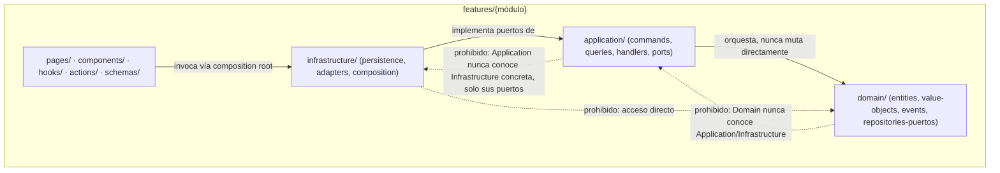
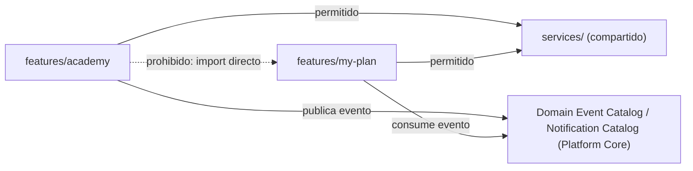

# RÉDACTION LAB — PROJECT STRUCTURE SPECIFICATION v1.0

**Rol:** Principal Software Architect / Repository Architect, Rédaction Lab. No modifica arquitectura, dominio, modelos funcionales ni contratos existentes — únicamente especifica la organización física del repositorio.
**Fecha:** 2026-07-20.
**Documentos Frozen consumidos como contrato obligatorio (ninguno modificado):** Product Blueprint, Arquitectura General, Domain Model v1.1, Application Model v1.3, Academia Functional Specification v1.3, Academia Infrastructure Model v1.1, Academia API Contract v1.2, Academia Frontend Contract v1.1, Platform Core Foundation v1.0, Architecture Change Management Standard v1.0, ACP-001/002/003 (Executed), Academia Architecture Certified.

**Nota de fundamentación (crítica, léase antes que el resto del documento):** este documento no parte de una página en blanco ni de una plantilla genérica. Se contrastó directamente contra el estado real del repositorio (`redaction-lab/`), en particular contra `ARCHITECTURE.md` (documento de infraestructura técnica ya existente, resultado de la resolución 18.2 y sucesivas) y contra la implementación ya construida de dos módulos reales: **Dashboard** (solo lectura, sin Aggregates propios) y **Mi Plan** (Domain-Driven Design completo: `domain/`, `application/`, `infrastructure/` ya implementados y probados — Sprints 3.3.2 a 3.3.4.1). No se encontró, en ningún directorio del repositorio, un documento nombrado "Implementation Blueprint v1.0" — su contenido, en la medida en que ya existe de forma operativa, está distribuido entre `ARCHITECTURE.md` y la implementación real de Mi Plan. Este documento **no inventa una convención nueva**: formaliza y generaliza, a nivel de especificación oficial, la convención que Mi Plan ya demuestra en código, para que Academia y todo módulo futuro con Aggregates propios la sigan exactamente igual, sin reinterpretarla módulo por módulo.

---

## 1. Objetivo

**Propósito.** Definir la organización física completa y única del repositorio `redaction-lab/`, de forma que todos los módulos —ya implementados o futuros— compartan la misma estructura de directorios, las mismas reglas de dependencia y las mismas convenciones de nombres, sin que cada equipo o cada módulo deba decidirlas de nuevo.

**Qué problemas resuelve:**
- Elimina la ambigüedad sobre dónde vive cada tipo de artefacto (una Entity de dominio, un Command, un Repository, una página, un test) para cualquier módulo nuevo.
- Evita que un módulo con reglas de negocio reales (Aggregates, invariantes, Domain Events) se implemente con la misma estructura plana que un módulo de solo lectura, o viceversa — ambos patrones ya coexisten en el repositorio real y este documento formaliza cuándo aplica cada uno.
- Da a Claude Code y a cualquier desarrollador una referencia única y verificable contra la cual auditar la conformidad estructural de un Pull Request.

**Qué queda fuera de su alcance:**
- Ninguna regla de negocio, caso de uso, endpoint o pantalla — esos ya están fijados en los documentos Frozen de cada módulo.
- Ninguna decisión de infraestructura de plataforma (Notification Catalog, RLS, Circuit Breaker, Outbox) — ya fijadas en el Infrastructure Model y el Platform Core Foundation.
- Ninguna elección de tecnología distinta a la ya aprobada (Sección 3 de `ARCHITECTURE.md`) — este documento no elige stack, solo organiza dónde vive el código que usa el stack ya decidido.
- Código real, componentes, esquemas Prisma con modelos, migraciones — ninguno de estos se genera aquí.

---

## 2. Filosofía de organización

La organización física responde a un único principio ya vigente y no negociable en el proyecto (`ARCHITECTURE.md`, Sección 2): **Feature-Driven Architecture** — cada ecosistema pedagógico es un módulo independiente bajo `features/`, con una frontera de dependencia estricta hacia el resto del sistema. Sobre ese principio ya fijado, este documento añade la capa de organización **interna** de un módulo, que debe soportar simultáneamente:

- **Clean Architecture.** Dentro de un módulo con Aggregates propios, las dependencias fluyen en una única dirección: `infrastructure → application → domain`, nunca al revés. `domain/` no importa nada de `application/` ni de `infrastructure/`; es exactamente el patrón que Mi Plan ya implementa (`features/my-plan/domain`, `features/my-plan/application`, `features/my-plan/infrastructure`) y el que el Infrastructure Model de Academia exige (Application define los puertos de Repository; Infrastructure los implementa).
- **DDD.** Cada módulo con reglas de negocio reales aloja sus Aggregates, Entities, Value Objects, Domain Events, Policies y Specifications en `domain/`, exactamente con la subestructura que Mi Plan ya prueba en código (`entities/`, `value-objects/`, `enums/`, `events/`, `exceptions/`, `repositories/` [puertos, interfaces], `services/` [Domain Services], `shared/` [primitivas: `AggregateRoot`, `Entity`]).
- **CQRS.** `application/commands/` y `application/queries/` se mantienen como colecciones separadas dentro de cada módulo — ya vigente en Mi Plan y ya exigido por el Application Model de Academia (Commands `CMD-01` a `CMD-17`, Queries `QRY-01` a `QRY-10`).
- **SOLID.** La separación de puertos (`application/ports/`) y adaptadores (`infrastructure/adapters/`, `infrastructure/persistence/`) aplica Dependency Inversion de forma literal: `application/` depende de una interfaz (`UnitOfWork`, `Clock`, `Logger`, `EventBus`), nunca de una implementación concreta de Prisma — ya demostrado por `features/my-plan/application/ports/` frente a `features/my-plan/infrastructure/adapters/`.
- **Modularidad.** Regla ya vigente y no relajada por este documento (`ARCHITECTURE.md`, Sección 4.2): ninguna feature importa directamente de otra feature.
- **Escalabilidad.** Agregar un módulo nuevo (Sección 16) nunca exige reorganizar un módulo existente — cada `features/{módulo}/` es autocontenido.
- **Testabilidad.** La estructura de `tests/unit/{módulo}/{domain,application,infrastructure}` ya espeja 1:1 la estructura de producción de Mi Plan — este documento formaliza ese espejo como obligatorio para todo módulo con capas DDD.
- **Mantenibilidad.** Un desarrollador que conoce la estructura de Mi Plan ya conoce la estructura que deberá tener Academia — no hay curva de aprendizaje adicional por módulo.

**Coexistencia de dos patrones internos, ambos ya reales y legítimos (no es una inconsistencia, es una decisión ya tomada implícitamente por el propio repositorio):**

| Patrón | Cuándo aplica | Ejemplo real ya implementado |
|---|---|---|
| **Módulo DDD completo** (`domain/` + `application/` + `infrastructure/`) | El módulo posee Aggregates propios, invariantes de negocio, Commands/Queries con orquestación real | Mi Plan (`LearningPlan`, `LearningTask`...); Academia (`AcademyUnit`, `Attempt`, `ModelExample` — a implementar siguiendo este mismo patrón) |
| **Módulo de solo lectura / agregador** (sin `domain/`/`application/`/`infrastructure/` propios) | El módulo no posee Aggregates propios — consume datos ya persistidos por otros módulos, vía el `database/` compartido | Dashboard (`database/repositories/studentDashboardRepository.ts`, sin `features/dashboard/domain`) |

Esta tabla es la resolución explícita de una posible objeción: **este documento no impone `domain/application/infrastructure` a todo módulo por igual** — lo impone únicamente a los módulos que el propio Domain Model de cada uno demuestre que lo necesitan (Aggregates reales). Un módulo agregador de solo lectura seguiría innecesariamente pesado si se le forzara la misma estructura sin Aggregates que orquestar.

---

## 3. Arquitectura física del repositorio

Estructura de nivel raíz — **ya existente, verificada directamente contra el repositorio**, no propuesta desde cero:

```
redaction-lab/
├── app/              # Next.js App Router — solo navegación (rutas, layouts, loading, error)
├── i18n/             # Configuración next-intl (routing, request, navigation)
├── messages/         # Diccionarios de traducción (fr.json fuente, es.json)
├── features/         # Un feature = un módulo/ecosistema (ver Secciones 6-7)
├── components/       # Componentes UI globales, reutilizables entre módulos
├── services/         # Lógica de negocio compartida entre módulos (auth/, ai/, analytics/, gamification/, storage/, database/, notifications/)
├── lib/               # Wrappers de bajo nivel (cliente Prisma, cliente Redis, validación de entorno) — sin lógica de negocio
├── prompts/           # Prompt Engine — plantillas de IA versionadas (único lugar permitido)
├── database/          # queries/ y repositories/ compartidos (para módulos sin domain/ propio — ver Sección 2)
├── config/            # theme, navigation, routes, constants, metadata, environment
├── providers/         # Providers de React de nivel raíz (Theme, Auth, Query, Toast...)
├── stores/            # Estado global de cliente (Zustand) — un dominio por store
├── hooks/             # Hooks globales, no específicos de un módulo
├── types/             # Tipos compartidos entre módulos
├── utils/              # Utilidades genéricas (fechas, strings, formatters) — sin lógica pedagógica
├── assets/             # Recursos estáticos versionados (ilustraciones, íconos, avatares...)
├── middleware/          # Lógica modular de middleware (auth, i18n, session)
├── middleware.ts          # Punto de entrada raíz exigido por Next.js
├── styles/                # CSS global (capas Tailwind + tokens)
├── public/                # Estáticos servidos directamente
├── tests/                  # unit/ integration/ e2e/ fixtures/ (ver Sección 13)
├── prisma/                 # schema.prisma, migrations/, seed.ts (ver Sección 9)
├── docs/                    # Documentación viva (ver Sección 14)
└── .github/workflows/        # CI/CD
```

Por cada directorio de nivel raíz, propósito/contenido permitido/restricciones:

| Directorio | Propósito | Contenido permitido | Restricciones |
|---|---|---|---|
| `app/` | Navegación Next.js App Router | Rutas, layouts, `loading.tsx`, `error.tsx`, `not-found.tsx`, metadata | Prohibido alojar lógica de negocio o llamadas a Prisma directas — solo importa y renderiza lo que exponen `features/*/pages` |
| `i18n/` | Configuración next-intl | `routing.ts`, `request.ts`, `navigation.ts` | Sin lógica de negocio ni de UI |
| `messages/` | Diccionarios de traducción | `fr.json` (fuente), `es.json` (traducción derivada) | Prohibido texto de UI hardcoded fuera de este directorio |
| `features/` | Módulos funcionales | Ver Secciones 6-7 | Ninguna feature importa directamente de otra |
| `components/` | UI global reutilizable | Componentes sin conocimiento de un módulo específico | Prohibido alojar componentes específicos de un ecosistema — esos viven en `features/*/components` |
| `services/` | Lógica compartida entre módulos | `auth/`, `ai/`, `analytics/`, `gamification/`, `storage/`, `database/`, `notifications/` | Nunca depende de componentes visuales |
| `lib/` | Wrappers de infraestructura de bajo nivel | Cliente Prisma, cliente Redis, validación de entorno | Sin lógica de negocio |
| `prompts/` | Plantillas de IA versionadas | Prompts de Coach/Feedback/Simulation/Evaluation/Recommendations/Grammar/Writing | Único lugar permitido para prompts — prohibido incrustarlos en componentes o servicios |
| `database/` | Acceso a datos compartido (módulos sin `domain/` propio) | `queries/`, `repositories/` | Nunca reglas de negocio con efectos secundarios — ver límite exacto en Sección 8 |
| `config/` | Configuración de aplicación | theme, navigation, routes, constants, metadata, environment | Sin lógica de negocio |
| `providers/` | Composición de Providers de React | Un archivo por Provider de nivel raíz | Sin lógica de negocio de módulo |
| `stores/` | Estado global de cliente | Un store por dominio de UI | Nunca estado de servidor cacheado (eso es TanStack Query, dentro de `features/*/hooks`) |
| `hooks/` | Hooks reutilizables entre módulos | `useAuth`, `useTheme`, `useDebounce`, `useToast`, `useMediaQuery` | Un hook específico de un módulo vive en `features/*/hooks`, no aquí |
| `types/` | Tipos compartidos | Tipos usados por 2+ módulos | Un tipo específico de un módulo vive en `features/*/types` |
| `utils/` | Utilidades genéricas | Fechas, strings, formatters, validadores genéricos | Sin lógica pedagógica |
| `assets/` | Recursos estáticos versionados | Ilustraciones, íconos, avatares, animaciones, fondos, logos | — |
| `middleware/` | Lógica modular de middleware | `auth.ts`, `i18n.ts`, `session.ts` | Compuesto por `middleware.ts` en la raíz |
| `styles/` | CSS global | `globals.css` (capas Tailwind + tokens) | Prohibido CSS específico de módulo fuera de Tailwind utilitario |
| `public/` | Estáticos sin versionar por build | Favicons, manifest | — |
| `tests/` | Pruebas | `unit/`, `integration/`, `e2e/`, `fixtures/` (ver Sección 13) | — |
| `prisma/` | Esquema y migraciones | `schema.prisma`, `migrations/`, `seed.ts` | Ninguna consulta ni lógica de negocio (ver Sección 9) |
| `docs/` | Documentación viva | `audits/`, `platform/`, `modules/`, `database/` | Toda decisión arquitectónica documentada aquí, nunca solo en un commit message |
| `.github/workflows/` | CI/CD | `ci.yml`, `deploy.yml` | — |

---

## 4. Organización de aplicaciones

El proyecto **no es un monorepo multi-aplicación** (no existen `/apps` ni `/packages` — decisión ya tomada por `ARCHITECTURE.md`, Sección 1, "Nota de fidelidad": la estructura vive en la raíz de `redaction-lab/`, no dentro de `src/` ni de un workspace multi-paquete). Existe una única aplicación Next.js que aloja:

- **Frontend:** `app/` (navegación) + `features/*/pages` (composición de pantalla) + `features/*/components` (UI específica del módulo) + `components/` (UI global) — ver Sección 10.
- **Backend:** `features/*/actions` (Server Actions) + `app/api/*` (Route Handlers, exclusivamente para integraciones externas: webhooks, health checks — nunca para lógica de producto) + `features/*/application` + `features/*/infrastructure` — ver Sección 11.
- **Herramientas:** `scripts/` a nivel de módulo cuando un módulo requiera un script de mantenimiento propio (p. ej. `prisma/seed.ts` a nivel raíz para seeding general); no existe hoy un directorio `/tools` a nivel raíz porque ningún documento Frozen ni ninguna necesidad real evidenciada lo justifica todavía (mismo criterio de exclusión por defecto que Platform Core Foundation, Sección 2: no se crea infraestructura por anticipación especulativa).
- **Utilidades:** `utils/` (genéricas, multi-módulo) y `features/*/utils` (específicas de un módulo) — nunca ambas para el mismo propósito.

---

## 5. Organización de paquetes compartidos

No son paquetes npm independientes (no hay `/packages`) — son directorios de nivel raíz con responsabilidad y límite explícitos:

| "Paquete" compartido | Ubicación real | Responsabilidad | Límite |
|---|---|---|---|
| **Domain** (compartido) | No existe un `domain/` global — cada módulo con Aggregates propios tiene el suyo en `features/{módulo}/domain/` | — | Ningún módulo importa el `domain/` de otro directamente (regla de Sección 8) |
| **Application** (compartido) | Igual que Domain — por módulo, en `features/{módulo}/application/` | — | — |
| **Infrastructure** (compartido) | `services/`, `lib/`, más `features/{módulo}/infrastructure/` por módulo | Adaptadores técnicos reutilizables (`services/ai`, `services/notifications`) vs. adaptadores específicos de persistencia de un módulo (`features/my-plan/infrastructure/persistence`) | `services/*` nunca depende de componentes visuales |
| **Shared** | `types/`, `utils/`, `hooks/` (raíz) | Código genuinamente reutilizado por 2+ módulos, sin lógica de negocio de ningún módulo específico | Un tipo/hook usado por un solo módulo pertenece a ese módulo, no aquí (regla de exclusión por defecto, mismo criterio que Platform Core Foundation Sección 2) |
| **UI / Design System** | `components/` (global) + Design Tokens en `tailwind.config.ts` | Componentes visuales sin conocimiento de dominio | Ver Sección 12 |
| **AI** | `services/ai/` (Gateway/estándar de integración) + `prompts/` (plantillas) | Único punto autorizado de comunicación con proveedores de IA (`AIProvider` interfaz, ya resuelto en el Infrastructure Model de Academia y formalizado como Core en Platform Core Foundation) | Ningún módulo llama a un proveedor de IA directamente — todo pasa por `services/ai` |
| **Core / Platform Core** | Distribuido: `services/notifications` (Notification Catalog), `database/repositories` (`AuditLog`, RLS+UnitOfWork), `services/database` (orquestación de lectura compartida) | Componentes transversales ya reconocidos formalmente en `redaction-lab-platform-core-foundation-v1.0-2026-07-19.md` | Un componente entra aquí solo si supera los 5 criterios de la Sección 2 de ese documento — nunca por conveniencia de un módulo |
| **Common Types** | `types/` (raíz) | Tipos usados por 2+ módulos (`User`, `Progress` genérico) | — |
| **Utilities** | `utils/` (raíz) | Funciones puras genéricas | Sin lógica pedagógica (regla ya vigente, `ARCHITECTURE.md` Sección 4.2) |

---

## 6. Organización por módulos funcionales

Todos los módulos exigidos siguen **exactamente** la misma organización interna (Sección 7). Mapeo entre el nombre conceptual del módulo y su carpeta real (o su ubicación real dentro de otro módulo, cuando así lo exige un documento Frozen):

| Módulo (nombre conceptual) | Carpeta | Estado |
|---|---|---|
| Dashboard | `features/dashboard` | Ya implementado (patrón agregador de solo lectura, Sección 2) |
| Mi Plan | `features/my-plan` | Ya implementado (patrón DDD completo, Sección 2) — referencia oficial |
| Academia | `features/academy` | Diseñado (Domain/Application/Infrastructure/API/Frontend Contract, todos Frozen); pendiente de implementación siguiendo este documento |
| Laboratorio | `features/laboratory` | Placeholder (carpetas creadas, sin lógica) |
| **Editor** | **Dentro de `features/academy/`** (no es una carpeta propia) | Decisión ya Frozen, no reinterpretable: la Functional Specification de Academia establece explícitamente que el Editor de Escritura es "funcionalidad interna exclusiva de Academia... no es un módulo independiente ni se comparte con otros ecosistemas" (Sección 4 de la Functional Specification). Vive como el componente `WritingEditor` (ya identificado en el Frontend Contract v1.1, Sección 5) dentro de `features/academy/components/`. |
| Corrector IA | `features/coach` | Ya existe como carpeta. La Functional Specification de Academia establece que "Corrector IA... es la misma capacidad transversal (Coach IA/Feedback Engine)" — no es un módulo distinto de Coach IA, es el mismo. |
| Centro de Entrenamiento | `features/daily-training` | Placeholder |
| Simulador DELF | `features/simulator` | Placeholder |
| Evolución | `features/analytics` | Placeholder. La Functional Specification de Academia refiere a este módulo como "Evolución/Learning Analytics" — mismo módulo, dos nombres. |
| Perfil | `features/profile` | Placeholder |
| Gamificación | `features/gamification` | Placeholder |
| **Panel del Profesor** | **Ver nota de resolución debajo** | — |
| **Panel Administrativo** | **Ver nota de resolución debajo** | — |

**Nota de resolución — Panel del Profesor / Panel Administrativo (ambigüedad real, resuelta con evidencia, no con invención):** el Frontend Contract v1.1 de Academia, ya Frozen, diseñó las pantallas del Profesor y del Administrador de Academia (`P-12` a `P-15`, rutas `/academy/teacher/*` y `/academy/admin/*`) **dentro** de `features/academy` — no como módulos aparte. Ese documento Frozen no puede reinterpretarse aquí. En consecuencia, este documento no crea `features/teacher-panel` ni `features/admin-panel` como carpetas nuevas — **no hay evidencia de un segundo módulo que ya necesite un panel docente/administrativo transversal** (mismo criterio de exclusión por defecto que Platform Core Foundation, Sección 2: "si un componente es útil hoy solo para un módulo, permanece en ese módulo"). El patrón oficial, generalizable a cualquier módulo futuro que también necesite vistas de Profesor/Administrador, es: **subcarpetas por rol dentro de `pages/`, `components/` y `actions/` del propio módulo** (`features/{módulo}/pages/teacher/`, `features/{módulo}/pages/admin/`), exactamente como Academia ya lo demuestra. Si en el futuro un segundo módulo demuestra la misma necesidad de un panel transversal que agregue vistas de varios módulos a la vez, esa sería una decisión de Platform Core (un componente nuevo, evaluado contra sus 5 criterios) — **no una decisión de este documento**, que no está autorizado a crear componentes de plataforma nuevos.

---

## 7. Organización interna de un módulo

Estructura oficial única — **verificada 1:1 contra la implementación real de Mi Plan**, generalizada como estándar:

```
features/{módulo}/
├── domain/                      # Solo si el módulo tiene Aggregates propios (ver Sección 2)
│   ├── entities/                 # Aggregate Roots y Entities internas
│   ├── value-objects/            # Identidades y VOs (p. ej. StudentId, WordCountRange)
│   ├── enums/                    # Enumeraciones de dominio (estados, tipos)
│   ├── events/                   # Domain Events del módulo
│   ├── exceptions/               # Excepciones de invariante de dominio
│   ├── repositories/             # Puertos (interfaces) de Repository — sin implementación
│   ├── services/                 # Domain Services (lógica que no pertenece a un único Aggregate)
│   └── shared/                   # Primitivas base (AggregateRoot, Entity)
├── application/                  # Solo si el módulo tiene Aggregates propios
│   ├── commands/                  # Un archivo por Command (CQRS — lado de escritura)
│   ├── queries/                   # Un archivo por Query (CQRS — lado de lectura)
│   ├── handlers/                  # Un Handler por Command/Query — orquesta Domain vía puertos
│   ├── dto/                       # Contratos de entrada/salida de Application
│   ├── mappers/                   # Traducción Domain ⇄ DTO
│   ├── ports/                     # Interfaces que Infrastructure debe implementar (UnitOfWork, Clock, Logger, EventBus, UuidGenerator, ReadPorts de Query)
│   ├── services/                  # Servicios de orquestación transversales a varios Handlers (p. ej. verificación de propiedad, publicación de eventos)
│   ├── validators/                # Validación de entrada a nivel Application (no invariantes de dominio)
│   └── exceptions/                # Excepciones de Application (Validation, Conflict, Forbidden, NotFound)
├── infrastructure/                 # Solo si el módulo tiene Aggregates propios
│   ├── persistence/
│   │   ├── repositories/            # Implementación Prisma de cada puerto de domain/repositories
│   │   ├── mappers/                 # Traducción Domain ⇄ modelo Prisma
│   │   └── unit-of-work/            # Implementación del puerto UnitOfWork (transacciones, RLS)
│   ├── query-services/               # Implementación de los ReadPorts de application/ports (lecturas optimizadas, fuera del ciclo de vida de un Aggregate)
│   ├── adapters/                     # Implementación de puertos técnicos (Clock, UuidGenerator, Logger)
│   ├── events/                       # Implementación del EventBus (in-process u Outbox)
│   ├── exceptions/                   # Traducción de errores técnicos (p. ej. de Prisma) a excepciones de Application
│   └── composition/                  # Composition Root — construye e inyecta el grafo de dependencias del módulo (patrón ya probado: myPlanContainer.ts)
├── components/                    # Componentes visuales específicos del módulo
├── pages/                         # Composición de pantalla completa (lo que `app/` importa y renderiza)
├── hooks/                         # Hooks específicos del módulo (incluye hooks de datos vía TanStack Query)
├── actions/                       # Server Actions — capa más delgada posible: invoca `infrastructure/composition`, nunca contiene lógica propia
├── services/                      # Reservado para orquestación de UI que no encaje en `hooks/`/`actions/` — vacío por defecto, no usar como sustituto de `application/`
├── schemas/                       # Esquemas Zod de validación de formularios/Server Actions (capa de Presentation, no confundir con `application/validators`)
├── types/                         # Tipos específicos del módulo, no compartidos
├── constants/                     # Constantes específicas del módulo
└── utils/                         # Utilidades específicas del módulo
```

**Sin código en esta especificación — solo responsabilidades**, tal como exige el encargo. Un módulo agregador de solo lectura (Dashboard) omite `domain/`, `application/` e `infrastructure/` propios y en su lugar consume `database/repositories` + `database/queries` + `services/database` directamente desde sus `actions/`/`hooks/` — exactamente como ya está implementado.

---

## 8. Reglas de dependencias

**Regla global (ya vigente, `ARCHITECTURE.md` Sección 4.2, no relajada aquí):** `features/*` nunca importa directamente de otro `features/*`. Toda comunicación pasa por `services/` compartidos o por eventos.

**Regla interna de un módulo DDD (Clean Architecture, ya probada por Mi Plan):**



**Regla de comunicación entre módulos:**



**Tabla explícita (obligatoria, sin excepciones):**

| Puede depender de | No puede depender de |
|---|---|
| `application/` → `domain/` | `domain/` → `application/` o `infrastructure/` |
| `infrastructure/` → `application/` (implementa sus puertos) y `domain/` (para mapear entidades) | `application/` → una implementación concreta de `infrastructure/` (solo su interfaz, vía `ports/`) |
| `presentation` (`pages/actions/hooks/components`) → `infrastructure/composition` (composition root) | `presentation` → `domain/` o `application/` directamente, saltándose el composition root |
| `features/{módulo}` → `services/`, `database/` (si es agregador), `components/` (global), `hooks/` (global), `types/` (global) | `features/{módulo}` → `features/{otro módulo}` directamente |
| `services/*` → `lib/`, `database/`, proveedores externos | `services/*` → `components/`, `features/*/components` |
| `app/` → `features/*/pages`, `providers/` | `app/` → Prisma, `database/`, lógica de negocio directa |

**Sin dependencias circulares:** verificable automáticamente vía `eslint-plugin-import` + `eslint-import-resolver-typescript` (ya configurados, `ARCHITECTURE.md` Sección 3) mediante reglas de boundaries por carpeta — mecanismo ya usado en el módulo Dashboard ("Verificación final: ESLint boundaries").

---

## 9. Organización de Prisma

Ya existente, verificada directamente:

```
prisma/
├── schema.prisma            # Único archivo de modelos/enums/relaciones — fuente de verdad del esquema físico
├── migrations/
│   └── {YYYYMMDDHHMM}_{descripcion}/
│       ├── migration.sql      # DDL aplicado
│       ├── migration.md       # Justificación, impacto, referencia a la resolución/ACP que la origina
│       └── rollback.sql       # Reversión explícita — obligatorio en toda migración
├── seed.ts                   # Datos base de desarrollo/testing
└── seed_{dominio}.ts         # Seeds específicos cuando el volumen de datos de un dominio lo justifica (ya existe seed_competencies.ts)
```

**Fixtures:** no existe un directorio de fixtures propio de Prisma — la responsabilidad está deliberadamente separada: `prisma/seed*.ts` puebla la base de datos para desarrollo/demo; `tests/fixtures/` (Sección 13) construye datos en memoria para pruebas, sin tocar la base de datos real. Confundir ambos fue explícitamente evitado en la implementación de Mi Plan (`tests/unit/my-plan/domain/fixtures.ts`, `tests/unit/my-plan/application/fixtures.ts` — fixtures de test, no de Prisma).

**Convenciones (ya fijadas, `ARCHITECTURE.md` Sección 6, no modificables aquí):** migraciones nombradas `YYYYMMDDHHMM_descripcion`; una migración = un módulo funcional; nunca se modifica una migración ya aplicada; orden de migraciones por dominio ya fijado (`01_initial_schema → ... → 15_seed_data`).

**Límite `/prisma` vs. `database/` vs. `services/database` vs. `features/*/infrastructure/persistence`:** ya documentado y vigente en `ARCHITECTURE.md`, Sección 2.1 — este documento lo extiende explícitamente al caso de un módulo DDD: `features/{módulo}/infrastructure/persistence/repositories` es el equivalente, a nivel de módulo, de `database/repositories` a nivel compartido — un módulo DDD **no** usa `database/repositories` para sus propios Aggregates (esa carpeta compartida es exclusivamente para módulos agregadores de solo lectura, Sección 2).

---

## 10. Organización del Frontend

| Elemento | Ubicación | Regla |
|---|---|---|
| **Layouts** | `app/[locale]/layout.tsx` (raíz efectivo), `app/[locale]/(app)/layout.tsx`, `app/[locale]/(auth)/layout.tsx`, `app/[locale]/(public)/layout.tsx` | Un layout por grupo de rutas ya definido (`(public)`, `(auth)`, `(app)`) |
| **Routes** | `app/[locale]/(app)/{módulo}/...` — segmentos en inglés (resolución 18.19), un segmento por módulo | Un módulo nuevo agrega su propio segmento; nunca reutiliza el de otro |
| **Pages** | `features/{módulo}/pages/` (composición real) + `app/.../page.tsx` (wiring mínimo, importa y renderiza) | `page.tsx` nunca contiene lógica — solo importa de `features/*/pages` |
| **Components** | `features/{módulo}/components/` (específicos) + `components/` (globales) | Ver Sección 5 |
| **Hooks** | `features/{módulo}/hooks/` (específicos, incluida la integración TanStack Query) + `hooks/` (globales) | — |
| **Providers** | `providers/` (raíz, compuestos en `providers/index.tsx`) | Un Provider por responsabilidad transversal (Theme, Auth, Query, Toast, Analytics, Coach) |
| **State** | `stores/` (Zustand, estado de cliente puro) + TanStack Query dentro de `features/*/hooks` (estado de servidor) | Nunca duplicar estado de servidor en un store de Zustand |
| **Assets** | `assets/{animations,avatars,backgrounds,icons,illustrations,logos}/` | Un módulo no crea su propia subcarpeta de assets fuera de esta convención |
| **i18n** | `i18n/` (configuración) + `messages/{fr,es}.json` (contenido) | Claves de traducción organizadas por módulo dentro del JSON (ya vigente); ningún texto de UI hardcoded (regla 13 de `ARCHITECTURE.md`) |

---

## 11. Organización del Backend

No existe un servicio backend independiente (Next.js App Router — Route Handlers y Server Actions, ya decidido en `ARCHITECTURE.md` Sección 2, resolución 18.1). Mapeo de los términos solicitados a la organización real:

| Elemento | Ubicación | Regla |
|---|---|---|
| **Controllers** | No existen como tal — su equivalente es `features/{módulo}/actions/` (Server Actions) para mutaciones desde el cliente, y `app/api/{integración}/route.ts` exclusivamente para integraciones externas (webhooks, health checks) | `app/api/*` nunca aloja lógica de producto — solo traduce una llamada externa hacia `infrastructure/composition` de un módulo |
| **Commands** | `features/{módulo}/application/commands/` | Uno por Command ya definido en el Application Model del módulo — ninguno inventado en esta especificación |
| **Queries** | `features/{módulo}/application/queries/` | Igual criterio |
| **Handlers** | `features/{módulo}/application/handlers/` | Un Handler por Command/Query — es el único lugar donde se orquesta Domain a través de puertos |
| **Repositories** | Puerto: `features/{módulo}/domain/repositories/` — Implementación: `features/{módulo}/infrastructure/persistence/repositories/` | El puerto nunca importa Prisma; la implementación nunca es importada directamente por `application/` |
| **Adapters** | `features/{módulo}/infrastructure/adapters/` (técnicos: Clock, UuidGenerator, Logger) + `services/*` (compartidos: `services/ai`, `services/notifications`) | — |
| **Providers** (de servicio, no de React) | `services/ai/provider.interface.ts` + implementación concreta — patrón ya establecido (`AIProvider`, Infrastructure Model de Academia) | Un único punto de entrada por tipo de proveedor externo |
| **Middlewares** | `middleware/{auth,i18n,session}.ts`, compuestos en `middleware.ts` (raíz) | Lógica de request/response de plataforma, nunca de un módulo específico |
| **Jobs** | `features/{módulo}/infrastructure/` (patrón tabla + worker con polling, ya aprobado como Background Jobs Pattern en Platform Core Foundation — ejemplo real: `feedback-queue.worker.ts` de Academia) | Reutiliza el patrón ya aprobado, no introduce una tecnología de colas nueva |
| **Events** | `features/{módulo}/domain/events/` (definición) + `features/{módulo}/infrastructure/events/` (bus, ya probado: `InProcessEventBus.ts`) | Domain Event Catalog (Platform Core) es la única fuente de nombres de eventos cross-módulo |

---

## 12. Organización del Design System

| Elemento | Ubicación | Regla |
|---|---|---|
| **Tokens** | `tailwind.config.ts` (ya poblado: colores Primary/Secondary/Neutral/Success/Warning/Danger, motion tokens) | Prohibido HEX/RGB/tamaños directos en componentes — todo valor visual referencia un token (regla 7 de `ARCHITECTURE.md`) |
| **Componentes** | `components/ui/` (primitivos globales: `Button`, `Card`, `Badge`, `Avatar`, `ProgressBar`, `Skeleton`, ya existentes) | Un componente de dominio (p. ej. `UnitStatusBadge` de Academia) vive en `features/academy/components/`, no en `components/ui/` |
| **Iconografía** | `assets/icons/` + `lucide-react` (ya en dependencias) | — |
| **Tipografía** | Definida en `tailwind.config.ts` | — |
| **Temas** | `providers/ThemeProvider.tsx` + tokens de `tailwind.config.ts` | — |
| **Estilos globales** | `styles/globals.css` (capas Tailwind + variables de tokens) | Sin CSS específico de módulo fuera de clases utilitarias de Tailwind |

---

## 13. Organización de pruebas

Espejo obligatorio de la estructura de producción — ya probado por Mi Plan:

```
tests/
├── unit/
│   ├── {módulo}/
│   │   ├── domain/          # Un archivo de test por Entity/VO/Policy/Domain Service (solo módulos DDD)
│   │   ├── application/     # Un archivo de test por Handler, más mocks.ts y fixtures.ts compartidos
│   │   └── infrastructure/  # Repositorios, mappers, adapters, composition, unit-of-work
│   └── components/          # Tests de componentes UI globales
├── integration/               # Cruces entre capas dentro de un módulo, o entre un módulo y `services/`
├── e2e/                        # Playwright — flujos completos de usuario
└── fixtures/                    # Constructores de datos de prueba en memoria, reutilizables entre unit/integration
```

**Pruebas visuales y de accesibilidad:** no existe hoy una carpeta ni herramienta dedicada verificada en el repositorio (no hay evidencia de Storybook, Chromatic ni axe-core en `package.json`). Se marca explícitamente como **PENDIENTE DE DECISIÓN DE INFRAESTRUCTURA** — no se inventa una herramienta ni una carpeta sin evidencia; el requisito funcional de accesibilidad WCAG 2.1 AA (ya exigido por la Functional Specification y el Frontend Contract de Academia) debe verificarse, hasta que se tome esa decisión, mediante los mismos mecanismos ya disponibles (`tests/unit`, `tests/e2e` con aserciones de rol/aria) sin bloquear el inicio de la implementación.

**Cobertura mínima:** 90% en pruebas unitarias, ya fijado y configurado (`vitest.config.ts`, `ARCHITECTURE.md` regla 9) — no modificable por este documento.

---

## 14. Organización de documentación

Ya existente, verificada directamente:

```
docs/
├── audits/            # Auditorías, especificaciones funcionales/técnicas versionadas por módulo (p. ej. academia-*-vX.Y-*.md)
├── platform/           # Documentos de Platform Core, Architecture Change Management Standard, Registros de ejecución de ACP, Certificaciones
├── modules/             # Cierres arquitectónicos narrativos por módulo (p. ej. mi-plan.md, dashboard.md)
└── database/             # Auditorías de convención de nombres, políticas RLS documentadas
```

**Mapeo de los tipos de documento solicitados:**

| Tipo | Ubicación | Convención de nombre ya vigente |
|---|---|---|
| Arquitectura | `docs/platform/`, `docs/audits/` | `{módulo}-{tipo-documento}-v{X.Y}-{YYYY-MM-DD}.md` |
| Decisiones (ADR-equivalente) | Resoluciones numeradas dentro de `02_Conocimiento_Consolidado_Resuelto.md` (raíz) — no un directorio `docs/adr/` separado; convención ya establecida y no modificable aquí | Resolución `NN.MM` |
| ACP | `docs/platform/` | `acp-{NNN}-registro-de-ejecucion-{fecha}.md`; el propio ACP (propuesta) vive dentro del Architecture Change Management Standard o como sección de un documento de ACCB |
| Manuales/guías | `docs/modules/` | `{módulo}.md` |
| API | `docs/audits/academia-api-contract-v{X.Y}-{fecha}.md` (patrón por módulo) | — |
| Frontend | `docs/audits/academia-frontend-contract-v{X.Y}-{fecha}.md` (patrón por módulo) | — |

---

## 15. Convenciones globales

**Ya fijadas y no negociables (`ARCHITECTURE.md`, Sección 6) — reproducidas aquí para referencia única, no redefinidas:**

| Elemento | Formato | Ejemplo |
|---|---|---|
| Componentes | PascalCase | `LessonCard.tsx` |
| Hooks | camelCase, prefijo `use` | `useLesson.ts` |
| Servicios | camelCase | `lessonService.ts` |
| Tipos | PascalCase | `Lesson.ts` |
| Carpetas | kebab-case | `daily-training` |
| Variables | camelCase | `studentId` |
| Constantes | UPPER_SNAKE_CASE | `MAX_UPLOAD_SIZE` |
| Tablas (BD) | singular, snake_case, inglés | `writing_submission` |
| Columnas (BD) | snake_case | `student_id` |
| Enum (tipo) | PascalCase | `SubmissionStatus` |
| Enum (valores) | UPPER_SNAKE_CASE | `ACTIVE` |
| Endpoints API | kebab-case | `/api/learning-plans` |
| Migraciones | `YYYYMMDDHHMM_descripcion` | `202708150900_initial_schema` |

**Convenciones añadidas por este documento — derivadas de la implementación real de Mi Plan, no inventadas:**

| Elemento | Formato | Ejemplo real |
|---|---|---|
| DTOs | PascalCase + sufijo `Dto`/`DTO` | `LearningPlanDto.ts`, `StudentUnitHistoryDTO` |
| Commands | PascalCase + sufijo `Command` | `CreateLearningPlanCommand.ts` |
| Queries | PascalCase + sufijo `Query` | `GetDailyPlanQuery.ts` |
| Handlers | PascalCase + sufijo `Handler` | `CreateLearningPlanHandler.ts` |
| Repositories (puerto) | PascalCase + sufijo `Repository` | `LearningPlanRepository.ts` (interfaz) |
| Repositories (implementación) | Prefijo de tecnología + mismo nombre del puerto | `PrismaLearningPlanRepository.ts` |
| Domain Events | PascalCase, tiempo pasado + sufijo `Event` | `PlanCreatedEvent.ts` |
| Value Objects | PascalCase, sustantivo | `StudentId.ts`, `SessionDuration.ts` |
| Puertos técnicos | PascalCase, sustantivo/rol | `Clock.ts`, `Logger.ts`, `UnitOfWork.ts` |
| Excepciones | PascalCase + sufijo `Exception` | `DomainInvariantViolationException.ts` |
| Composition Root | camelCase + sufijo `Container` | `myPlanContainer.ts` |

---

## 16. Estrategia de crecimiento

Agregar un módulo nuevo (p. ej. cuando comience la implementación de Laboratorio, Simulador DELF o Centro de Entrenamiento) sigue un procedimiento fijo, sin reorganizar ningún módulo existente:

1. Verificar que la carpeta `features/{módulo}` ya existe como placeholder (ya es el caso para todos los módulos de la Sección 6) o crearla con la estructura plana mínima (`components/pages/hooks/services/types/schemas/utils/constants/actions`, todas con `.gitkeep`).
2. Si el Domain Model del módulo define Aggregates propios (evidencia: un documento `{módulo}-domain-model-vX.Y.md` Frozen con Aggregates), añadir `domain/`, `application/`, `infrastructure/` siguiendo exactamente la Sección 7 — nunca una variante propia.
3. Añadir el segmento de ruta correspondiente bajo `app/[locale]/(app)/{módulo}/` (ya reservado para todos los módulos de la Sección 6).
4. Añadir `tests/unit/{módulo}/{domain,application,infrastructure}` en espejo.
5. Añadir la migración de Prisma correspondiente, respetando el orden ya fijado (`ARCHITECTURE.md` Sección 2).
6. Ningún paso anterior requiere modificar `app/`, `components/`, `services/`, `providers/`, `stores/`, `hooks/`, `types/`, `utils/` de otro módulo — la única extensión permitida a esos directorios compartidos es aditiva (un nuevo archivo, nunca una modificación de uno existente sin ACP si ese archivo pertenece a un componente ya Frozen del Platform Core).

**Límite explícito:** un componente nuevo solo se promueve de "dentro de un módulo" a "compartido" (`services/`, `types/`, Platform Core) cuando un **segundo** módulo demuestra la misma necesidad con evidencia real — nunca por anticipación (mismo criterio ya aplicado en Platform Core Foundation, Sección 2, y reutilizado aquí sin modificarlo).

---

## 17. Checklist de conformidad

Verificable para cualquier módulo nuevo o ya existente:

- [ ] La carpeta del módulo vive exclusivamente bajo `features/{nombre-kebab-case}`.
- [ ] Si el módulo tiene Aggregates propios, existen `domain/`, `application/`, `infrastructure/` con exactamente las subcarpetas de la Sección 7 — ninguna subcarpeta adicional no listada, ninguna renombrada.
- [ ] Si el módulo es un agregador de solo lectura, **no** existen `domain/`, `application/`, `infrastructure/` vacíos o parciales — usa `database/` + `services/database` compartidos.
- [ ] Ningún archivo de `features/{módulo}` importa directamente de `features/{otro módulo}`.
- [ ] `domain/` del módulo no importa nada de `application/` ni de `infrastructure/`.
- [ ] `application/` del módulo depende de `domain/` y de sus propios `ports/`, nunca de una clase concreta de `infrastructure/`.
- [ ] Todo Repository tiene su puerto en `domain/repositories/` y su implementación en `infrastructure/persistence/repositories/`, con el mismo nombre base.
- [ ] `app/[locale]/(app)/{módulo}/.../page.tsx` no contiene lógica — solo importa de `features/{módulo}/pages`.
- [ ] `tests/unit/{módulo}/` espeja exactamente `domain/`, `application/`, `infrastructure/` del módulo (cuando aplica).
- [ ] Toda migración de Prisma del módulo sigue `YYYYMMDDHHMM_descripcion` e incluye `migration.sql`, `migration.md`, `rollback.sql`.
- [ ] Todo texto de UI del módulo pasa por `next-intl` (`messages/fr.json`/`es.json`) — cero strings hardcoded.
- [ ] Todo valor visual del módulo referencia un token de `tailwind.config.ts` — cero HEX/RGB directos.
- [ ] El módulo no introduce ninguna carpeta de nivel raíz nueva sin haber superado el proceso de la Sección 16.

---

## VALIDACIÓN AUTOMÁTICA

| Verificación | Resultado |
|---|---|
| ✓ La estructura soporta todos los módulos definidos en el Product Blueprint | **Cumple.** Los 13 módulos de la Sección 6 tienen carpeta asignada (`features/*`) o ubicación resuelta con evidencia (`Editor` dentro de Academia; Panel del Profesor/Administrativo dentro de cada módulo que los requiera). |
| ✓ No contradice ningún documento Frozen | **Cumple.** La organización interna de Academia (Sección 7) deriva directamente de su Infrastructure Model (Repository por Aggregate, puertos de Application) y su Application Model (Commands/Queries `CMD-01`–`CMD-17`, `QRY-01`–`QRY-10`); ninguna decisión de este documento reabre o reinterpreta el Domain Model, el API Contract o el Frontend Contract. |
| ✓ Es consistente con Clean Architecture | **Cumple.** Sección 8 fija la dirección única de dependencia `infrastructure → application → domain`, con verificación automática vía ESLint boundaries ya configurado. |
| ✓ Soporta CQRS | **Cumple.** `application/commands` y `application/queries` como colecciones separadas, ya probadas en Mi Plan y exigidas por el Application Model de Academia. |
| ✓ Soporta DDD | **Cumple.** `domain/{entities, value-objects, enums, events, exceptions, repositories, services, shared}` cubre exactamente los conceptos ya definidos en los Domain Models de Mi Plan y Academia. |
| ✓ Soporta escalabilidad horizontal | **Cumple, dentro del alcance de esta especificación.** La estructura no impone acoplamiento entre módulos ni entre instancias; el despliegue horizontal en sí (Vercel/Railway, ya decidido en `ARCHITECTURE.md`) es una decisión de infraestructura de plataforma, no de organización de carpetas. |
| ✓ Soporta testing | **Cumple.** Espejo `tests/unit/{módulo}/{domain,application,infrastructure}` ya probado; cobertura mínima 90% ya configurada. |
| ✓ Soporta IA | **Cumple.** Único punto de integración (`services/ai`), prompts versionados en `prompts/`, patrón ya reconocido como Core en Platform Core Foundation. |
| ✓ Soporta futuras ampliaciones | **Cumple.** Sección 16 define el procedimiento exacto de crecimiento sin reorganización. |
| ✓ No introduce dependencias circulares | **Cumple.** Tabla de la Sección 8 es exhaustiva y unidireccional en todos sus pares; verificable automáticamente vía ESLint boundaries. |

---

## RESULTADO

**A) PROJECT STRUCTURE SPECIFICATION APPROVED — READY FOR DEVELOPMENT PLAYBOOK**

**Justificación con evidencia:** esta especificación no introduce ninguna convención nueva sin respaldo — cada sección se contrastó directamente contra el repositorio real (`ARCHITECTURE.md`, la implementación completa de Mi Plan bajo `features/my-plan/{domain,application,infrastructure}`, y la implementación de solo lectura de Dashboard) y contra los documentos Frozen de Academia (Domain Model v1.1, Application Model v1.3, Infrastructure Model v1.1, API Contract v1.2, Frontend Contract v1.1). La única ambigüedad real detectada durante su redacción — la ubicación de "Panel del Profesor" y "Panel Administrativo" como posibles módulos independientes — se resolvió con evidencia directa del Frontend Contract v1.1 de Academia (ya Frozen, que las define como rutas internas de Academia, no como módulos aparte), sin inventar una carpeta nueva sin justificación. No se modificó, redefinió ni contradijo ningún documento Frozen; no se introdujo ninguna tecnología distinta a la ya aprobada en `ARCHITECTURE.md`; no se inventó ningún módulo adicional a los 13 ya solicitados.
